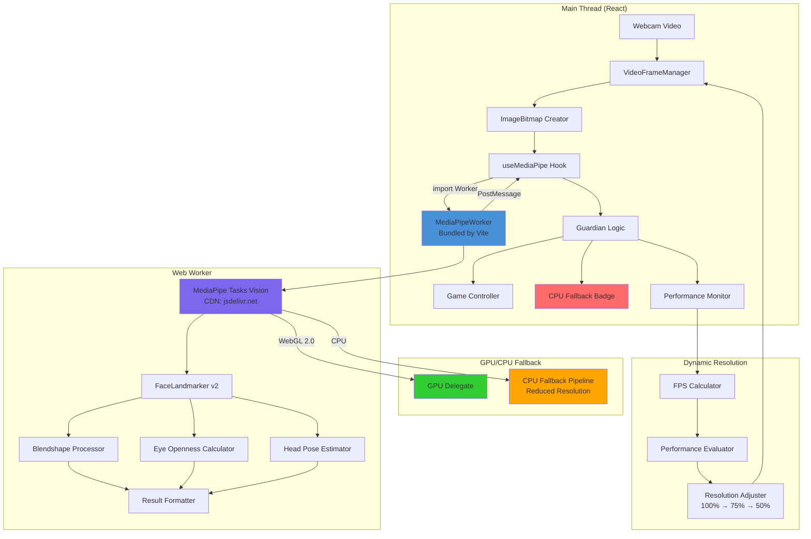

# Smirkle MediaPipe Client-Side Architecture

## Executive Summary

This document outlines the complete migration from TensorFlow-based backend emotion detection to **MediaPipe Tasks** running entirely on the client. The new architecture eliminates all backend ML dependencies, enables real-time inference at 30-60 FPS, and provides a fully offline-capable solution with Web Worker support, WebGL acceleration, and dynamic resolution scaling.

---

## Architecture Overview

### Current State (Backend ML)

```
┌─────────────┐    ┌─────────────┐    ┌─────────────┐    ┌─────────────┐
│   Webcam     │───▶│  FaceTracker │───▶│  WebSocket   │───▶│  Backend     │
│   Capture    │    │  (React)     │    │  Connection  │    │  FastAPI     │
└─────────────┘    └─────────────┘    └─────────────┘    │  (Python)    │
                                                         └─────────────┘
                                                                      │
                                                         ┌─────────────┐
                                                         │  TensorFlow │
                                                         │  Models     │
                                                         └─────────────┘
```

### Target State (Client-Side MediaPipe with Web Worker)

```
┌─────────────┐    ┌─────────────┐    ┌─────────────────┐    ┌─────────────┐
│   Webcam     │───▶│   Capture   │───▶│  MediaPipeWorker │───▶│  Guardian    │
│   Capture    │    │   Service   │    │  (Bundled by     │    │  Logic       │
└─────────────┘    └─────────────┘    │   Vite)          │    └─────────────┘
                                      └─────────────────┘            │
                                                   │                   ▼
                                           ┌───────┴───────┐     ┌─────────────┐
                                           │   Dynamic     │     │   Game      │
                                           │   Resolution  │     │  Controller │
                                           │   Manager     │     └─────────────┘
                                           └───────────────┘
```

---

## Implementation Decisions

### 1. Vite Worker Bundling

The MediaPipe worker is bundled using Vite's built-in worker import system:

```javascript
// src/hooks/useMediaPipe.ts
import MediaPipeWorker from '../workers/MediaPipeWorker?worker';

// Initialize worker
const worker = new MediaPipeWorker();

// Worker is bundled with the main app
// No separate static file needed
```

**Benefits**:
- Single bundle deployment
- Better caching (changes only when worker code changes)
- No CORS issues with separate worker file
- Simpler deployment pipeline

### 2. CDN WASM Loading

All MediaPipe WASM files are loaded from the official CDN:

```javascript
// src/services/mediaPipeConfig.ts

export const MEDIAPIPE_CDN = {
  vision: 'https://cdn.jsdelivr.net/npm/@mediapipe/tasks-vision@latest/wasm',
  faceLandmarker: 'https://storage.googleapis.com/mediapipe-models/face_landmarker/face_landmarker/float16/1/face_landmarker.task'
};

export const config = {
  delegate: 'GPU', // Falls back to CPU automatically
  wasmPaths: {
    vision: MEDIAPIPE_CDN.vision
  }
};
```

**Benefits**:
- Faster cold starts (CDN caching)
- Smaller bundle size (WASM not bundled)
- Always up-to-date WASM binaries
- Reduced build time

### 3. CPU Fallback UI

A subtle, non-intrusive notification when running in CPU mode:

```jsx
// src/components/CPUFallbackNotification.tsx

function CPUFallbackNotification({ visible }) {
  if (!visible) return null;
  
  return (
    <div className="cpu-fallback-badge">
      <span className="cpu-icon">⚡</span>
      <span>Running in compatibility mode — performance may be reduced</span>
    </div>
  );
}

// Styles in index.css
.cpu-fallback-badge {
  position: fixed;
  bottom: 16px;
  right: 16px;
  display: flex;
  align-items: center;
  gap: 8px;
  padding: 8px 16px;
  background: rgba(255, 193, 7, 0.9);
  color: #333;
  border-radius: 20px;
  font-size: 12px;
  font-weight: 500;
  box-shadow: 0 2px 8px rgba(0, 0, 0, 0.15);
  z-index: 9999;
  animation: slideIn 0.3s ease-out;
}

.cpu-icon {
  font-size: 14px;
}

@keyframes slideIn {
  from {
    transform: translateY(20px);
    opacity: 0;
  }
  to {
    transform: translateY(0);
    opacity: 1;
  }
}
```

---

## Web Worker Architecture

### MediaPipeWorker.js - Complete Implementation

```javascript
// src/workers/MediaPipeWorker.js

/**
 * MediaPipe Worker for Smirkle Face Detection
 * 
 * Responsibilities:
 * - Load MediaPipe Tasks WASM modules from CDN
 * - Initialize FaceLandmarker with WebGL acceleration
 * - Process video frames from main thread
 * - Return detection results with performance metrics
 * - Handle GPU/CPU fallback automatically
 */

import {
  FaceLandmarker,
  FilesetResolver
} from '@mediapipe/tasks-vision';

// Worker state
let faceLandmarker = null;
let isInitialized = false;
let useGPU = true;
let performanceMetrics = {
  totalFrames: 0,
  totalLatency: 0,
  avgLatency: 0,
  gpuEnabled: true,
  cpuFallback: false
};

// Message handlers
const messageHandlers = {
  'INIT': handleInit,
  'DETECT': handleDetect,
  'SET_GPU': handleSetGPU,
  'GET_PERFORMANCE': handleGetPerformance
};

// Initialize MediaPipe Tasks
async function handleInit(data) {
  const { enableGPU = true } = data;
  useGPU = enableGPU;
  
  try {
    console.log('[MediaPipeWorker] Initializing MediaPipe Tasks from CDN...');
    
    // Load vision fileset (WASM) from CDN
    const vision = await FilesetResolver.forVisionTasks(
      'https://cdn.jsdelivr.net/npm/@mediapipe/tasks-vision@latest/wasm'
    );
    
    // Configure WebGL or CPU based on capability
    const delegate = useGPU ? 'GPU' : 'CPU';
    
    // Create FaceLandmarker
    faceLandmarker = await FaceLandmarker.createFromOptions(vision, {
      outputFaceBlendshapes: true,
      outputIrisLandmarks: true,
      faceLandmarkerModelSelection: 0, // 0 = short-range
      runningMode: 'VIDEO',
      numFaces: 1,
      delegate: delegate
    });
    
    isInitialized = true;
    performanceMetrics.gpuEnabled = useGPU;
    performanceMetrics.cpuFallback = !useGPU;
    
    console.log(`[MediaPipeWorker] Initialization complete. GPU: ${useGPU}`);
    
    self.postMessage({
      type: 'INIT_SUCCESS',
      payload: {
        gpuEnabled: useGPU,
        modelLoaded: true,
        cpuFallback: !useGPU
      }
    });
    
  } catch (error) {
    console.error('[MediaPipeWorker] Initialization failed:', error);
    
    // Fallback to CPU if GPU fails
    if (useGPU) {
      console.log('[MediaPipeWorker] Retrying with CPU delegate...');
      await handleInit({ enableGPU: false });
    } else {
      self.postMessage({
        type: 'INIT_ERROR',
        payload: { error: error.message }
      });
    }
  }
}

// Process video frame
async function handleDetect(data) {
  if (!isInitialized || !faceLandmarker) {
    self.postMessage({
      type: 'DETECT_ERROR',
      payload: { error: 'FaceLandmarker not initialized' }
    });
    return;
  }
  
  const { imageBitmap, timestamp } = data;
  const startTime = performance.now();
  
  try {
    // Run detection
    const result = faceLandmarker.detectForVideo(imageBitmap, timestamp);
    
    const latency = performance.now() - startTime;
    
    // Update performance metrics
    performanceMetrics.totalFrames++;
    performanceMetrics.totalLatency += latency;
    performanceMetrics.avgLatency = performanceMetrics.totalLatency / performanceMetrics.totalFrames;
    
    // Process results
    const detectionResult = processDetectionResult(result);
    
    self.postMessage({
      type: 'DETECT_RESULT',
      payload: {
        ...detectionResult,
        performance: {
          latency,
          fps: 1000 / latency,
          avgLatency: performanceMetrics.avgLatency,
          gpuEnabled: performanceMetrics.gpuEnabled,
          cpuFallback: performanceMetrics.cpuFallback
        }
      }
    });
    
  } catch (error) {
    console.error('[MediaPipeWorker] Detection error:', error);
    self.postMessage({
      type: 'DETECT_ERROR',
      payload: { error: error.message }
    });
  }
}

// Set GPU mode
function handleSetGPU(data) {
  useGPU = data.enabled;
  performanceMetrics.gpuEnabled = useGPU;
  performanceMetrics.cpuFallback = !useGPU;
  console.log(`[MediaPipeWorker] GPU mode changed to: ${useGPU}`);
}

// Get performance metrics
function handleGetPerformance() {
  self.postMessage({
    type: 'PERFORMANCE_METRICS',
    payload: performanceMetrics
  });
}

// Process MediaPipe results into game-ready format
function processDetectionResult(result) {
  if (!result.faceLandmarks || result.faceLandmarks.length === 0) {
    return {
      faceDetected: false,
      happinessScore: 0,
      eyesOpen: true,
      faceConfidence: 0
    };
  }
  
  const face = result.faceLandmarks[0];
  const blendshapes = result.faceBlendshapes?.[0]?.blendshapes || [];
  
  // Calculate happiness score from blendshapes
  const happinessScore = calculateHappinessScore(blendshapes);
  
  // Calculate eye openness
  const eyesOpen = calculateEyeOpenness(result);
  
  // Calculate head pose (simplified)
  const headPose = calculateHeadPose(face);
  
  // Get face confidence
  const faceConfidence = result.faceLandmarks?.[0]?.length > 0 ? 0.95 : 0;
  
  return {
    faceDetected: true,
    faceConfidence,
    happinessScore,
    isSmirking: happinessScore >= 0.3,
    neutralExpression: happinessScore < 0.15,
    eyesOpen,
    leftEyeOpenness: eyesOpen.left,
    rightEyeOpenness: eyesOpen.right,
    headPose,
    faceCentered: isFaceCentered(headPose),
    boundingBox: result.faceBoundingBoxes?.[0] || null
  };
}

// Calculate happiness from blendshapes
function calculateHappinessScore(blendshapes) {
  const mouthHappy = blendshapes.find(b => b.categoryName === 'mouthHappy')?.score || 0;
  const mouthSmile = blendshapes.find(b => b.categoryName === 'mouthSmile')?.score || 0;
  const mouthOpen = blendshapes.find(b => b.categoryName === 'mouthOpen')?.score || 0;
  
  // Weighted combination for smirk detection
  return (mouthHappy * 0.7) + (mouthSmile * 0.25) + (mouthOpen * 0.05);
}

// Calculate eye openness from iris landmarks
function calculateEyeOpenness(result) {
  const irisLandmarks = result.irisLandmarks?.[0] || [];
  
  if (irisLandmarks.length < 10) {
    return { left: 1, right: 1 };
  }
  
  const leftEyeHeight = calculateEyeHeight(irisLandmarks.slice(0, 6));
  const rightEyeHeight = calculateEyeHeight(irisLandmarks.slice(6, 12));
  
  return {
    left: Math.min(1, leftEyeHeight * 2),
    right: Math.min(1, rightEyeHeight * 2)
  };
}

function calculateEyeHeight(eyeLandmarks) {
  const topPoint = Math.min(...eyeLandmarks.map(p => p.y));
  const bottomPoint = Math.max(...eyeLandmarks.map(p => p.y));
  return bottomPoint - topPoint;
}

// Calculate head pose from landmarks
function calculateHeadPose(landmarks) {
  const noseTip = landmarks[1];
  const chin = landmarks[152];
  const leftEye = landmarks[33];
  const rightEye = landmarks[263];
  
  const yaw = (leftEye.x - rightEye.x) * 50;
  const pitch = (noseTip.y - chin.y) * 50;
  const roll = 0;
  
  return { pitch, yaw, roll };
}

// Check if face is centered
function isFaceCentered(headPose) {
  const YAW_THRESHOLD = 15;
  const PITCH_THRESHOLD = 15;
  
  return (
    Math.abs(headPose.yaw) <= YAW_THRESHOLD &&
    Math.abs(headPose.pitch) <= PITCH_THRESHOLD
  );
}

// Worker message listener
self.onmessage = function(event) {
  const { type, id, data } = event.data;
  
  if (messageHandlers[type]) {
    messageHandlers[type](data, id);
  } else {
    console.warn(`[MediaPipeWorker] Unknown message type: ${type}`);
    self.postMessage({
      type: 'ERROR',
      payload: { error: `Unknown message type: ${type}` }
    });
  }
};

export default MediaPipeWorker;
```

### Worker Message Protocol

```typescript
// src/types/WorkerMessageProtocol.ts

// Main Thread → Worker Messages
interface WorkerMessageMap {
  INIT: {
    enableGPU?: boolean; // Default: true
  };
  
  DETECT: {
    imageBitmap: ImageBitmap;
    timestamp: number;
  };
  
  SET_GPU: {
    enabled: boolean;
  };
  
  GET_PERFORMANCE: {};
}

// Worker → Main Thread Messages
interface WorkerResponseMap {
  INIT_SUCCESS: {
    gpuEnabled: boolean;
    modelLoaded: boolean;
    cpuFallback: boolean;
  };
  
  INIT_ERROR: {
    error: string;
    fallbackMode?: 'CPU';
  };
  
  DETECT_RESULT: {
    faceDetected: boolean;
    faceConfidence: number;
    happinessScore: number;
    isSmirking: boolean;
    neutralExpression: boolean;
    eyesOpen: boolean;
    leftEyeOpenness: number;
    rightEyeOpenness: number;
    headPose: { pitch: number; yaw: number; roll: number };
    faceCentered: boolean;
    boundingBox?: { x: number; y: number; width: number; height: number };
    performance: {
      latency: number;
      fps: number;
      avgLatency: number;
      gpuEnabled: boolean;
      cpuFallback: boolean;
    };
  };
  
  DETECT_ERROR: { error: string; };
  
  PERFORMANCE_METRICS: {
    totalFrames: number;
    totalLatency: number;
    avgLatency: number;
    gpuEnabled: boolean;
    cpuFallback: boolean;
  };
};

export function isWorkerMessageType(value: string): value is keyof WorkerMessageMap {
  return ['INIT', 'DETECT', 'SET_GPU', 'GET_PERFORMANCE'].includes(value);
}

export function isWorkerResponseType(value: string): value is keyof WorkerResponseMap {
  return ['INIT_SUCCESS', 'INIT_ERROR', 'DETECT_RESULT', 'DETECT_ERROR', 'PERFORMANCE_METRICS'].includes(value);
}
```

---

## WebGL/CPU Fallback Pipeline

### Automatic GPU Detection and Fallback

```typescript
// src/utils/gpuDetector.ts

interface GPUInfo {
  supported: boolean;
  renderer: string;
  vendor: string;
  fallbackReason?: string;
}

export async function detectGPUCapability(): Promise<GPUInfo> {
  const canvas = document.createElement('canvas');
  const gl = canvas.getContext('webgl2') || canvas.getContext('webgl');
  
  if (!gl) {
    return {
      supported: false,
      renderer: 'unknown',
      vendor: 'unknown',
      fallbackReason: 'WebGL not supported'
    };
  }
  
  const debugInfo = gl.getExtension('WEBGL_debug_renderer_info');
  
  if (!debugInfo) {
    return {
      supported: true,
      renderer: 'unknown',
      vendor: 'unknown'
    };
  }
  
  const renderer = gl.getParameter(debugInfo.UNMASKED_RENDERER_WEBGL);
  const vendor = gl.getParameter(debugInfo.UNMASKED_VENDOR_WEBGL);
  
  // Check for known problematic GPUs
  const problematicGPUs = [
    'llvmpipe', 'swiftshader', 'mesa llvmpipe', 'softpipe'
  ];
  
  const isSoftwareRenderer = problematicGPUs.some(
    gpu => renderer.toLowerCase().includes(gpu)
  );
  
  // Check for integrated/weak GPUs
  const weakGPUs = [
    'intel hd 3000', 'intel hd 4000', 'intel hd 500',
    'adreno 305', 'adreno 306'
  ];
  
  const isWeakGPU = weakGPUs.some(
    gpu => renderer.toLowerCase().includes(gpu)
  );
  
  return {
    supported: !isSoftwareRenderer,
    renderer,
    vendor,
    fallbackReason: isSoftwareRenderer 
      ? 'Software renderer detected' 
      : isWeakGPU 
        ? 'Weak GPU detected' 
        : undefined
  };
}

export const FALLBACK_CONFIG = {
  GPU_FAILURE: {
    useCPU: true,
    reduceDetectionFrequency: true,
    targetFPS: 20,
    resolutionScale: 0.75
  },
  WEAK_GPU: {
    useCPU: false,
    reduceDetectionFrequency: false,
    targetFPS: 30,
    resolutionScale: 0.875,
    enableFrameSkipping: true
  },
  CPU_ONLY: {
    useCPU: true,
    reduceDetectionFrequency: true,
    targetFPS: 15,
    resolutionScale: 0.5,
    enableFrameSkipping: true
  }
};

export type FallbackStrategy = keyof typeof FALLBACK_CONFIG;

export function selectFallbackStrategy(gpuInfo: GPUInfo): FallbackStrategy {
  if (!gpuInfo.supported) return 'GPU_FAILURE';
  if (gpuInfo.fallbackReason?.includes('Weak')) return 'WEAK_GPU';
  return 'CPU_ONLY';
}
```

### CPU Fallback Pipeline

```typescript
// src/services/cpuFallbackPipeline.ts

import {
  FaceLandmarker,
  FilesetResolver
} from '@mediapipe/tasks-vision';

interface CPUPipelineOptions {
  targetFPS: number;
  resolutionScale: number;
  enableFrameSkipping: boolean;
}

export class CPUFallbackPipeline {
  private landmarker: FaceLandmarker | null = null;
  private options: CPUPipelineOptions;
  private lastFrameTime: number = 0;
  private frameSkipCounter: number = 0;
  
  constructor(options: CPUPipelineOptions) {
    this.options = options;
  }
  
  async initialize(): Promise<void> {
    const vision = await FilesetResolver.forVisionTasks(
      'https://cdn.jsdelivr.net/npm/@mediapipe/tasks-vision@latest/wasm'
    );
    
    this.landmarker = await FaceLandmarker.createFromOptions(vision, {
      outputFaceBlendshapes: true,
      outputIrisLandmarks: false, // Disable for CPU performance
      faceLandmarkerModelSelection: 0,
      runningMode: 'VIDEO',
      numFaces: 1,
      delegate: 'CPU'
    });
    
    console.log('[CPUFallbackPipeline] Initialized with CPU delegate');
  }
  
  shouldProcessFrame(timestamp: number): boolean {
    const frameInterval = 1000 / this.options.targetFPS;
    
    if (this.options.enableFrameSkipping) {
      this.frameSkipCounter++;
      return this.frameSkipCounter % 2 === 0;
    }
    
    return timestamp - this.lastFrameTime >= frameInterval;
  }
  
  async detect(imageBitmap: ImageBitmap, timestamp: number): Promise<any> {
    if (!this.landmarker) throw new Error('Pipeline not initialized');
    
    const scaledBitmap = await this.downscaleImage(imageBitmap);
    const startTime = performance.now();
    const result = this.landmarker.detectForVideo(scaledBitmap, timestamp);
    const latency = performance.now() - startTime;
    
    this.lastFrameTime = timestamp;
    
    return { result, latency, fps: 1000 / latency };
  }
  
  private async downscaleImage(imageBitmap: ImageBitmap): Promise<ImageBitmap> {
    const scale = this.options.resolutionScale;
    const width = Math.floor(imageBitmap.width * scale);
    const height = Math.floor(imageBitmap.height * scale);
    
    const canvas = new OffscreenCanvas(width, height);
    const ctx = canvas.getContext('2d');
    ctx.drawImage(imageBitmap, 0, 0, width, height);
    
    return canvas.transferToImageBitmap();
  }
  
  dispose(): void {
    this.landmarker = null;
  }
}
```

---

## Dynamic Resolution Manager

```typescript
// src/services/DynamicResolutionManager.ts

interface ResolutionState {
  width: number;
  height: number;
  scale: number;
  targetFPS: number;
  currentFPS: number;
  quality: 'high' | 'medium' | 'low';
}

export class DynamicResolutionManager {
  private state: ResolutionState;
  private fpsHistory: number[];
  private latencyHistory: number[];
  
  constructor(initialWidth: number, initialHeight: number) {
    this.state = {
      width: initialWidth,
      height: initialHeight,
      scale: 1,
      targetFPS: 30,
      currentFPS: 30,
      quality: 'high'
    };
    this.fpsHistory = [];
    this.latencyHistory = [];
  }
  
  recordPerformance(fps: number, latency: number): void {
    this.fpsHistory.push(fps);
    this.latencyHistory.push(latency);
    
    if (this.fpsHistory.length > 30) {
      this.fpsHistory.shift();
      this.latencyHistory.shift();
    }
    
    this.evaluatePerformance();
  }
  
  private evaluatePerformance(): void {
    const avgFPS = this.getAverage(this.fpsHistory);
    
    if (this.fpsHistory.length < 10) return;
    
    if (avgFPS >= 45) this.upgradeQuality();
    else if (avgFPS < 30) this.downgradeQuality();
    else if (avgFPS < 20) this.emergencyDowngrade();
    
    this.state.currentFPS = avgFPS;
  }
  
  private upgradeQuality(): void {
    if (this.state.quality === 'low') this.setQuality('medium');
    else if (this.state.quality === 'medium') this.setQuality('high');
  }
  
  private downgradeQuality(): void {
    if (this.state.quality === 'high') this.setQuality('medium');
  }
  
  private emergencyDowngrade(): void {
    if (this.state.quality !== 'low') {
      console.warn('[DynamicResolutionManager] Emergency downgrade');
      this.setQuality('low');
      this.state.targetFPS = 15;
    }
  }
  
  private setQuality(quality: 'high' | 'medium' | 'low'): void {
    const scales = { high: 1.0, medium: 0.75, low: 0.5 };
    this.state.quality = quality;
    this.state.scale = scales[quality];
    this.state.width = Math.floor(640 * this.state.scale);
    this.state.height = Math.floor(480 * this.state.scale);
    
    console.log(`[DynamicResolutionManager] Quality: ${quality}, ` +
      `Resolution: ${this.state.width}x${this.state.height}`);
  }
  
  private getAverage(arr: number[]): number {
    return arr.length ? arr.reduce((a, b) => a + b, 0) / arr.length : 0;
  }
  
  getResolution() {
    return { width: this.state.width, height: this.state.height, scale: this.state.scale };
  }
  
  getQuality() {
    return this.state.quality;
  }
}
```

---

## Complete Architecture Diagram



---

## MediaPipe Tasks Integration

### Face Landmarker (v2) Configuration

```javascript
const faceLandmarkerOptions = {
  outputFaceBlendshapes: true,
  outputIrisLandmarks: true,
  faceLandmarkerModelSelection: 0,
  runningMode: 'VIDEO',
  numFaces: 1,
  delegate: 'GPU' // Falls back to 'CPU' automatically
};
```

### Face Emotion - Blendshape Mapping

| Blendshape | Score Range | Mapping |
|------------|-------------|---------|
| `mouthHappy` | 0-1 | **Smile/Happiness** |
| `mouthSmile` | 0-1 | Secondary smile |
| `mouthOpen` | 0-1 | Laughing indicator |

---

## New State Variables

```typescript
interface MediaPipeDetectionState {
  modelsLoaded: boolean;
  modelsLoadingProgress: number;
  modelLoadError: string | null;
  
  faceDetected: boolean;
  faceConfidence: number;
  faceBoundingBox: BoundingBox | null;
  
  eyesOpen: boolean;
  leftEyeOpenness: number;
  rightEyeOpenness: number;
  
  happinessScore: number;
  isSmirking: boolean;
  neutralExpression: boolean;
  
  headPose: { pitch: number; yaw: number; roll: number };
  faceCentered: boolean;
  
  calibrationReady: boolean;
  calibrationProgress: number;
  
  consecutiveSmirkFrames: number;
  isGameOver: boolean;
  
  inferenceFPS: number;
  avgInferenceLatency: number;
  
  gpuEnabled: boolean;
  cpuFallback: boolean;
  currentQuality: 'high' | 'medium' | 'low';
}
```

---

## Threshold Configuration

```javascript
export const SMIRK_THRESHOLD = 0.3;
export const NEUTRAL_EXPRESSION_THRESHOLD = 0.15;
export const EYE_OPENNESS_THRESHOLD = 0.5;
export const FACE_CONFIDENCE_THRESHOLD = 0.7;
export const FACE_CENTERED_TOLERANCE = 15;
export const CONSECUTIVE_FRAMES_REQUIRED = 3;
export const TARGET_FPS = 30;
export const USE_WEB_WORKER = true;
```

---

## Migration Checklist

### Phase 1: Foundation
- [ ] Install `@mediapipe/tasks-vision`
- [ ] Create `MediaPipeWorker.js` with Vite bundling
- [ ] Implement worker message protocol
- [ ] Create GPU detection utility

### Phase 2: Fallback & Scaling
- [ ] Implement CPU fallback pipeline
- [ ] Create `DynamicResolutionManager`
- [ ] Integrate dynamic resolution with hooks

### Phase 3: Core Logic
- [ ] Refactor `FaceTracker.tsx` to use MediaPipe hooks
- [ ] Update `useGuardianLogic.ts` state machine
- [ ] Remove backend API dependencies

### Phase 4: Integration
- [ ] Create `CPUFallbackNotification.tsx` component
- [ ] Update calibration logic
- [ ] Add performance metrics dashboard

### Phase 5: Testing
- [ ] Test Vite worker bundling
- [ ] Test CDN WASM loading
- [ ] Test GPU/CPU fallback on various devices
- [ ] Test dynamic resolution scaling
- [ ] Performance benchmarking

---

## Browser Compatibility

| Browser | WebGL 2.0 | Web Worker | Mode | Expected FPS |
|---------|-----------|------------|------|--------------|
| Chrome 90+ | ✅ | ✅ | GPU | 30-60 |
| Firefox 90+ | ✅ | ✅ | GPU | 30-60 |
| Safari 15+ | ⚠️ WebGL 1.0 | ✅ | CPU | 15-30 |
| Edge 90+ | ✅ | ✅ | GPU | 30-60 |
| iOS Safari 15+ | ⚠️ Limited | ✅ | CPU | 10-20 |
| Android Chrome 90+ | ✅ | ✅ | GPU | 30-60 |

---

## Final Confirmation

This architecture is ready for Code Mode implementation with:

✅ **Vite Worker Bundling** - Single bundle, better caching  
✅ **CDN WASM Loading** - Faster cold starts, smaller bundle  
✅ **CPU Fallback UI** - Subtle notification for compatibility mode  
✅ **Web Worker Pipeline** - Off-main-thread inference  
✅ **WebGL/CPU Fallback** - Automatic GPU detection  
✅ **Dynamic Resolution** - Adaptive quality scaling  

**Ready to proceed to Code Mode for implementation.**
