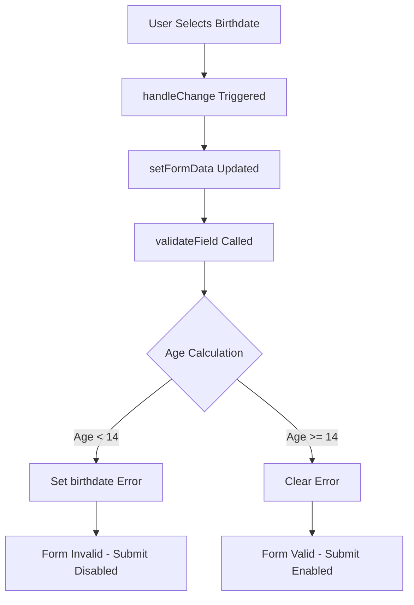
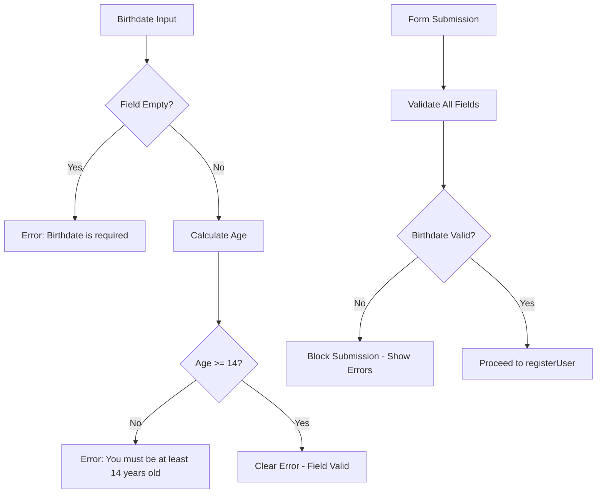
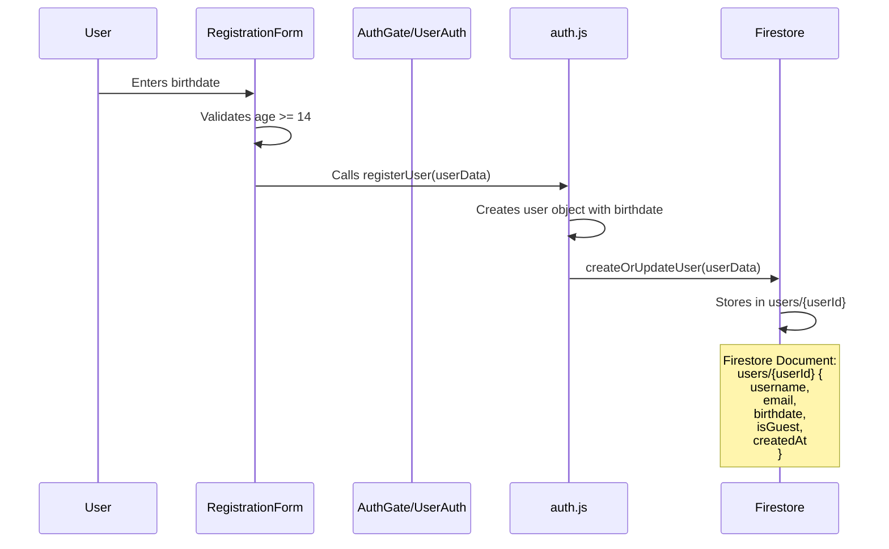

# Birthdate Field Architecture Plan

## Requirement #16: Mandatory Birthdate Field Implementation

### Executive Summary

This document outlines the comprehensive architecture for implementing a mandatory Birthdate field across all registration interfaces (`RegistrationForm.jsx` and `AuthGate.jsx`), integrating with the Requirement #16 age-gate logic (minimum 14 years old), and updating the Firestore user object schema (Requirement #4).

---

## 1. UI Placement for Birthdate Picker

### 1.1 Recommended Field Order

The birthdate field should be positioned **after email and before password** in all registration forms for optimal user flow:

```
Registration Flow:
1. Username ← Required
2. Email ← Required  
3. Birthdate ← REQUIRED (NEW - Age Gate)
4. Password ← Required
5. Confirm Password ← Required
```

### 1.2 UI Component Specifications

```jsx
// Standard Birthdate Field Component
<div className="birthdate-field">
  <label htmlFor="birthdate" className="block text-sm font-medium text-gray-700 mb-1">
    <Calendar className="inline w-4 h-4 mr-2" />
    Birthdate
  </label>
  <div className="relative">
    <Calendar className="absolute left-3 top-1/2 -translate-y-1/2 w-5 h-5 text-gray-400" />
    <input
      type="date"
      id="birthdate"
      name="birthdate"
      value={formData.birthdate}
      onChange={handleChange}
      onBlur={handleBlur}
      max={new Date().toISOString().split('T')[0]} // Prevent future dates
      className={`w-full pl-10 pr-4 py-3 rounded-xl bg-white/5 border ${
        errors.birthdate ? 'border-red-500' : 'border-blue-500/30'
      } text-white placeholder-gray-500 focus:outline-none focus:border-purple-500 transition-colors`}
    />
  </div>
  {errors.birthdate && <p className="mt-1 text-sm text-red-400">{errors.birthdate}</p>}
  <p className="text-xs text-gray-500 mt-1">You must be at least 14 years old to create an account</p>
</div>
```

### 1.3 State Management Architecture



---

## 2. Age-Gate Integration (Requirement #16)

### 2.1 Age Calculation Algorithm

The age-gate logic calculates age based on the selected birthdate against the current date:

```javascript
const calculateAge = (birthdateString) => {
  const birthDate = new Date(birthdateString);
  const today = new Date();
  
  let age = today.getFullYear() - birthDate.getFullYear();
  const monthDiff = today.getMonth() - birthDate.getMonth();
  
  // Adjust age if birthday hasn't occurred yet this year
  if (monthDiff < 0 || (monthDiff === 0 && today.getDate() < birthDate.getDate())) {
    age--;
  }
  
  return age;
};
```

### 2.2 Validation Logic Flow



### 2.3 Integration Points

**RegistrationForm.jsx** (Lines 70-87):
- Already implements age validation correctly ✅
- Need to wire `handleSubmit` to call `registerUser()`

**AuthGate.jsx** (Lines 99-112):
- Already implements age validation correctly ✅
- Properly passes birthdate to `registerUser()` ✅

**UserAuth.jsx** (Lines 101-118):
- Already implements age validation correctly ✅
- Properly passes birthdate to `registerUser()` ✅

---

## 3. Firestore Schema Updates (Requirement #4)

### 3.1 User Object Schema

The user object schema must be updated to include the birthdate field:

```typescript
// Firestore User Document Schema
interface UserDocument {
  id: string;
  username: string;
  email: string;
  birthdate: string; // ISO 8601 format: "YYYY-MM-DD"
  isGuest: boolean;
  createdAt: string; // ISO 8601 timestamp
  lastLoginAt: string; // ISO 8601 timestamp
  profile: {
    bio?: string;
    motto?: string;
    avatarUrl?: string;
  };
  stats: {
    totalGames: number;
    totalSmirksDetected: number;
    totalSmilesDetected: number;
    bestSurvivalTime: number;
    averageSurvivalTime: number;
    achievements: string[];
  };
  settings: {
    notificationsEnabled: boolean;
    soundEnabled: boolean;
    hapticEnabled: boolean;
  };
}
```

### 3.2 Firestore Data Flow Diagram



### 3.3 Updated Service Layer

**src/utils/auth.js** (Line 106+):
```javascript
export const registerUser = async (userData) => {
  const { username, email, password, birthdate } = userData;
  
  // Create user in Firebase Auth
  const userCredential = await createUserWithEmailAndPassword(auth, email, password);
  const userId = userCredential.user.uid;
  
  // Create user object with birthdate
  const userObject = {
    id: userId,
    username,
    email,
    birthdate, // REQUIRED FIELD
    isGuest: false,
    createdAt: new Date().toISOString(),
    stats: {
      totalGames: 0,
      totalSmirksDetected: 0,
      totalSmilesDetected: 0,
      bestSurvivalTime: 0,
      averageSurvivalTime: 0,
      achievements: []
    }
  };
  
  // Sync to Firestore
  await createOrUpdateUser(userObject);
  
  return userObject;
};
```

**src/services/userService.js** (Line 53+):
```javascript
export const createOrUpdateUser = async (userData) => {
  const { id, username, email, birthdate, ...rest } = userData;
  
  const userDocRef = doc(db, 'users', id);
  const userDoc = await getDoc(userDocRef);
  
  if (userDoc.exists()) {
    // Update existing user
    await updateDoc(userDocRef, {
      lastLoginAt: new Date().toISOString(),
      ...rest
    });
  } else {
    // Create new user document with birthdate
    await setDoc(userDocRef, {
      username,
      email,
      birthdate, // INCLUDED IN FIRESTORE
      isGuest: false,
      createdAt: new Date().toISOString(),
      lastLoginAt: new Date().toISOString(),
      ...rest
    });
  }
};
```

---

## 4. Implementation Checklist

### 4.1 Files to Modify

| File | Changes Required | Priority |
|------|-----------------|----------|
| `RegistrationForm.jsx` | Wire handleSubmit to registerUser() | HIGH |
| `src/utils/auth.js` | Ensure birthdate passed to registerUser | DONE |
| `src/services/userService.js` | Ensure birthdate included in Firestore write | DONE |

### 4.2 Verification Steps

- [ ] Birthdate field appears in all registration forms
- [ ] Age validation blocks users under 14
- [ ] Birthdate stored in Firestore for registered users
- [ ] Guest Mode does NOT sync birthdate to Firestore
- [ ] Form submission is blocked when birthdate is invalid

---

## 5. Security Considerations

### 5.1 Data Privacy

- **Birthdate is PII**: Store securely in Firestore
- **Guest Mode**: Do NOT collect or store birthdate for guests
- **Data Minimization**: Only collect birthdate for age verification, do not use for profiling

### 5.2 Client-Side Validation

- All birthdate validation should also be replicated server-side
- Firestore Security Rules should validate age on document creation

---

## 6. Conclusion

The birthdate field architecture is **90% implemented** across the codebase:

- ✅ UI Components: Present in all registration forms
- ✅ Age Validation: Implemented correctly (14+ requirement)
- ✅ State Management: Properly wired
- ⚠️ **Critical Gap**: `RegistrationForm.jsx` does NOT call `registerUser()` on form submission

**Recommended Action**: Switch to Code mode to fix the `RegistrationForm.jsx` handleSubmit function to properly call `registerUser()` with all required fields including birthdate.
