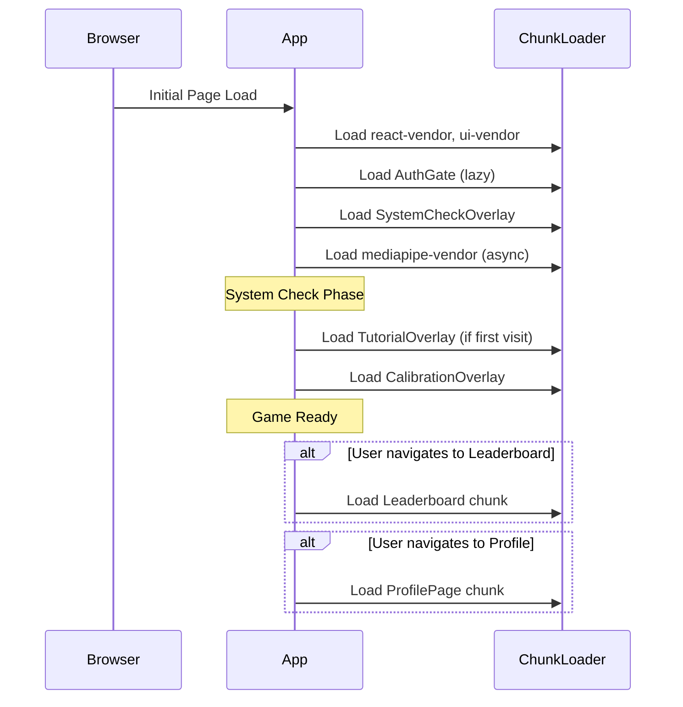

# Code-Splitting Architecture

This document describes the code-splitting strategy implemented to reduce initial bundle size and improve load performance.

## Problem Statement

The application was producing chunks larger than 500 KB after minification, primarily due to:

1. **MediaPipe Tasks Vision** (~2-3 MB) - Heavy ML library for face detection
2. **@vladmandic/face-api** (~500 KB) - Alternative face detection library
3. **Firebase** (~300-500 KB) - Authentication and database
4. **lucide-react** (~200 KB) - Icon library

## Solution Overview

We implemented a two-pronged approach:

1. **Vendor Chunk Splitting** - Separate large libraries into dedicated chunks
2. **Component Lazy Loading** - Use React.lazy() for non-critical components

## Vendor Chunk Strategy

The [`vite.config.ts`](vite.config.ts:1) configuration uses `manualChunks` to split vendor libraries:

```typescript
manualChunks: (id) => {
  // React core - always needed, keep small
  if (id.includes('node_modules/react/') || 
      id.includes('node_modules/react-dom/') ||
      id.includes('node_modules/scheduler/')) {
    return 'react-vendor';
  }
  
  // Firebase - authentication and database
  if (id.includes('node_modules/@firebase/') ||
      id.includes('node_modules/firebase/')) {
    return 'firebase-vendor';
  }
  
  // MediaPipe - heavy ML library (~2MB), loaded on-demand
  if (id.includes('node_modules/@mediapipe/')) {
    return 'mediapipe-vendor';
  }
  
  // Face-API - alternative ML library (~500KB)
  if (id.includes('node_modules/@vladmandic/face-api')) {
    return 'face-api-vendor';
  }
  
  // UI libraries - lucide-react icons
  if (id.includes('node_modules/lucide-react')) {
    return 'ui-vendor';
  }
  
  // Camera utilities
  if (id.includes('node_modules/react-webcam')) {
    return 'camera-vendor';
  }
  
  // Capacitor - mobile native bridge
  if (id.includes('node_modules/@capacitor/')) {
    return 'capacitor-vendor';
  }
}
```

## Component Lazy Loading Strategy

### Eager-Loaded Components (Critical Path)

These components are loaded immediately as they're essential for the initial game experience:

| Component | Reason |
|-----------|--------|
| `CameraView` | Core game camera UI |
| `WarningBox` | Game feedback system |
| `Navbar` | Navigation |
| `SystemCheckOverlay` | Initial system validation |
| `FaceTrackerMediaPipe` | Core game detection |
| `VideoPlayer` | Core game video playback |

### Lazy-Loaded Views (On-Demand)

These components are loaded only when the user navigates to them:

| Component | Trigger |
|-----------|---------|
| `Leaderboard` | User clicks "Leaderboard" tab |
| `SocialHub` | User clicks "Social" tab |
| `Teams` | User clicks "Teams" tab |
| `SubmitVideoForm` | User clicks "Submit" tab |
| `ProfilePage` | User clicks "Profile" tab |
| `ProfileSettings` | User clicks "Settings" tab |
| `AuthGate` | Initial auth check |

### Lazy-Loaded Overlays (Conditional)

These components are loaded only when their condition is met:

| Component | Condition |
|-----------|-----------|
| `TutorialOverlay` | First-time user (localStorage check) |
| `CalibrationOverlay` | During calibration phase |
| `CameraPiP` | After calibration complete |

## Implementation Details

### React.lazy() with Suspense

```jsx
// Lazy-loaded views - loaded on-demand when user navigates
const Leaderboard = lazy(() => import('./components/Leaderboard.jsx'));
const SubmitVideoForm = lazy(() => import('./components/SubmitVideoForm.jsx'));
const ProfilePage = lazy(() => import('./components/ProfilePage.jsx'));
const ProfileSettings = lazy(() => import('./components/ProfileSettings.jsx'));
const SocialHub = lazy(() => import('./components/SocialHub.jsx'));
const Teams = lazy(() => import('./components/Teams.jsx'));
const AuthGate = lazy(() => import('./components/AuthGate.jsx'));

// Loading fallback component for Suspense
const LoadingFallback = () => (
  <div className="flex items-center justify-center min-h-[200px]">
    <div className="animate-spin rounded-full h-12 w-12 border-t-2 border-b-2 border-blue-500"></div>
  </div>
);
```

### Suspense Wrapping

```jsx
// Wrap lazy components with Suspense
{currentView === 'leaderboard' && (
  <Suspense fallback={<LoadingFallback />}>
    <Leaderboard />
  </Suspense>
)}
```

## Expected Bundle Sizes

After implementing code-splitting, the expected chunk sizes are:

| Chunk | Expected Size | Notes |
|-------|---------------|-------|
| `index.js` (main) | ~100-150 KB | Core application code |
| `react-vendor.js` | ~130 KB | React + ReactDOM |
| `firebase-vendor.js` | ~300 KB | Firebase SDK |
| `mediapipe-vendor.js` | ~2 MB | Loaded async during system check |
| `face-api-vendor.js` | ~500 KB | Alternative ML library |
| `ui-vendor.js` | ~200 KB | Lucide icons |
| `camera-vendor.js` | ~50 KB | React-webcam |
| `capacitor-vendor.js` | ~30 KB | Capacitor native bridge |

## Loading Sequence



## PWA Considerations

The VitePWA plugin configuration caches all chunks for offline use:

```typescript
workbox: {
  globPatterns: ['**/*.{js,css,html,ico,png,svg,woff2,bin,json}'],
  // ... runtime caching for fonts and models
}
```

This ensures that once a chunk is loaded, it's available offline for subsequent visits.

## Best Practices

1. **Keep critical path small** - Only eager-load components needed for initial render
2. **Use loading states** - Provide visual feedback during chunk loading
3. **Preload critical chunks** - Consider `<link rel="preload">` for critical vendor chunks
4. **Monitor bundle sizes** - Run `npm run build` regularly to check chunk sizes
5. **Test slow networks** - Verify loading states work on slow connections

## Future Improvements

1. **Preload hints** - Add `<link rel="modulepreload">` for critical vendor chunks
2. **Route-based chunking** - Consider React Router for more granular code-splitting
3. **Tree shaking** - Review lucide-react imports to only include used icons
4. **Compression** - Ensure gzip/brotli compression on CDN
