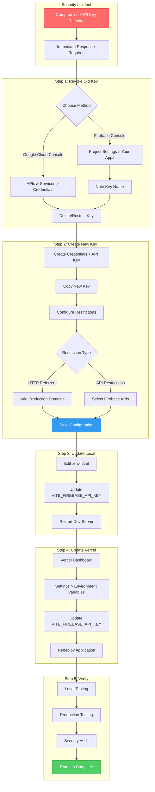

# Firebase API Key Regeneration Guide

> **Security Incident Response**: This guide provides step-by-step instructions for regenerating a compromised Firebase API key for the Smirkle application.

## Overview

When a Firebase API key is compromised (exposed in public repositories, leaked in logs, or suspected of unauthorized use), you must immediately revoke the old key and generate a new one. This guide covers the complete process for the Smirkle application.

---

## Prerequisites

- Access to the [Firebase Console](https://console.firebase.google.com/) with Owner/Editor permissions
- Access to the [Google Cloud Console](https://console.cloud.google.com/) with appropriate IAM permissions
- Access to the Vercel Dashboard for the Smirkle project
- Local development environment access

---

## Step 1: Revoke the Old API Key

### Option A: Via Firebase Console (Recommended)

1. **Navigate to Firebase Console**
   - Go to [https://console.firebase.google.com/](https://console.firebase.google.com/)
   - Select the Smirkle project

2. **Access Project Settings**
   - Click the **gear icon** (Settings) in the top-left navigation
   - Select **Project settings**

3. **Locate the Web App**
   - Scroll down to the **"Your apps"** section
   - Find the web app (usually named "Smirkle" or similar)
   - Note the current `apiKey` value for reference

4. **Delete the Current API Key**
   - The Firebase Console doesn't directly allow key deletion
   - You'll need to use Google Cloud Console (see Option B below)

### Option B: Via Google Cloud Console (Complete Control)

1. **Navigate to Google Cloud Console**
   - Go to [https://console.cloud.google.com/](https://console.cloud.google.com/)
   - Select the same project linked to your Firebase app

2. **Access API Credentials**
   - Navigate to **APIs & Services** > **Credentials**
   - Or use direct link: `https://console.cloud.google.com/apis/credentials?project=YOUR_PROJECT_ID`

3. **Identify the Compromised Key**
   - Look for API keys under the "API Keys" section
   - Find the key that matches your Firebase API key
   - The name typically follows patterns like:
     - `Browser key` (auto-created by Firebase)
     - `AIza...` (API key prefix)

4. **Delete or Restrict the Key**
   
   **For immediate revocation (Recommended for compromised keys):**
   - Click the **trash icon** next to the API key
   - Confirm deletion
   
   **For temporary restriction (If you need time to update):**
   - Click the **pencil icon** (Edit) on the API key
   - Scroll to **API restrictions**
   - Set to **"Don't allow any API calls"**
   - Click **Save**

---

## Step 2: Create a New API Key

### Via Google Cloud Console

1. **Create New API Key**
   - In **APIs & Services** > **Credentials**
   - Click **+ CREATE CREDENTIALS** at the top
   - Select **API key**

2. **Copy the New Key**
   - A dialog will appear with your new API key
   - **Copy the key immediately** - you'll need it for configuration
   - Click **Close** (you can always view it later)

3. **Configure Application Restrictions (Critical for Security)**

   Click the **pencil icon** to edit the new key and configure restrictions:

   #### Application Restrictions

   Choose the most appropriate option for your deployment:

   | Restriction Type | Use Case | Configuration |
   |-----------------|----------|---------------|
   | **HTTP referrers** | Web applications | Add all domains where the app is hosted |
   | **IP addresses** | Server-side calls | Add server IPs (not applicable for client-side Firebase) |
   | **Android apps** | Android native | Add package name + SHA-1 fingerprint |
   | **iOS apps** | iOS native | Add bundle ID |
   | **None** | Development only | Not recommended for production |

   **For Smirkle Web Application, configure HTTP referrers:**

   ```
   # Production domain
   https://smirkle.vercel.app/*
   https://smirkle.vercel.app
   
   # Preview deployments (Vercel)
   https://smirkle-*-*.vercel.app/*
   
   # Local development
   http://localhost:*
   http://localhost:5173/*
   http://127.0.0.1:*
   
   # Any custom domains
   https://your-custom-domain.com/*
   ```

   > **Note**: Vercel preview URLs follow the pattern `https://[project]-[branch]-[hash].vercel.app`

4. **Configure API Restrictions**

   - Under **API restrictions**, select **"Restrict key"**
   - Choose only the APIs your app uses:
     - **Firebase Installations API**
     - **Cloud Firestore API** (if using Firestore)
     - **Firebase Authentication API** (if using Auth)
     - **Firebase Realtime Database API** (if using Realtime DB)
     - **Cloud Storage for Firebase API** (if using Storage)
   
   - Click **Save**

### Via Firebase Console (Alternative)

1. **Create a New Web App (if needed)**
   - In Firebase Console > Project Settings
   - Click **Add app** > Select **Web** (</> icon)
   - Register the app with a nickname
   - Copy the new `apiKey` from the config object

2. **Or Use Existing App with New Key**
   - Firebase automatically creates API keys
   - You may need to create a new key in Google Cloud Console
   - The Firebase Console will display the available key

---

## Step 3: Update Local Environment Variables

### Update `.env.local` File

1. **Open the `.env.local` file** in your project root:
   ```bash
   # Location: c:/Users/nicol/smirkle/.env.local
   ```

2. **Update the Firebase API key**:
   ```env
   # ===========================
   # Firebase Configuration
   # ===========================
   VITE_FIREBASE_API_KEY=YOUR_NEW_API_KEY_HERE
   VITE_FIREBASE_PROJECT_ID=your_project_id  # Keep existing
   VITE_FIREBASE_AUTH_DOMAIN=your-project.firebaseapp.com  # Keep existing
   VITE_FIREBASE_DATABASE_URL=https://your-project.firebaseio.com  # Keep existing
   VITE_FIREBASE_STORAGE_BUCKET=your-project.appspot.com  # Keep existing
   VITE_FIREBASE_MESSAGING_SENDER_ID=your_sender_id  # Keep existing
   VITE_FIREBASE_APP_ID=your_app_id  # Keep existing
   VITE_FIREBASE_MEASUREMENT_ID=G-XXXXXXXXXX  # Keep existing
   ```

3. **Verify the file is in `.gitignore`**:
   ```bash
   # Check that .env.local is ignored
   grep -q ".env.local" .gitignore && echo "Protected" || echo "WARNING: Add .env.local to .gitignore"
   ```

   The `.gitignore` should contain:
   ```gitignore
   # Environment files with secrets
   .env.local
   .env.*.local
   ```

4. **Restart the development server**:
   ```bash
   # Stop any running dev server (Ctrl+C)
   # Restart to load new environment variables
   npm run dev
   ```

---

## Step 4: Update Vercel Environment Variables

### Via Vercel Dashboard

1. **Access Project Settings**
   - Go to [https://vercel.com/dashboard](https://vercel.com/dashboard)
   - Select the **Smirkle** project
   - Click **Settings** tab

2. **Navigate to Environment Variables**
   - In the left sidebar, click **Environment Variables**

3. **Update the Firebase API Key**
   
   **Option A: Edit existing variable (Recommended)**
   - Find `VITE_FIREBASE_API_KEY` in the list
   - Click the **...** (three dots) menu
   - Select **Edit**
   - Enter the new API key value
   - Select environments: **Production**, **Preview**, and **Development**
   - Click **Save**

   **Option B: Remove and re-add**
   - Click **Remove** on the old variable
   - Click **Add New** to create a new variable
   - Name: `VITE_FIREBASE_API_KEY`
   - Value: `YOUR_NEW_API_KEY_HERE`
   - Environments: Select all three
   - Click **Save**

4. **Verify All Firebase Variables**
   
   Ensure these environment variables are set correctly:

   | Variable Name | Environment(s) | Notes |
   |--------------|----------------|-------|
   | `VITE_FIREBASE_API_KEY` | All | **Updated with new key** |
   | `VITE_FIREBASE_PROJECT_ID` | All | Should remain unchanged |
   | `VITE_FIREBASE_AUTH_DOMAIN` | All | Should remain unchanged |
   | `VITE_FIREBASE_STORAGE_BUCKET` | All | Should remain unchanged |
   | `VITE_FIREBASE_MESSAGING_SENDER_ID` | All | Should remain unchanged |
   | `VITE_FIREBASE_APP_ID` | All | Should remain unchanged |
   | `VITE_FIREBASE_MEASUREMENT_ID` | All | Optional, for analytics |

5. **Trigger a New Deployment**
   
   Environment variable changes require a redeployment:
   
   - Go to the **Deployments** tab
   - Click **...** on the most recent deployment
   - Select **Redeploy**
   
   Or push a new commit to trigger automatic deployment.

---

## Step 5: Verification Steps

### 5.1 Local Verification

1. **Start the development server**:
   ```bash
   npm run dev
   ```

2. **Check browser console** for Firebase initialization:
   - Open DevTools (F12)
   - Check Console for any Firebase errors
   - Should NOT see: "Firebase Configuration Warning: Missing environment variables"

3. **Test authentication**:
   - Navigate to the app's login/register page
   - Attempt to sign in or create an account
   - Verify Firebase Auth works correctly

4. **Test Firestore operations**:
   - Navigate to any feature that uses the database
   - Verify data can be read/written

### 5.2 Production Verification

1. **Check deployment status**:
   - Go to Vercel Dashboard
   - Verify the latest deployment succeeded
   - Check build logs for any errors

2. **Test the live application**:
   - Visit the production URL
   - Open browser DevTools
   - Check for Firebase initialization errors
   - Test authentication and data operations

3. **Monitor Firebase Console**:
   - Go to Firebase Console > Project Settings
   - Check **Usage** metrics for the new API key
   - Verify requests are being received

### 5.3 Security Verification

1. **Verify old key is revoked**:
   - Attempt to use the old API key (should fail)
   - Check Google Cloud Console > Credentials
   - Confirm old key is deleted or restricted

2. **Check for exposed secrets**:
   ```bash
   # Search for any accidental commits of API keys
   git log -p --all -- "VITE_FIREBASE_API_KEY" | head -50
   ```

3. **Review application restrictions**:
   - In Google Cloud Console > Credentials
   - Verify the new key has proper HTTP referrer restrictions
   - Ensure only your domains are allowed

---

## Architecture Diagram: API Key Rotation Flow



---

## Environment Variables Reference

### Required Variables (Must Update)

| Variable | Description | Example |
|----------|-------------|---------|
| `VITE_FIREBASE_API_KEY` | Firebase API Key (the one being rotated) | `AIzaSyC...` |

### Variables That Remain Unchanged

| Variable | Description | Notes |
|----------|-------------|-------|
| `VITE_FIREBASE_PROJECT_ID` | Firebase Project ID | Stays the same |
| `VITE_FIREBASE_AUTH_DOMAIN` | Auth domain | Stays the same |
| `VITE_FIREBASE_STORAGE_BUCKET` | Storage bucket | Stays the same |
| `VITE_FIREBASE_MESSAGING_SENDER_ID` | FCM sender ID | Stays the same |
| `VITE_FIREBASE_APP_ID` | App identifier | Stays the same |
| `VITE_FIREBASE_MEASUREMENT_ID` | Analytics ID | Optional, stays the same |

---

## Troubleshooting

### Common Issues

| Issue | Cause | Solution |
|-------|-------|----------|
| "Firebase initialization failed" | Missing environment variable | Check all required vars are set |
| "Permission denied" on Firestore | API key restrictions | Verify API restrictions include Firestore API |
| Authentication fails | Wrong authDomain | Verify `VITE_FIREBASE_AUTH_DOMAIN` is correct |
| "API key not valid" | Key not yet propagated | Wait 5-10 minutes after creation |
| Requests blocked | HTTP referrer mismatch | Add your domain to allowed referrers |

### Debug Commands

```bash
# Check if environment variables are loaded
echo $env:VITE_FIREBASE_API_KEY

# View Vite environment variables in browser console
console.log(import.meta.env)

# Check Firebase initialization
# In browser console on your app:
firebase.apps.length > 0 ? "Firebase initialized" : "Firebase NOT initialized"
```

---

## Security Best Practices

1. **Never commit `.env.local` to version control**
   - Always verify `.gitignore` includes `.env.local`
   - Use `.env.example` for documentation only

2. **Use HTTP referrer restrictions**
   - Limit API key usage to your domains only
   - Include all preview/development URLs

3. **Rotate keys periodically**
   - Consider rotating API keys every 6-12 months
   - Immediately rotate if any suspicion of compromise

4. **Monitor API usage**
   - Check Google Cloud Console > APIs & Services > Dashboard
   - Set up budget alerts for unusual usage spikes

5. **Use separate projects for environments**
   - Development/staging should use separate Firebase projects
   - Never use production credentials in development

---

## Checklist Summary

- [ ] **Step 1**: Revoke old API key in Google Cloud Console
- [ ] **Step 2**: Create new API key with proper restrictions
- [ ] **Step 3**: Update `.env.local` with new key
- [ ] **Step 4**: Update Vercel environment variables
- [ ] **Step 5**: Verify local and production functionality
- [ ] **Security**: Confirm old key is revoked
- [ ] **Security**: Verify `.env.local` is in `.gitignore`

---

## Related Documentation

- [`firebaseConfig.js`](../src/services/firebaseConfig.js) - Firebase initialization code
- [`.env.local.example`](../.env.local.example) - Environment variable template
- [`DEPLOYMENT.md`](../DEPLOYMENT.md) - Deployment documentation
- [`firestore-architecture.md`](./firestore-architecture.md) - Firestore security rules

---

*Last Updated: February 2026*
*Document Version: 1.0*