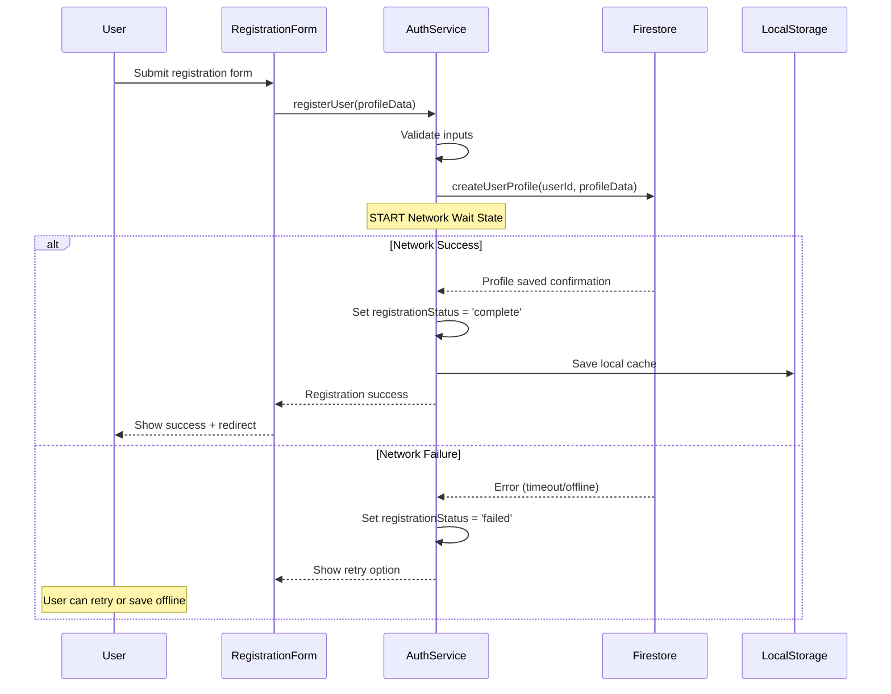
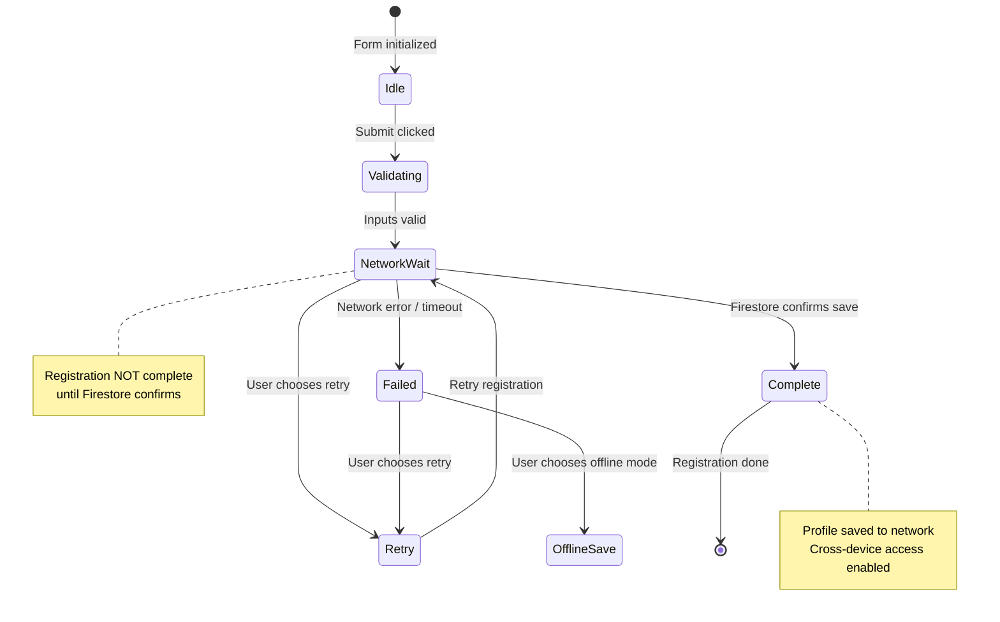

# Smirkle Firestore Architecture Plan
## Requirement #4: Centralized User Profile Storage

## 1. Firestore Collection Schema Design

### 1.1 Users Collection Schema

```
Firestore Structure:
└── smirkle-project (Firestore Database)
    ├── users (collection)
    │   └── {userId} (document)
    │       ├── profile (subcollection)
    │       │   └── userId, username, email, birthdate, bio, motto, avatarUrl
    │       ├── stats (subcollection)
    │       │   └── totalGames, bestSurvivalTime, achievements, pokerFaceLevel
    │       └── social (subcollection) [Future #5, #7]
    │           └── friends, friendRequests, blockedUsers, clans
    ├── scores (collection)
    │   └── {scoreId}
    │       └── userId, scoreValue, survivalTime, timestamp
    └── videos (collection) [Existing]
```

### 1.2 User Profile Document Schema

```typescript
// users/{userId}/profile/userProfile
interface UserProfile {
  // Core Identity (Requirement #4)
  userId: string;           // Document ID matches collection ID
  username: string;         // Display name
  email: string;            // Contact email (with privacy controls)
  birthdate: string;        // ISO date format (age verification)
  createdAt: timestamp;     // Account creation
  updatedAt: timestamp;     // Last profile update
  
  // Extended Profile (Future #5)
  bio?: string;             // Short biography
  motto?: string;           // Personal tagline
  avatarUrl?: string;       // Profile picture URL
  
  // Privacy Controls (Future #5)
  privacySettings: {
    showOnLeaderboard: boolean;
    showBirthYear: boolean; // Hide birth year, show age range only
    allowFriendRequests: boolean;
    showOnlineStatus: boolean;
  };
}

// users/{userId}/stats/userStats
interface UserStats {
  userId: string;
  totalGames: number;
  totalSmirksDetected: number;
  totalSmilesDetected: number;
  bestSurvivalTime: number;  // Best score in seconds
  averageSurvivalTime: number;
  longestStreak: number;
  pokerFaceLevel: number;   // Gamification tier (1-100)
  experience: number;       // XP points
  achievements: string[];   // Array of achievement IDs
  lastPlayedDate: timestamp;
}

// users/{userId}/social/socialData (Future #5, #7)
interface SocialData {
  userId: string;
  friends: string[];              // Array of friend userIds
  friendRequests: {                // Incoming friend requests
    requestId: string;
    fromUserId: string;
    username: string;
    timestamp: timestamp;
    status: 'pending' | 'accepted' | 'rejected';
  }[];
  blockedUsers: string[];         // Blocked userIds
  clanId?: string;                 // Current clan/squad (#7)
  clanRole?: 'leader' | 'officer' | 'member';
}
```

## 2. Success/Failure Feedback Loop Design

### 2.1 Registration Flow with Network Confirmation



### 2.2 Registration Status State Machine



### 2.3 Registration Form State Management

```typescript
// useRegistration hook interface
interface UseRegistrationReturn {
  status: 'idle' | 'validating' | 'network_wait' | 'complete' | 'failed' | 'retry';
  progress: number;           // 0-100 progress indicator
  error: string | null;      // Error message if failed
  canRetry: boolean;
  canOfflineSave: boolean;
  retry: () => Promise<void>;
  cancel: () => void;
}

// Registration Status Details
const REGISTRATION_STATUS = {
  IDLE: 'idle',                    // Form ready, no submission
  VALIDATING: 'validating',        // Checking input validity
  NETWORK_WAIT: 'network_wait',    // Waiting for Firestore confirmation
  COMPLETE: 'complete',            // ✅ Network confirmed
  FAILED: 'failed',                // ❌ Network error
  RETRY: 'retry'                   // User triggered retry
};
```

## 3. Firestore Integration Architecture

### 3.1 Service Layer Structure

```
src/services/
├── firebaseConfig.js          # Existing - Firebase initialization
├── userService.js             # NEW - User profile operations
│   ├── createUserProfile()    # Create user in Firestore
│   ├── updateUserProfile()    # Update existing profile
│   ├── getUserProfile()       # Fetch user data
│   ├── deleteUserProfile()    # Account deletion
│   └── validateUsername()     # Check username availability
├── authService.js             # NEW - Authentication wrapper
│   ├── registerWithEmail()    # Email/password registration
│   ├── loginWithEmail()       # Email/password login
│   ├── loginWithGoogle()      # OAuth provider
│   └── logout()               # Sign out
└── syncService.js             # NEW - Offline/Online sync
    ├── syncLocalToCloud()     # Push local changes
    ├── syncCloudToLocal()     # Pull remote changes
    └── handleConflict()       # Resolve sync conflicts
```

### 3.2 User Service Implementation

```typescript
// src/services/userService.ts
import { 
  doc, setDoc, getDoc, updateDoc, deleteDoc,
  serverTimestamp, collection, query, where, getDocs
} from 'firebase/firestore';
import { db } from './firebaseConfig';

const USERS_COLLECTION = 'users';
const PROFILE_SUB_COLLECTION = 'profile';
const STATS_SUB_COLLECTION = 'stats';

/**
 * Create user profile in Firestore
 * @param {string} userId - Unique user identifier
 * @param {Object} profileData - User profile data
 * @returns {Promise<{success: boolean, error?: string}>}
 */
export async function createUserProfile(userId, profileData) {
  const userProfileRef = doc(db, USERS_COLLECTION, userId, PROFILE_SUB_COLLECTION, 'userProfile');
  const userStatsRef = doc(db, USERS_COLLECTION, userId, STATS_SUB_COLLECTION, 'userStats');
  
  try {
    const now = new Date().toISOString();
    
    // Profile document
    await setDoc(userProfileRef, {
      userId,
      username: profileData.username,
      email: profileData.email.toLowerCase(),
      birthdate: profileData.birthdate,
      createdAt: now,
      updatedAt: now,
      bio: profileData.bio || '',
      motto: profileData.motto || '',
      avatarUrl: profileData.avatarUrl || '',
      privacySettings: {
        showOnLeaderboard: true,
        showBirthYear: false,
        allowFriendRequests: true,
        showOnlineStatus: true
      }
    });
    
    // Stats document (defaults)
    await setDoc(userStatsRef, {
      userId,
      totalGames: 0,
      totalSmirksDetected: 0,
      totalSmilesDetected: 0,
      bestSurvivalTime: 0,
      averageSurvivalTime: 0,
      longestStreak: 0,
      pokerFaceLevel: 1,
      experience: 0,
      achievements: [],
      lastPlayedDate: null
    });
    
    return { success: true };
  } catch (error) {
    console.error('Firestore createUserProfile error:', error);
    return { 
      success: false, 
      error: error.message || 'Failed to save profile to server' 
    };
  }
}

/**
 * Update user profile
 * @param {string} userId 
 * @param {Object} updates 
 * @returns {Promise<{success: boolean}>}
 */
export async function updateUserProfile(userId, updates) {
  const userProfileRef = doc(db, USERS_COLLECTION, userId, PROFILE_SUB_COLLECTION, 'userProfile');
  
  try {
    await updateDoc(userProfileRef, {
      ...updates,
      updatedAt: new Date().toISOString()
    });
    return { success: true };
  } catch (error) {
    console.error('Firestore updateUserProfile error:', error);
    return { success: false, error: error.message };
  }
}

/**
 * Get user profile
 * @param {string} userId 
 * @returns {Promise<Object|null>}
 */
export async function getUserProfile(userId) {
  const userProfileRef = doc(db, USERS_COLLECTION, userId, PROFILE_SUB_COLLECTION, 'userProfile');
  
  try {
    const docSnap = await getDoc(userProfileRef);
    if (docSnap.exists()) {
      return { success: true, data: docSnap.data() };
    }
    return { success: false, error: 'Profile not found' };
  } catch (error) {
    console.error('Firestore getUserProfile error:', error);
    return { success: false, error: error.message };
  }
}
```

## 4. Future Expansion: Social Features (#5, #7)

### 4.1 Social Data Schema (Ready for #5)

```typescript
// users/{userId}/social/socialData
interface SocialDocument {
  userId: string;
  friends: {
    friendId: string;
    username: string;
    addedAt: timestamp;
    pokerFaceLevel: number;  // For sorting friend list
  }[];
  friendRequests: {
    requestId: string;
    fromUserId: string;
    fromUsername: string;
    message?: string;
    timestamp: timestamp;
    status: 'pending' | 'accepted' | 'rejected';
  }[];
  blockedUsers: string[];
  
  // Clan/Squad features (#7)
  clanId?: string;
  clanRole?: 'leader' | 'officer' | 'member';
  clanJoinedAt?: timestamp;
  
  // Activity feed (#5)
  recentActivities: {
    activityId: string;
    type: 'score' | 'achievement' | 'friend_join' | 'clan_event';
    data: Object;
    timestamp: timestamp;
  }[];
}
```

### 4.2 Firestore Security Rules (for future implementation)

```javascript
// firestore.rules
rules_version = '2';
firestore service cloud.firestore {
  match /databases/{database}/documents {
    
    // Users collection rules
    match /users/{userId} {
      // Profile readable by anyone, writable by owner
      match /profile/userProfile {
        allow read: if true;
        allow write: if request.auth != null && request.auth.uid == userId;
      }
      
      // Stats readable by anyone, writable by owner
      match /stats/userStats {
        allow read: if true;
        allow write: if request.auth != null && request.auth.uid == userId;
      }
      
      // Social data: readable by friends, writable by owner
      match /social/socialData {
        allow read: if request.auth != null && (
          request.auth.uid == userId ||
          exists(/databases/$(database)/documents/users/$(userId)/social/socialData/friends/$(request.auth.uid))
        );
        allow write: if request.auth != null && request.auth.uid == userId;
      }
    }
    
    // Scores collection: leaderboard public, user scores private
    match /scores/{scoreId} {
      allow read: if true;
      allow write: if request.auth != null;
    }
  }
}
```

## 5. Implementation Checklist

### Phase 1: Core Profile Storage (#4)
- [ ] Update firebaseConfig.js to export Firestore instance
- [ ] Create userService.js with createUserProfile, updateUserProfile, getUserProfile
- [ ] Modify RegistrationForm.jsx to use network-first approach
- [ ] Implement registration status state machine
- [ ] Add loading/progress UI during network wait
- [ ] Add retry mechanism for failed registrations
- [ ] Update auth.js to sync with Firestore on login
- [ ] Test cross-device profile access

### Phase 2: Stats & Leaderboard (#4)
- [ ] Create scoreService.js integration with Firestore
- [ ] Update App.jsx submitScore to use Firestore
- [ ] Implement Leaderboard component with real-time updates
- [ ] Add offline fallback for leaderboard

### Phase 3: Social Features Preparation (#5, #7)
- [ ] Add social subcollection to user documents
- [ ] Create friendService.js for friend operations
- [ ] Implement friend request system
- [ ] Add clan/squad schema and service
- [ ] Implement real-time presence system

## 6. Error Handling Strategy

### 6.1 Network Failure Scenarios

| Scenario | Behavior | User Feedback |
|----------|----------|----------------|
| Initial registration fails | Retry up to 3 times, then show offline option | "Network error. Retry or save locally?" |
| Offline save selected | Save to LocalStorage, queue for sync | "Saved locally. Will sync when online." |
| Online detected | Auto-sync queued data | "Syncing profile..." |
| Conflict on sync | Last-write-wins for profile, manual for scores | "Sync conflict. Review changes?" |

### 6.2 Timeout Configuration

```javascript
const FIRESTORE_TIMEOUTS = {
  createProfile: 5000,      // 5 seconds to create profile
  updateProfile: 3000,      // 3 seconds to update
  fetchProfile: 3000,       // 3 seconds to fetch
  syncQueue: 10000          // 10 seconds for batch sync
};
```

---

**Architectural Summary:**
This design provides a centralized Firestore storage system that:
1. ✅ Satisfies Requirement #4 with Name, Birthdate, Email storage
2. ✅ Implements success/failure feedback loop with registration status states
3. ✅ Pre-expands for Requirements #5 (social features) and #7 (clans/squads)
4. ✅ Provides offline fallback with queued sync capability
5. ✅ Includes security rules for future multi-user features
