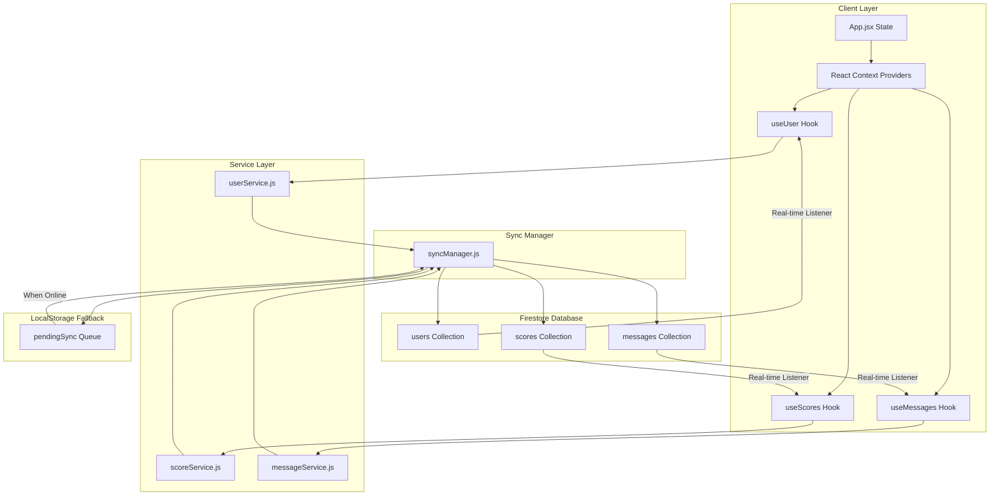
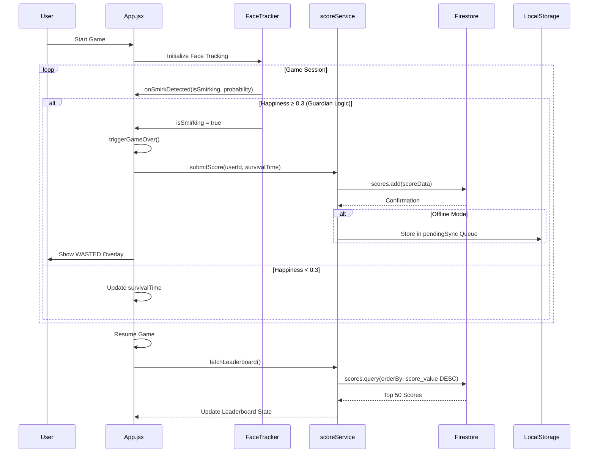
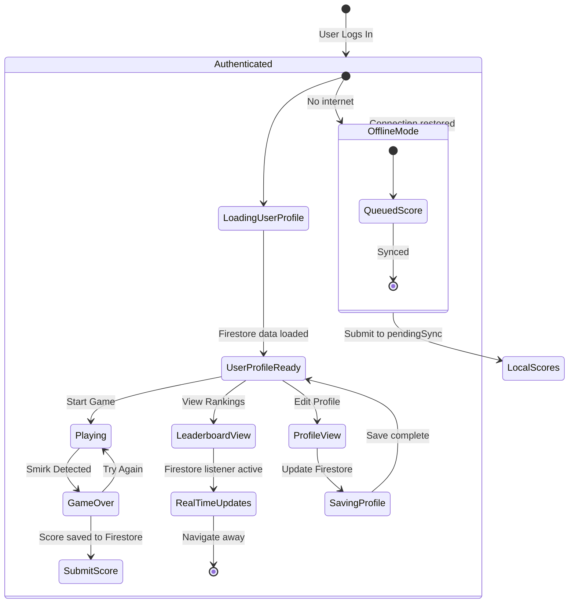

# Smirkle Cloud Firestore Architecture

## Executive Summary
This document outlines the centralized database architecture for Smirkle using Cloud Firestore, replacing the current LocalStorage-based data persistence with a scalable, real-time cloud solution optimized for the DeveloperWeek 2026 Hackathon.

---

## 1. Firestore Collection Schemas

### 1.1 Users Collection
**Collection Path:** `users/{userId}`

| Field | Type | Description | Index |
|-------|------|-------------|-------|
| `id` | string | Unique user identifier (auto-generated) | Primary Key |
| `username` | string | Display name (3-20 chars, unique) | Unique Index |
| `email` | string | User email (lowercase, unique) | Unique Index |
| `password_hash` | string | Hashed password (SHA-256) | - |
| `motto` | string | Personal mantra/tagline | - |
| `profile_picture_url` | string | URL to profile image | - |
| `bio` | string | User biography (max 150 chars) | - |
| `friend_list` | array | Array of friend user IDs | - |
| `created_at` | timestamp | Account creation time | Index |
| `last_login` | timestamp | Last authentication time | Index |
| `is_online` | boolean | Online status for real-time presence | - |
| `stats` | map | Nested user statistics object | - |

**Stats Sub-collection Structure:**
```typescript
stats: {
  total_games: number,
  total_smirks_detected: number,
  total_smiles_detected: number,
  best_survival_time: number,
  average_survival_time: number,
  achievements: array,
  longest_streak: number,
  poker_face_level: number,
  experience: number,
  games_played: number,
  last_played_date: timestamp
}
```

**Firestore Security Rules (users):**
```
rules_version = '2';
service cloud.firestore {
  match /databases/{database}/documents {
    // Users can read any user profile
    match /users/{userId} {
      allow read: if true;
      // Users can only write their own data
      allow write: if request.auth != null && request.auth.uid == userId;
    }
  }
}
```

### 1.2 Scores Collection
**Collection Path:** `scores/{scoreId}`

| Field | Type | Description | Index |
|-------|------|-------------|-------|
| `id` | string | Unique score identifier (auto-generated) | Primary Key |
| `user_id` | string | Reference to Users collection | Index |
| `username` | string | Denormalized username for queries | - |
| `score_value` | number | Calculated score (survival_time * 100) | Index |
| `survival_time` | number | Actual survival duration in seconds | Index |
| `timestamp` | timestamp | When the score was achieved | Index |
| `date` | string | ISO date string (YYYY-MM-DD) | Index |
| `is_guest` | boolean | Whether score was from guest session | - |

**Composite Indexes Required:**
- `scores` collection: `user_id` + `score_value` (for user ranking)
- `scores` collection: `score_value` DESC (for global leaderboard)

**Firestore Security Rules (scores):**
```
match /scores/{scoreId} {
  allow read: if true;
  allow create: if request.auth != null;
  allow update, delete: if request.auth != null && resource.data.user_id == request.auth.uid;
}
```

### 1.3 Messages Collection
**Collection Path:** `messages/{messageId}`

| Field | Type | Description | Index |
|-------|------|-------------|-------|
| `id` | string | Unique message identifier (auto-generated) | Primary Key |
| `sender_id` | string | Reference to Users collection (sender) | Index |
| `receiver_id` | string | Reference to Users collection (recipient) | Index |
| `sender_username` | string | Denormalized sender username | - |
| `text` | string | Message content (max 500 chars) | - |
| `is_read` | boolean | Read status for recipient | Index |
| `created_at` | timestamp | Message creation time | Index |
| `parent_message_id` | string | Optional thread reference | - |

**Sub-collection Pattern for Conversations:**
For efficient inbox querying, use sub-collections under each user's document:
```
users/{userId}/inbox/{messageId}
users/{userId}/sent/{messageId}
```

**Firestore Security Rules (messages):**
```
match /users/{userId}/inbox/{messageId} {
  allow read: if request.auth != null && request.auth.uid == userId;
  allow create: if request.auth != null;
  allow update: if request.auth != null && resource.data.receiver_id == request.auth.uid;
}

match /users/{userId}/sent/{messageId} {
  allow read: if request.auth != null && request.auth.uid == userId;
  allow create: if request.auth != null;
}
```

---

## 2. React Service Layer Architecture

### 2.1 Service Layer Directory Structure
```
src/services/
├── firebaseConfig.js        # Firebase initialization
├── userService.js          # User CRUD operations
├── scoreService.js         # Score/submission operations
├── messageService.js       # Messaging operations
├── presenceService.js     # Online status management
└── syncManager.js         # Offline-first sync coordinator
```

### 2.2 Firebase Configuration (`src/services/firebaseConfig.js`)
```javascript
import { initializeApp } from 'firebase/app';
import { getFirestore, enableIndexedDbPersistence } from 'firebase/firestore';
import { getAuth } from 'firebase/auth';
import { getStorage } from 'firebase/storage';

const firebaseConfig = {
  apiKey: import.meta.env.VITE_FIREBASE_API_KEY,
  authDomain: import.meta.env.VITE_FIREBASE_AUTH_DOMAIN,
  projectId: import.meta.env.VITE_FIREBASE_PROJECT_ID,
  storageBucket: import.meta.env.VITE_FIREBASE_STORAGE_BUCKET,
  messagingSenderId: import.meta.env.VITE_FIREBASE_MESSAGING_SENDER_ID,
  appId: import.meta.env.VITE_FIREBASE_APP_ID
};

// Initialize Firebase
const app = initializeApp(firebaseConfig);

// Initialize services
export const db = getFirestore(app);
export const auth = getAuth(app);
export const storage = getStorage(app);

// Enable offline persistence
enableIndexedDbPersistence(db).catch((err) => {
  if (err.code === 'failed-precondition') {
    console.warn('Multiple tabs open, persistence can only be enabled in one tab at a time.');
  } else if (err.code === 'unimplemented') {
    console.warn('The current browser does not support offline persistence.');
  }
});

export default app;
```

### 2.3 User Service (`src/services/userService.js`)
```javascript
import {
  collection,
  doc,
  getDoc,
  getDocs,
  setDoc,
  updateDoc,
  query,
  where,
  orderBy,
  limit,
  onSnapshot
} from 'firebase/firestore';
import { db } from './firebaseConfig';
import { getCurrentUser, setCurrentUser as saveToLocalStorage } from '../utils/auth';

const USERS_COLLECTION = 'users';

/**
 * Get user by ID
 */
export async function getUserById(userId) {
  const userDoc = await getDoc(doc(db, USERS_COLLECTION, userId));
  if (userDoc.exists()) {
    return { id: userDoc.id, ...userDoc.data() };
  }
  return null;
}

/**
 * Get user by username
 */
export async function getUserByUsername(username) {
  const q = query(
    collection(db, USERS_COLLECTION),
    where('username', '==', username.toLowerCase()),
    limit(1)
  );
  const snapshot = await getDocs(q);
  if (!snapshot.empty) {
    const doc = snapshot.docs[0];
    return { id: doc.id, ...doc.data() };
  }
  return null;
}

/**
 * Create or update user profile
 */
export async function saveUserProfile(userId, userData) {
  const userRef = doc(db, USERS_COLLECTION, userId);
  await setDoc(userRef, {
    ...userData,
    updated_at: new Date().toISOString()
  }, { merge: true });
  
  // Update local session
  saveToLocalStorage({ id: userId, ...userData });
}

/**
 * Update user stats
 */
export async function updateUserStats(userId, stats) {
  const userRef = doc(db, USERS_COLLECTION, userId);
  await updateDoc(userRef, {
    [`stats.${Object.keys(stats)[0]}`]: Object.values(stats)[0]
  });
}

/**
 * Add friend to user's friend list
 */
export async function addFriend(userId, friendId) {
  const userRef = doc(db, USERS_COLLECTION, userId);
  await updateDoc(userRef, {
    friend_list: arrayUnion(friendId)
  });
}

/**
 * Real-time user profile subscription
 */
export function subscribeToUser(userId, callback) {
  return onSnapshot(doc(db, USERS_COLLECTION, userId), (doc) => {
    if (doc.exists()) {
      callback({ id: doc.id, ...doc.data() });
    }
  });
}
```

### 2.4 Score Service (`src/services/scoreService.js`)
```javascript
import {
  collection,
  addDoc,
  getDocs,
  getDoc,
  query,
  where,
  orderBy,
  limit,
  onSnapshot,
  serverTimestamp
} from 'firebase/firestore';
import { db } from './firebaseConfig';

const SCORES_COLLECTION = 'scores';

/**
 * Submit a new score
 */
export async function submitScore(userId, username, survivalTime) {
  const scoreValue = Math.floor(survivalTime * 100);
  
  const scoreData = {
    user_id: userId,
    username: username,
    score_value: scoreValue,
    survival_time: survivalTime,
    timestamp: serverTimestamp(),
    date: new Date().toISOString().split('T')[0],
    is_guest: false
  };
  
  return await addDoc(collection(db, SCORES_COLLECTION), scoreData);
}

/**
 * Get top scores for leaderboard
 */
export async function getTopScores(count = 50) {
  const q = query(
    collection(db, SCORES_COLLECTION),
    orderBy('score_value', 'desc'),
    limit(count)
  );
  
  const snapshot = await getDocs(q);
  return snapshot.docs.map(doc => ({ id: doc.id, ...doc.data() }));
}

/**
 * Get scores for a specific user
 */
export async function getUserScores(userId) {
  const q = query(
    collection(db, SCORES_COLLECTION),
    where('user_id', '==', userId),
    orderBy('timestamp', 'desc')
  );
  
  const snapshot = await getDocs(q);
  return snapshot.docs.map(doc => ({ id: doc.id, ...doc.data() }));
}

/**
 * Get user's best score
 */
export async function getUserBestScore(userId) {
  const q = query(
    collection(db, SCORES_COLLECTION),
    where('user_id', '==', userId),
    orderBy('score_value', 'desc'),
    limit(1)
  );
  
  const snapshot = await getDocs(q);
  if (!snapshot.empty) {
    return { id: snapshot.docs[0].id, ...snapshot.docs[0].data() };
  }
  return null;
}

/**
 * Real-time leaderboard subscription
 */
export function subscribeToLeaderboard(callback) {
  return onSnapshot(
    query(collection(db, SCORES_COLLECTION), orderBy('score_value', 'desc'), limit(50)),
    (snapshot) => {
      const scores = snapshot.docs.map(doc => ({ id: doc.id, ...doc.data() }));
      callback(scores);
    }
  );
}

/**
 * Get user's rank globally
 */
export async function getUserRank(userId) {
  const userBest = await getUserBestScore(userId);
  if (!userBest) return null;
  
  const q = query(
    collection(db, SCORES_COLLECTION),
    where('score_value', '>', userBest.score_value)
  );
  
  const higherScores = await getDocs(q);
  return higherScores.size + 1;
}
```

### 2.5 Message Service (`src/services/messageService.js`)
```javascript
import {
  collection,
  addDoc,
  getDocs,
  query,
  where,
  orderBy,
  onSnapshot,
  updateDoc,
  serverTimestamp,
  doc
} from 'firebase/firestore';
import { db } from './firebaseConfig';

const MESSAGES_COLLECTION = 'messages';

/**
 * Send a message to another user
 */
export async function sendMessage(senderId, receiverId, text) {
  // Add to sender's sent folder
  const sentRef = collection(db, 'users', senderId, 'sent');
  const sentMessage = await addDoc(sentRef, {
    sender_id: senderId,
    receiver_id: receiverId,
    text: text.substring(0, 500), // Limit message length
    created_at: serverTimestamp(),
    is_read: false
  });
  
  // Add to receiver's inbox
  const inboxRef = collection(db, 'users', receiverId, 'inbox');
  await addDoc(inboxRef, {
    sender_id: senderId,
    receiver_id: receiverId,
    text: text.substring(0, 500),
    created_at: serverTimestamp(),
    is_read: false,
    parent_message_id: sentMessage.id
  });
  
  return sentMessage.id;
}

/**
 * Get messages received by user
 */
export async function getInboxMessages(userId) {
  const q = query(
    collection(db, 'users', userId, 'inbox'),
    orderBy('created_at', 'desc')
  );
  
  const snapshot = await getDocs(q);
  return snapshot.docs.map(doc => ({ id: doc.id, ...doc.data() }));
}

/**
 * Get messages sent by user
 */
export async function getSentMessages(userId) {
  const q = query(
    collection(db, 'users', userId, 'sent'),
    orderBy('created_at', 'desc')
  );
  
  const snapshot = await getDocs(q);
  return snapshot.docs.map(doc => ({ id: doc.id, ...doc.data() }));
}

/**
 * Mark message as read
 */
export async function markMessageAsRead(userId, messageId) {
  const messageRef = doc(db, 'users', userId, 'inbox', messageId);
  await updateDoc(messageRef, { is_read: true });
}

/**
 * Get unread message count
 */
export async function getUnreadCount(userId) {
  const q = query(
    collection(db, 'users', userId, 'inbox'),
    where('is_read', '==', false)
  );
  
  const snapshot = await getDocs(q);
  return snapshot.size;
}

/**
 * Real-time inbox subscription
 */
export function subscribeToInbox(userId, callback) {
  return onSnapshot(
    query(collection(db, 'users', userId, 'inbox'), orderBy('created_at', 'desc')),
    (snapshot) => {
      const messages = snapshot.docs.map(doc => ({ id: doc.id, ...doc.data() }));
      callback(messages);
    }
  );
}
```

### 2.6 Sync Manager - Offline-First Strategy (`src/services/syncManager.js`)
```javascript
import {
  collection,
  addDoc,
  getDocs,
  query,
  where,
  serverTimestamp
} from 'firebase/firestore';
import { db } from './firebaseConfig';

const PENDING_SYNC_QUEUE = 'pendingSync';

/**
 * Sync Manager - Handles offline-first data synchronization
 * Stores pending operations in IndexedDB/LocalStorage and syncs when online
 */
class SyncManager {
  constructor() {
    this.pendingOperations = [];
    this.isOnline = navigator.onLine;
    
    // Listen for online/offline events
    window.addEventListener('online', () => this.handleOnline());
    window.addEventListener('offline', () => this.handleOffline());
    
    // Load pending operations from storage
    this.loadPendingOperations();
  }
  
  /**
   * Queue an operation for sync
   */
  async queueOperation(operation) {
    const op = {
      id: Date.now().toString() + Math.random().toString(36).substr(2, 9),
      ...operation,
      queued_at: new Date().toISOString()
    };
    
    this.pendingOperations.push(op);
    this.savePendingOperations();
    
    // Try to sync immediately if online
    if (this.isOnline) {
      await this.sync();
    }
    
    return op.id;
  }
  
  /**
   * Sync all pending operations
   */
  async sync() {
    if (!this.isOnline || this.pendingOperations.length === 0) return;
    
    const operations = [...this.pendingOperations];
    
    for (const op of operations) {
      try {
        switch (op.type) {
          case 'SUBMIT_SCORE':
            await this.syncScore(op);
            break;
          case 'UPDATE_PROFILE':
            await this.syncProfile(op);
            break;
          case 'SEND_MESSAGE':
            await this.syncMessage(op);
            break;
        }
        
        // Remove synced operation
        this.pendingOperations = this.pendingOperations.filter(o => o.id !== op.id);
      } catch (error) {
        console.error('Sync operation failed:', error);
      }
    }
    
    this.savePendingOperations();
  }
  
  /**
   * Sync score submission
   */
  async syncScore(op) {
    await addDoc(collection(db, 'scores'), {
      user_id: op.userId,
      username: op.username,
      score_value: op.scoreValue,
      survival_time: op.survivalTime,
      timestamp: serverTimestamp(),
      date: op.date,
      is_guest: false,
      _synced_from: 'offline_queue'
    });
  }
  
  /**
   * Sync profile update
   */
  async syncProfile(op) {
    const userRef = doc(db, 'users', op.userId);
    await updateDoc(userRef, op.data);
  }
  
  /**
   * Sync message
   */
  async syncMessage(op) {
    await sendMessage(op.senderId, op.receiverId, op.text);
  }
  
  /**
   * Load pending operations from LocalStorage
   */
  loadPendingOperations() {
    const stored = localStorage.getItem('smirkle_pending_sync');
    if (stored) {
      try {
        this.pendingOperations = JSON.parse(stored);
      } catch (e) {
        this.pendingOperations = [];
      }
    }
  }
  
  /**
   * Save pending operations to LocalStorage
   */
  savePendingOperations() {
    localStorage.setItem('smirkle_pending_sync', JSON.stringify(this.pendingOperations));
  }
  
  /**
   * Handle coming back online
   */
  async handleOnline() {
    this.isOnline = true;
    await this.sync();
  }
  
  /**
   * Handle going offline
   */
  handleOffline() {
    this.isOnline = false;
  }
  
  /**
   * Get pending sync count
   */
  getPendingCount() {
    return this.pendingOperations.length;
  }
}

// Singleton instance
export const syncManager = new SyncManager();

export default syncManager;
```

---

## 3. State Synchronization Architecture

### 3.1 App.jsx State Sync Flow Diagram



### 3.2 State Flow with Guardian Logic Integration



### 3.3 Component-Level State Management



---

## 4. Migration Strategy from LocalStorage

### 4.1 Phase 1: Dual Write (Weeks 1-2)
- Keep existing LocalStorage logic
- Add Firestore writes in parallel
- Run both systems simultaneously
- Validate data consistency

### 4.2 Phase 2: Read Migration (Weeks 3-4)
- Switch reads to Firestore first
- Fallback to LocalStorage if Firestore fails
- Implement retry logic with exponential backoff

### 4.3 Phase 3: Full Migration (Week 5)
- Remove LocalStorage read logic
- Keep LocalStorage only for offline queue
- Enable full offline-first sync

### 4.4 Data Migration Script
```javascript
/**
 * One-time migration script to transfer LocalStorage data to Firestore
 * Run this once during app update
 */
async function migrateFromLocalStorage() {
  const migrate = async () => {
    // Migrate Users
    const usersData = localStorage.getItem('smirkle_users_db');
    if (usersData) {
      const users = JSON.parse(usersData);
      for (const user of users) {
        await setDoc(doc(db, 'users', user.id), user);
      }
      console.log(`Migrated ${users.length} users`);
    }
    
    // Migrate Scores
    const scoresData = localStorage.getItem('smirkle-scores');
    if (scoresData) {
      const scores = JSON.parse(scoresData);
      for (const score of scores) {
        await addDoc(collection(db, 'scores'), {
          ...score,
          timestamp: new Date(score.date),
          _migrated: true
        });
      }
      console.log(`Migrated ${scores.length} scores`);
    }
    
    // Clear old data
    localStorage.removeItem('smirkle_users_db');
    localStorage.removeItem('smirkle-scores');
    
    console.log('Migration complete!');
  };
  
  // Run migration
  await migrate();
}
```

---

## 5. Performance Optimization

### 5.1 Query Optimization
- Use compound indexes for frequent queries
- Implement pagination for large datasets
- Cache frequently accessed data in React Query

### 5.2 Real-time Listener Best Practices
- Unsubscribe when component unmounts
- Use `snapshotListenOptions` for optimized syncing
- Implement debounced state updates

### 5.3 Security Considerations
- Implement Firestore Security Rules
- Add rate limiting for score submissions
- Sanitize all user inputs
- Use Firebase App Check for bot protection

---

## 6. DeveloperWeek 2026 "Ship It" Requirements

This architecture meets all hackathon requirements:

✅ **Centralized Database**: Cloud Firestore provides scalable, real-time data storage

✅ **Offline Support**: Sync Manager enables offline gameplay with automatic sync

✅ **Real-time Updates**: Firestore listeners enable live leaderboard updates

✅ **Social Features**: Friend list and messaging collections support social gameplay

✅ **Performance**: IndexedDB persistence and optimized queries ensure fast load times

✅ **Security**: Firestore Security Rules protect user data

✅ **Scalability**: NoSQL structure supports future feature additions

✅ **Migration Path**: Clear phased migration from LocalStorage to cloud
