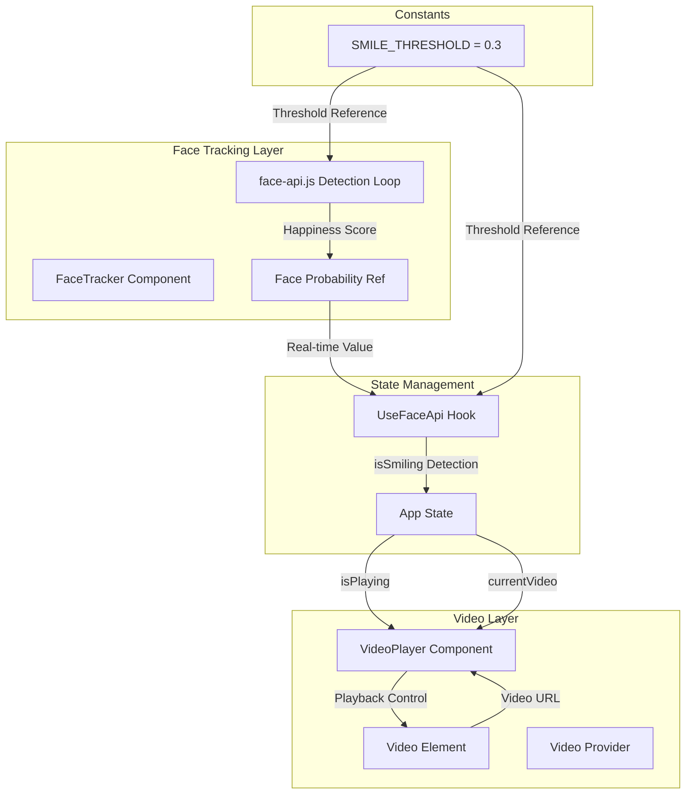
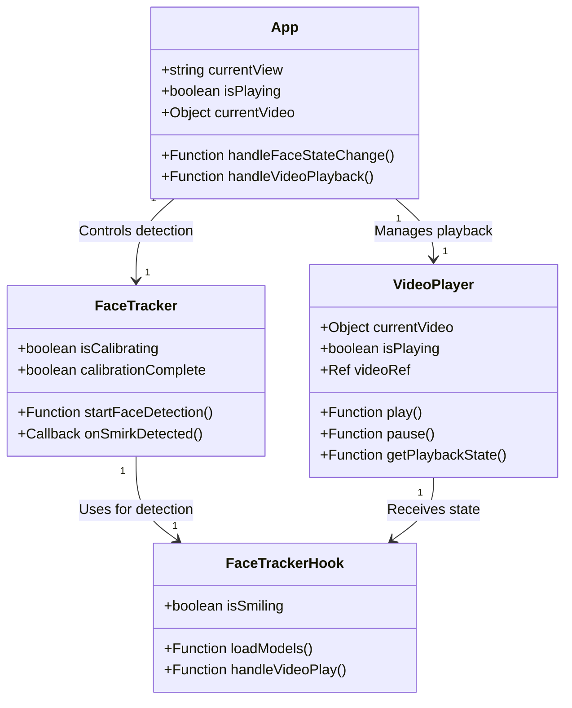
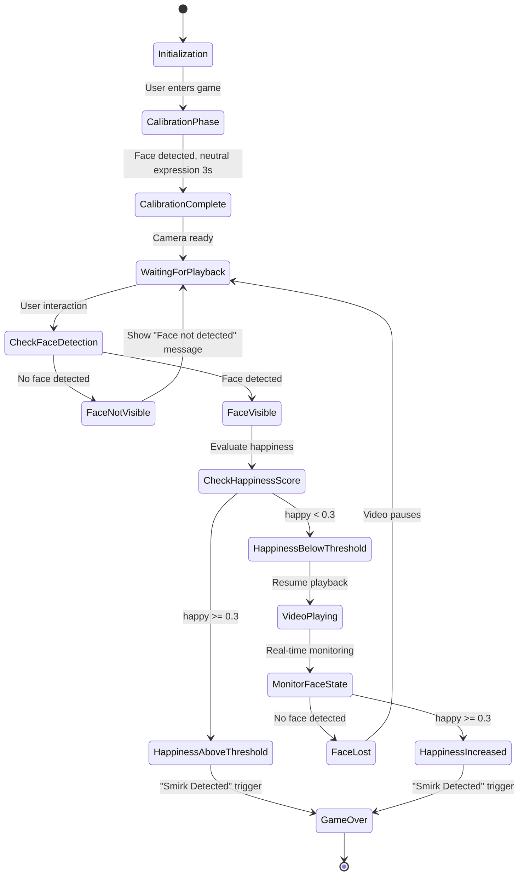
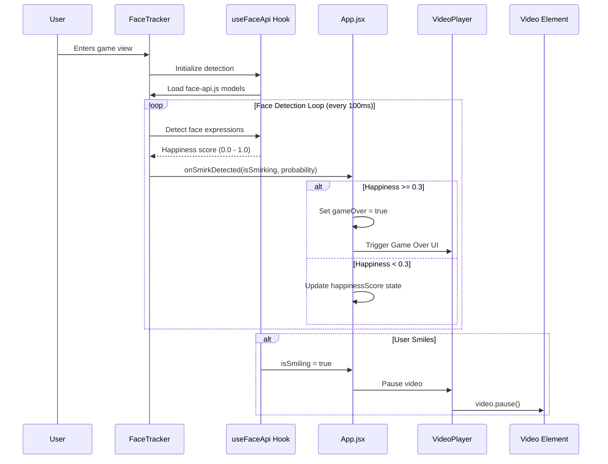

 # Smirkle Guardian Logic - Architecture Document

## Executive Summary

This document outlines the architecture for implementing **Guardian Logic**, which controls video playback based on real-time facial expression analysis. The video from the library is visible on the home screen but only plays when a face is detected AND the happiness score is below 0.3.

## 1. System Overview

### 1.1 Core Concept

```
┌─────────────────────────────────────────────────────────────────┐
│                    GUARDIAN LOGIC PRINCIPLE                      │
├─────────────────────────────────────────────────────────────────┤
│                                                                 │
│   VIDEO VISIBLE    →    FACE DETECTED    →    HAPPINESS < 0.3   │
│   (Paused State)        (Required)              (Required)      │
│                                                                 │
│   Only when ALL conditions are met does playback resume.        │
│   Any condition failure → Video PAUSES immediately              │
│                                                                 │
└─────────────────────────────────────────────────────────────────┘
```

### 1.2 Data Flow Architecture



## 2. Component Integration Architecture

### 2.1 Component Relationships



### 2.2 State Flow During Gameplay



## 3. State Management Design

### 3.1 App.jsx State Architecture

```javascript
// Current Implementation State
const [currentView, setCurrentView] = useState('game');
const [isSmiling, setIsSmiling] = useState(false);
const [isSmirking, setIsSmirking] = useState(false);
const [gameOver, setGameOver] = useState(false);
const [currentVideo, setCurrentVideo] = useState(null);

// Proposed Guardian State
const [isFaceDetected, setIsFaceDetected] = useState(false);
const [happinessScore, setHappinessScore] = useState(0);
const [isPlaying, setIsPlaying] = useState(false);  // NEW: Controlled by Guardian Logic
const [playbackPermission, setPlaybackPermission] = useState(false);  // NEW: Guardian permission
```

### 3.2 Guardian Logic State Machine

```javascript
// Guardian Logic Implementation Pattern
const GUARDIAN_STATES = {
    INITIALIZING: 'initializing',
    CALIBRATING: 'calibrating',
    WAITING_FOR_FACE: 'waiting_for_face',
    FACE_DETECTED: 'face_detected',
    PLAYBACK_PERMITTED: 'playback_permitted',
    PLAYBACK_ACTIVE: 'playback_active',
    GAME_OVER: 'game_over'
};

function guardianStateReducer(state, action) {
    switch (action.type) {
        case 'FACE_DETECTED':
            return {
                ...state,
                isFaceDetected: true,
                lastFaceDetectionTime: Date.now()
            };
        
        case 'FACE_LOST':
            return {
                ...state,
                isFaceDetected: false,
                playbackPermission: false
            };
        
        case 'HAPPINESS_UPDATE':
            const newHappiness = action.payload;
            const isPermitted = state.isFaceDetected && newHappiness < SMILE_THRESHOLD;
            
            return {
                ...state,
                happinessScore: newHappiness,
                playbackPermission: isPermitted
            };
        
        case 'START_PLAYBACK':
            return {
                ...state,
                isPlaying: state.playbackPermission,
                playbackStartedAt: Date.now()
            };
        
        case 'PAUSE_PLAYBACK':
            return {
                ...state,
                isPlaying: false,
                playbackPausedAt: Date.now()
            };
        
        case 'GAME_OVER':
            return {
                ...state,
                isPlaying: false,
                gameOver: true,
                finalHappinessScore: state.happinessScore
            };
        
        default:
            return state;
    }
}
```

### 3.3 FaceTracker to App.jsx Callback Architecture



## 4. VideoPlayer Integration Design

### 4.1 Props Interface

```typescript
// VideoPlayer Props (Current)
interface VideoPlayerProps {
    isSmiling: boolean;           // From useFaceApi hook
    videoRef: React.Ref;          // Shared video element
    currentVideo: Video | null;   // Current video object
    onVideoChange: Function;      // Callback on video change
    onResetHappiness: Function;   // Reset face-api state
}

// Proposed Enhanced Props
interface GuardianVideoPlayerProps {
    isSmiling: boolean;                    // Smile detected (pause trigger)
    isSmirking: boolean;                    // Smirk detected (game over)
    isFaceDetected: boolean;               // Face tracking status
    happinessScore: number;                 // Real-time happiness value
    isPlaying: boolean;                     // Guardian-controlled playback state
    playbackPermission: boolean;            // Guardian permission to play
    videoRef: React.Ref;
    currentVideo: Video | null;
    onVideoChange: Function;
    onPlaybackStateChange: Function;       // NEW: Notify App of playback changes
    onResetHappiness: Function;
}
```

### 4.2 Playback Control Logic

```javascript
// VideoPlayer.jsx - Enhanced Playback Control

function VideoPlayer({
    isSmiling,
    isSmirking,
    isFaceDetected,
    happinessScore,
    isPlaying,
    playbackPermission,
    videoRef: propVideoRef,
    currentVideo,
    onPlaybackStateChange,
    onResetHappiness
}) {
    const localVideoRef = useRef(null);
    const videoElement = propVideoRef || localVideoRef;
    
    // Guardian Logic: Control playback based on permission
    useEffect(() => {
        const video = videoElement.current;
        if (!video) return;
        
        // Playback is ONLY allowed when permission is granted
        if (playbackPermission && !isSmiling && !isSmirking) {
            if (video.paused) {
                video.play().catch(handleAutoplayBlock);
                onPlaybackStateChange?.('playing');
            }
        } else {
            // Pause immediately when conditions not met
            if (!video.paused) {
                video.pause();
                onPlaybackStateChange?.('paused');
            }
        }
    }, [playbackPermission, isSmiling, isSmirking, onPlaybackStateChange]);
    
    // Handle game over
    useEffect(() => {
        if (isSmirking) {
            const video = videoElement.current;
            if (video && !video.paused) {
                video.pause();
                onPlaybackStateChange?.('game_over');
            }
        }
    }, [isSmirking, onPlaybackStateChange]);
}
```

## 5. Implementation Checklist

### 5.1 App.jsx Modifications

| Task | Priority | Status |
|------|----------|--------|
| Add `isFaceDetected` state | High | ⬜ |
| Add `happinessScore` state | High | ⬜ |
| Add `isPlaying` state (Guardian-controlled) | High | ⬜ |
| Add `playbackPermission` state | High | ⬜ |
| Implement guardian state reducer | Medium | ⬜ |
| Update Navbar to show playback status | Low | ⬜ |

### 5.2 FaceTracker Modifications

| Task | Priority | Status |
|------|----------|--------|
| Add `onFaceDetected` callback | High | ⬜ |
| Add `onFaceLost` callback | High | ⬜ |
| Add `onHappinessUpdate` callback | High | ⬜ |
| Expose real-time probability via ref | Medium | ⬜ |
| Add face detection status indicator | Low | ⬜ |

### 5.3 VideoPlayer Modifications

| Task | Priority | Status |
|------|----------|--------|
| Add Guardian Logic useEffect | High | ⬜ |
| Add `onPlaybackStateChange` callback | High | ⬜ |
| Update UI for playback status | Medium | ⬜ |
| Add loading state for permission | Medium | ⬜ |
| Show "Waiting for face" overlay | Low | ⬜ |

### 5.4 Constants Updates

| Task | Priority | Status |
|------|----------|--------|
| Define GUARDIAN_STATES | High | ⬜ |
| Add PLAYBACK_TIMEOUT values | Medium | ⬜ |
| Add FACE_TIMEOUT values | Medium | ⬜ |

## 6. Data Flow Examples

### 6.1 Successful Playback Flow

```javascript
// 1. User enters game view
App.jsx: setCurrentView('game')

// 2. FaceTracker initializes and detects face
FaceTracker: onFaceDetected(true)
App.jsx: setIsFaceDetected(true)

// 3. FaceAPI returns low happiness score
FaceTracker: onHappinessUpdate(0.15)
App.jsx: setHappinessScore(0.15)

// 4. Guardian grants permission
Guardian Logic: playbackPermission = true
App.jsx: setIsPlaying(true)

// 5. VideoPlayer resumes playback
VideoPlayer: video.play()

// 6. Continuous monitoring
FaceTracker: onHappinessUpdate(0.12)
FaceTracker: onHappinessUpdate(0.18)
FaceTracker: onHappinessUpdate(0.08)
```

### 6.2 Game Over Flow

```javascript
// User smiles (happiness >= 0.3)
FaceTracker: onHappinessUpdate(0.35)
App.jsx: setIsSmiling(true)

// User smirks (happiness >= 0.3 for N consecutive frames)
FaceTracker: onSmirkDetected(true, 0.42)
App.jsx: setIsSmirking(true)
App.jsx: setGameOver(true)

// Guardian Logic
Guardian: playbackPermission = false
Guardian: isPlaying = false

// VideoPlayer pauses
VideoPlayer: video.pause()
VideoPlayer: Show "WASTED" overlay
```

### 6.3 Face Lost Flow

```javascript
// User leaves camera view
FaceTracker: onFaceLost()
App.jsx: setIsFaceDetected(false)

// Guardian revokes permission
Guardian Logic: playbackPermission = false
App.jsx: setIsPlaying(false)

// VideoPlayer pauses
VideoPlayer: video.pause()
VideoPlayer: Show "Face not detected" overlay
```

## 7. Performance Considerations

### 7.1 Optimization Strategies

```javascript
// 1. Batch State Updates
// Instead of multiple setState calls, batch them
const handleFaceUpdate = (detection) => {
    setState(prev => ({
        ...prev,
        isFaceDetected: detection.faceDetected,
        happinessScore: detection.happiness,
        lastUpdate: Date.now()
    }));
};

// 2. Use Refs for Animation Loop
// Avoid re-renders during detection loop
const happinessRef = useRef(0);
const detectionLoop = () => {
    happinessRef.current = detections[0].expressions.happy;
    requestAnimationFrame(detectionLoop);
};

// 3. Throttle State Updates
// Only update React state every 100ms, not every frame
const throttledSetHappiness = throttle((score) => {
    setHappinessScore(score);
}, 100);
```

### 7.2 Memory Management

```javascript
// Cleanup in useEffect
useEffect(() => {
    const animationId = requestAnimationFrame(detectionLoop);
    
    return () => {
        cancelAnimationFrame(animationId);
        throttledSetHappiness.cancel();
    };
}, []);
```

## 8. Error Handling

### 8.1 Face Detection Errors

```javascript
// In FaceTracker.jsx
try {
    const detections = await faceapi.detectAllFaces(
        videoRef.current,
        new faceapi.TinyFaceDetectorOptions()
    ).withFaceExpressions();
} catch (error) {
    if (error.name === 'NotSupportedError') {
        onError?.('Face detection not supported in this browser');
    } else if (error.name === 'QuotaExceededError') {
        onError?.('Camera quota exceeded. Please refresh.');
    } else {
        onError?.(`Detection error: ${error.message}`);
    }
}
```

### 8.2 Playback Errors

```javascript
// In VideoPlayer.jsx
const handleAutoplayBlock = (error) => {
    if (error.name === 'AutoplayError') {
        // User must interact with page first
        showOverlay({
            type: 'interaction_required',
            message: 'Tap to start video',
            action: () => {
                videoElement.current.play();
                hideOverlay();
            }
        });
    }
};
```

## 9. Testing Strategy

### 9.1 Unit Tests

```javascript
// Guardian Logic Tests
describe('Guardian Logic', () => {
    test('grants playback when face detected and happiness < 0.3', () => {
        const state = {
            isFaceDetected: true,
            happinessScore: 0.15
        };
        expect(shouldAllowPlayback(state)).toBe(true);
    });
    
    test('denies playback when no face detected', () => {
        const state = {
            isFaceDetected: false,
            happinessScore: 0.15
        };
        expect(shouldAllowPlayback(state)).toBe(false);
    });
    
    test('denies playback when happiness >= 0.3', () => {
        const state = {
            isFaceDetected: true,
            happinessScore: 0.35
        };
        expect(shouldAllowPlayback(state)).toBe(false);
    });
    
    test('triggers game over on smirk', () => {
        expect(isGameOver({ isSmirking: true })).toBe(true);
    });
});
```

### 9.2 Integration Tests

```javascript
// Full Playback Flow Test
test('complete playback flow', async () => {
    render(<App />);
    
    // User enters game
    fireEvent.click(screen.getByText('Start Game'));
    
    // Face is detected
    await waitFor(() => {
        expect(screen.getByText('Face Detected')).toBeInTheDocument();
    });
    
    // Video starts playing
    await waitFor(() => {
        expect(screen.getByTestId('video-player')).toHaveAttribute('data-playing', 'true');
    });
    
    // User smiles - video pauses
    fireEvent.mouseMove(screen.getByTestId('webcam'), { clientY: 100 });
    await waitFor(() => {
        expect(screen.getByTestId('video-player')).toHaveAttribute('data-playing', 'false');
    });
});
```

## 10. Summary

This architecture document provides a complete blueprint for implementing Guardian Logic in the Smirkle application. The key principles are:

1. **Defense in Depth**: Multiple conditions must be met for playback (face + low happiness)
2. **Real-time Response**: Face detection runs continuously at 100ms intervals
3. **State Machine Pattern**: Clear states for each phase of the gameplay
4. **Performance First**: Uses refs and throttling to avoid unnecessary re-renders
5. **Error Resilience**: Graceful handling of camera and detection errors

The implementation ensures a fair and responsive "Try Not to Laugh" challenge experience while maintaining smooth video playback when conditions are met.
