# Haptic Feedback Integration Plan for Smirkle

## Executive Summary

This document outlines the architectural design for integrating haptic feedback (device vibration) into the Smirkle "Try Not to Laugh" challenge app. The haptic feedback will be triggered when the Guardian Logic detects a smirk (happiness ≥ 0.3), providing immediate physical reinforcement to the user.

## Current Architecture Analysis

### Existing Detection Flow

```mermaid
flowchart TD
    A[FaceTracker.jsx] --> B[faceapi.detectAllFaces]
    B --> C{Detections > 0?}
    C -->|Yes| D[Extract expressions.happy]
    C -->|No| E[Continue Detection Loop]
    D --> F{happiness ≥ 0.3?}
    F -->|Yes| G[onSmirkDetected true]
    F -->|No| E
    G --> H[Parent Component Handles]
```



### Current State Management

- **FaceTracker.jsx**: Uses `requestAnimationFrame` for continuous detection loop (line 148)
- **Detection Threshold**: `expressions.happy > 0.3` (line 138)
- **Callback**: `onSmirkDetected(isSmirking)` propagates to parent

## Proposed Haptic Feedback Architecture

### 1. New useHapticFeedback Hook


### 2. Guardian Logic State Flow with Haptics

```mermaid
stateDiagram-v2
    [*] --> DetectionLoop
    DetectionLoop --> CheckHappiness: happy ≥ 0.3
    CheckHappiness --> TriggerHaptic: cooldown elapsed
    CheckHappiness --> ContinueDetection: cooldown active
    TriggerHaptic --> VibrationPattern: navigator.vibrate(50ms)
    VibrationPattern --> UpdateCooldown: timestamp = now
    UpdateCooldown --> ContinueDetection
    ContinueDetection --> DetectionLoop
```



### 3. Proposed Component Hierarchy


## Implementation Details

### A. New Hook: useHapticFeedback.js

```javascript
// src/hooks/useHapticFeedback.js
import { useCallback, useRef, useState } from 'react';

const VIBRATION_COOLDOWN_MS = 500; // Prevent feedback loop
const VIBRATION_PATTERN = [50, 50, 50]; // Sharp pulse pattern

export function useHapticFeedback() {
  const [isVibrationEnabled, setIsVibrationEnabled] = useState(true);
  const lastVibrationRef = useRef(0);
  const vibrationInProgressRef = useRef(false);

  const vibrate = useCallback((intensity = 0.3) => {
    // Check if vibration is supported and enabled
    if (!isVibrationEnabled || !navigator.vibrate) {
      return;
    }

    const now = Date.now();
    
    // Prevent feedback loop: cooldown check
    if (now - lastVibrationRef.current < VIBRATION_COOLDOWN_MS) {
      return;
    }

    // Prevent overlapping vibrations
    if (vibrationInProgressRef.current) {
      return;
    }

    // Mark vibration as in progress
    vibrationInProgressRef.current = true;
    lastVibrationRef.current = now;

    // Execute vibration pattern
    // Pattern: vibrate, pause, vibrate, pause, vibrate
    navigator.vibrate(VIBRATION_PATTERN);

    // Reset after pattern completes
    setTimeout(() => {
      vibrationInProgressRef.current = false;
    }, VIBRATION_PATTERN.reduce((a, b) => a + b, 0));
  }, [isVibrationEnabled]);

  const enableVibration = useCallback(() => {
    setIsVibrationEnabled(true);
  }, []);

  const disableVibration = useCallback(() => {
    setIsVibrationEnabled(false);
  }, []);

  const toggleVibration = useCallback(() => {
    setIsVibrationEnabled(prev => !prev);
  }, []);

  return {
    vibrate,
    isVibrationEnabled,
    enableVibration,
    disableVibration,
    toggleVibration
  };
}
```

### B. Modified useSmirkDetection Hook

```javascript
// src/hooks/useSmirkDetection.js
import { useState, useCallback, useRef } from 'react';
import { useHapticFeedback } from './useHapticFeedback';

export function useSmirkDetection(options = {}) {
  const {
    threshold = 0.3,
    onSmirkDetected,
    enableHaptics = true
  } = options;

  const [isSmirking, setIsSmirking] = useState(false);
  const [happinessScore, setHappinessScore] = useState(0);
  const smirkCountRef = useRef(0);
  const { vibrate, isVibrationEnabled } = useHapticFeedback();

  const handleDetection = useCallback((expressions) => {
    const score = expressions.happy || 0;
    setHappinessScore(score);

    const isNowSmirking = score >= threshold;

    // State transition: false -> true (smirk detected)
    if (isNowSmirking && !isSmirking) {
      smirkCountRef.current += 1;
      
      // Trigger haptic feedback if enabled
      if (enableHaptics && isVibrationEnabled) {
        vibrate(score);
      }

      // Call external callback
      if (onSmirkDetected) {
        onSmirkDetected({
          isSmirking: true,
          score,
          smirkCount: smirkCountRef.current,
          timestamp: Date.now()
        });
      }
    }

    setIsSmirking(isNowSmirking);
  }, [threshold, onSmirkDetected, enableHaptics, isSmirking, vibrate, isVibrationEnabled]);

  const resetSmirkCount = useCallback(() => {
    smirkCountRef.current = 0;
  }, []);

  return {
    isSmirking,
    happinessScore,
    smirkCount: smirkCountRef.current,
    handleDetection,
    resetSmirkCount
  };
}
```

### C. Modified FaceTracker.jsx

```javascript
// src/components/FaceTracker.jsx (lines 117-154 modified)

import { useSmirkDetection } from '../hooks/useSmirkDetection';

// Inside component:
const {
  isSmirking,
  happinessScore,
  handleDetection,
  smirkCount
} = useSmirkDetection({
  threshold: 0.3,
  onSmirkDetected: (data) => {
    // Log for debugging (remove in production)
    console.log('🤫 Smirk detected:', data);
    
    // Propagate to parent if needed
    if (onSmirkDetected) {
      onSmirkDetected(data);
    }
  },
  enableHaptics: isMobile // Only on mobile devices
});

// Replace detection loop (lines 117-154):
function startFaceDetection() {
  if (!videoRef.current || !isVideoReady) return;

  const detectFaces = async () => {
    if (!videoRef.current) return;

    try {
      const displaySize = {
        width: videoRef.current.videoWidth,
        height: videoRef.current.videoHeight
      };

      const detections = await faceapi.detectAllFaces(
        videoRef.current,
        new faceapi.TinyFaceDetectorOptions({ 
          inputSize: 320, 
          scoreThreshold: 0.5 
        })
      ).withFaceExpressions();

      // Process detections
      if (detections && detections.length > 0) {
        const expressions = detections[0].expressions;
        
        // Use centralized detection handler (includes haptics)
        handleDetection(expressions);
        
        // Original callback for backward compatibility
        const isSmirking = expressions.happy > 0.3;
        if (onSmirkDetected) {
          onSmirkDetected(isSmirking);
        }
      }
    } catch (err) {
      console.error('Face detection error:', err);
    }

    // Continue detection loop
    if (videoRef.current && !videoRef.current.paused) {
      animationRef.current = requestAnimationFrame(detectFaces);
    }
  };

  detectFaces();
}
```

## Performance Optimization Strategy

### 1. Vibration Debouncing

```javascript
// Cooldown prevents multiple rapid vibrations
const VIBRATION_COOLDOWN_MS = 500; // 500ms minimum between vibrations

// Use Ref to track without re-renders
const cooldownRef = useRef(0);

const triggerVibration = (score) => {
  const now = Date.now();
  if (now - cooldownRef.current >= VIBRATION_COOLDOWN_MS) {
    navigator.vibrate([50, 30, 50]); // Sharp pulse
    cooldownRef.current = now;
  }
};
```

### 2. Frame Skipping for Performance

```javascript
// Only check every N frames to reduce CPU load
const FRAME_SKIP = 2;
let frameCount = 0;

const detectFaces = async () => {
  frameCount++;
  
  if (frameCount % FRAME_SKIP !== 0) {
    // Skip this frame, continue loop
    animationRef.current = requestAnimationFrame(detectFaces);
    return;
  }
  
  // Perform detection...
};
```

### 3. Async Vibration to Avoid Blocking

```javascript
// Vibration is non-blocking but we use async pattern
const triggerVibrationAsync = async (pattern) => {
  // Navigator.vibrate is sync but we wrap for consistency
  return new Promise((resolve) => {
    if (navigator.vibrate) {
      navigator.vibrate(pattern);
    }
    // Use setTimeout to yield to event loop
    setTimeout(resolve, pattern.reduce((a, b) => a + b, 0));
  });
};
```

## Browser Compatibility & Fallback

### Feature Detection

```javascript
const checkVibrationSupport = () => {
  // Check if navigator.vibrate exists
  if (!('vibrate' in navigator)) {
    console.warn('Vibration API not supported on this device');
    return false;
  }
  
  // iOS Safari requires user interaction first
  // We'll handle this in the start game button
  
  return true;
};
```

### Fallback Strategy

| Platform | Support | Fallback |
|----------|---------|----------|
| Android | Full support | None needed |
| iOS Safari | 11.0+ (with user gesture) | Visual flash + sound |
| iOS WebView | Limited | Visual flash only |
| Desktop | Not supported | Visual indicators only |

### Graceful Degradation Hook

```javascript
// src/hooks/useHapticFallback.js
import { useState, useEffect } from 'react';

export function useHapticFallback() {
  const [hapticSupported, setHapticSupported] = useState(false);
  const [fallbackMode, setFallbackMode] = useState('none');

  useEffect(() => {
    const isSupported = 'vibrate' in navigator;
    setHapticSupported(isSupported);
    
    if (!isSupported) {
      setFallbackMode('visual');
    } else {
      // Check if iOS (needs gesture)
      const isIOS = /iPad|iPhone|iPod/.test(navigator.userAgent);
      if (isIOS) {
        setFallbackMode('delayed');
      }
    }
  }, []);

  const triggerFallback = useCallback((type = 'smirk') => {
    switch (fallbackMode) {
      case 'visual':
        // Trigger visual indicator
        document.body.classList.add('smirk-detected-flash');
        setTimeout(() => {
          document.body.classList.remove('smirk-detected-flash');
        }, 200);
        break;
      case 'delayed':
        // iOS: queue vibration for next interaction
        window.pendingVibration = true;
        break;
      default:
        break;
    }
  }, [fallbackMode]);

  return { hapticSupported, fallbackMode, triggerFallback };
}
```

## Anti-Feedback Loop Mechanisms

### 1. State-Based Debouncing

```javascript
// Prevent multiple rapid triggers
const SMIRK_DEBOUNCE_MS = 300;

function useSmirkDebounce(callback) {
  const timeoutRef = useRef(null);

  return useCallback((data) => {
    if (timeoutRef.current) {
      clearTimeout(timeoutRef.current);
    }

    timeoutRef.current = setTimeout(() => {
      callback(data);
    }, SMIRK_DEBOUNCE_MS);
  }, [callback]);
}
```

### 2. Consecutive Frame Requirement

```javascript
// Require N consecutive frames above threshold
const CONSECUTIVE_FRAMES_REQUIRED = 3;
let consecutiveFramesAboveThreshold = 0;

const checkSmirk = (expressions) => {
  const isAboveThreshold = expressions.happy >= 0.3;
  
  if (isAboveThreshold) {
    consecutiveFramesAboveThreshold++;
  } else {
    consecutiveFramesAboveThreshold = 0;
  }

  if (consecutiveFramesAboveThreshold >= CONSECUTIVE_FRAMES_REQUIRED) {
    triggerVibration();
    consecutiveFramesAboveThreshold = 0; // Reset
  }
};
```

## Testing Strategy

### Unit Tests

```javascript
// __tests__/useHapticFeedback.test.js
import { renderHook, act } from '@testing-library/react';
import { useHapticFeedback } from '../hooks/useHapticFeedback';

describe('useHapticFeedback', () => {
  beforeEach(() => {
    navigator.vibrate = jest.fn();
  });

  it('should vibrate when triggered', () => {
    const { result } = renderHook(() => useHapticFeedback());
    
    act(() => {
      result.current.vibrate(0.5);
    });

    expect(navigator.vibrate).toHaveBeenCalledWith([50, 50, 50]);
  });

  it('should respect cooldown period', () => {
    const { result } = renderHook(() => useHapticFeedback());
    
    act(() => {
      result.current.vibrate(0.5);
      result.current.vibrate(0.5);
    });

    // Should only vibrate once
    expect(navigator.vibrate).toHaveBeenCalledTimes(1);
  });

  it('should disable vibration when opted out', () => {
    const { result } = renderHook(() => useHapticFeedback());
    
    act(() => {
      result.current.disableVibration();
      result.current.vibrate(0.5);
    });

    expect(navigator.vibrate).not.toHaveBeenCalled();
  });
});
```

## Mobile-Specific Considerations

### 1. Battery Impact

- Vibration uses haptic motor (low power)
- Pattern `[50, 50, 50]` uses ~15mA for 150ms total
- Cooldown prevents excessive drain

### 2. Performance on Low-End Devices

```javascript
// Adaptive quality based on device performance
const useAdaptiveDetection = () => {
  const [performanceMode, setPerformanceMode] = useState('high');

  useEffect(() => {
    // Check device memory and CPU
    if (navigator.deviceMemory && navigator.deviceMemory < 4) {
      setPerformanceMode('low');
    }
  }, []);

  const getDetectionOptions = () => {
    switch (performanceMode) {
      case 'low':
        return { inputSize: 160, scoreThreshold: 0.7 }; // Faster, less accurate
      case 'high':
      default:
        return { inputSize: 320, scoreThreshold: 0.5 }; // Balanced
    }
  };

  return { performanceMode, getDetectionOptions };
};
```

## Implementation Checklist

- [ ] Create `useHapticFeedback` hook
- [ ] Create `useSmirkDetection` hook
- [ ] Modify `FaceTracker.jsx` to use new hooks
- [ ] Add iOS Safari user gesture handling
- [ ] Implement visual fallback for unsupported devices
- [ ] Add unit tests for hooks
- [ ] Add integration tests for end-to-end flow
- [ ] Document vibration patterns and thresholds
- [ ] Add accessibility considerations (opt-out option)

## References

- [MDN: Navigator.vibrate()](https://developer.mozilla.org/en-US/docs/Web/API/Navigator/vibrate)
- [face-api.js Documentation](https://justadudewhohacks.github.io/face-api.js/)
- [iOS Vibration Patterns](https://developer.apple.com/documentation/uikit/uifeedbackgenerator)
