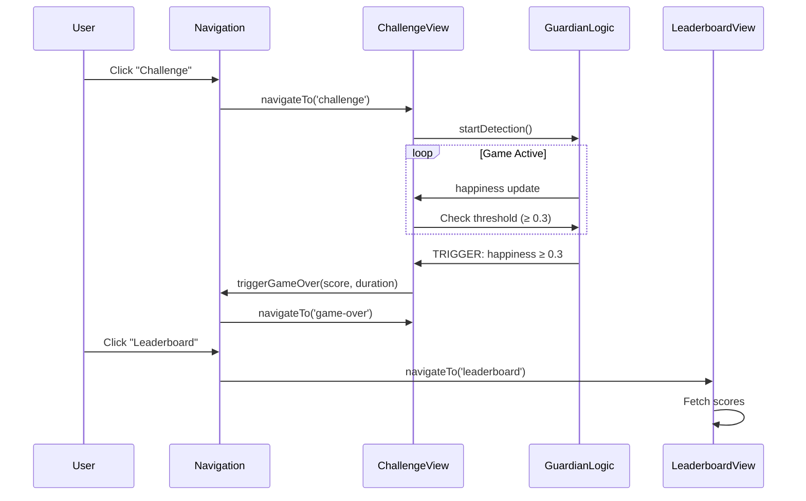

# Smirkle Navigation Architecture

## Overview
A top navigation menu system that allows users to toggle between three primary views: **Challenge**, **Leaderboard**, and **Submit Video**. The architecture is designed for the DeveloperWeek 2026 Hackathon with "Ship It" requirements in mind.

## State Management Strategy

### View State
```javascript
// useViewState hook state shape
{
  currentView: 'challenge' | 'leaderboard' | 'submit-video' | 'game-over',
  previousView: 'challenge' | 'leaderboard' | 'submit-video' | null,
  gameScore: number,
  gameDuration: number,
  isGameActive: boolean
}
```

### View Transition Rules
1. **Challenge → Game Over**: Triggered by Guardian Logic (happiness ≥ 0.3)
2. **Challenge → Leaderboard**: User-initiated via nav or after Game Over
3. **Leaderboard → Challenge**: User-initiated to start new game
4. **Submit Video → Challenge**: User-initiated after submission
5. **Game Over → Leaderboard**: User-initiated to view scores
6. **Game Over → Challenge**: User-initiated to retry

## Navigation Component Structure

```
src/components/
├── Navigation.jsx         # Top navigation bar
├── NavigationItem.jsx     # Individual nav button
├── ChallengeView.jsx     # Main game view
├── LeaderboardView.jsx    # Score display
└── SubmitVideoView.jsx   # Video submission form
```

### Navigation Component (Top Menu)
```jsx
// src/components/Navigation.jsx
import { useView } from '../hooks/useView';

export function Navigation() {
  const { currentView, navigateTo } = useView();
  
  const navItems = [
    { id: 'challenge', label: 'Challenge', icon: '🎯' },
    { id: 'leaderboard', label: 'Leaderboard', icon: '🏆' },
    { id: 'submit-video', label: 'Submit Video', icon: '📹' }
  ];
  
  return (
    <nav className="top-nav">
      <div className="nav-brand">SMIRKLE</div>
      <div className="nav-items">
        {navItems.map(item => (
          <NavigationItem
            key={item.id}
            {...item}
            isActive={currentView === item.id}
            onClick={() => navigateTo(item.id)}
          />
        ))}
      </div>
    </nav>
  );
}
```

### View Provider (State Management)
```jsx
// src/contexts/ViewContext.jsx
import { createContext, useContext, useState } from 'react';

const ViewContext = createContext();

export function ViewProvider({ children }) {
  const [state, setState] = useState({
    currentView: 'challenge',
    previousView: null,
    gameScore: 0,
    gameDuration: 0,
    isGameActive: false
  });
  
  const navigateTo = (view) => {
    setState(prev => ({
      ...prev,
      previousView: prev.currentView,
      currentView: view
    }));
  };
  
  const triggerGameOver = (score, duration) => {
    setState(prev => ({
      ...prev,
      currentView: 'game-over',
      gameScore: score,
      gameDuration: duration,
      isGameActive: false
    }));
  };
  
  const startGame = () => {
    setState(prev => ({
      ...prev,
      currentView: 'challenge',
      isGameActive: true,
      gameScore: 0
    }));
  };
  
  return (
    <ViewContext.Provider value={{ state, navigateTo, triggerGameOver, startGame }}>
      {children}
    </ViewContext.Provider>
  );
}

export const useView = () => useContext(ViewContext);
```

## Mermaid Diagram: View Transitions

```mermaid
stateDiagram-v2
    [*] --> Challenge: App Start
    
    state Challenge {
        [*] --> Playing
        Playing --> GameOver: Guardian Logic Trigger (happiness ≥ 0.3)
    }
    
    state Navigation {
        Challenge --> Leaderboard: User clicks Leaderboard
        Leaderboard --> Challenge: User clicks Challenge
        Challenge --> SubmitVideo: User clicks Submit Video
        SubmitVideo --> Challenge: After submission
    }
    
    state GameOver {
        [*] --> ScoreDisplay: Show final score
        ScoreDisplay --> Leaderboard: View Leaderboard
        ScoreDisplay --> Challenge: Retry Challenge
    }
    
    Leaderboard --> Challenge: Start New Game
```

## State Flow Sequence



## Implementation Checklist

- [ ] Create `src/contexts/ViewContext.jsx`
- [ ] Create `src/hooks/useView.js`
- [ ] Create `src/components/Navigation.jsx`
- [ ] Create `src/components/NavigationItem.jsx`
- [ ] Create `src/components/LeaderboardView.jsx`
- [ ] Create `src/components/SubmitVideoView.jsx`
- [ ] Wrap App with ViewProvider
- [ ] Add Navigation to App layout
- [ ] Implement view conditional rendering
- [ ] Connect Guardian Logic to triggerGameOver

## File Reference
- [`src/App.jsx`](src/App.jsx) - Main app with ViewProvider wrapper
- [`src/hooks/useFaceApi.js`](src/hooks/useFaceApi.js) - Face detection hook
- [`src/components/FaceTracker.jsx`](src/components/FaceTracker.jsx) - Guardian Logic component
