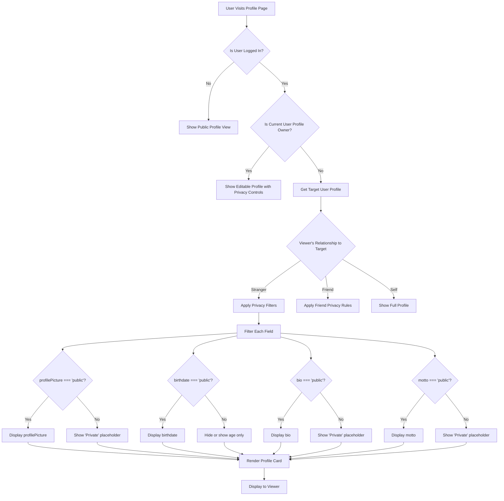
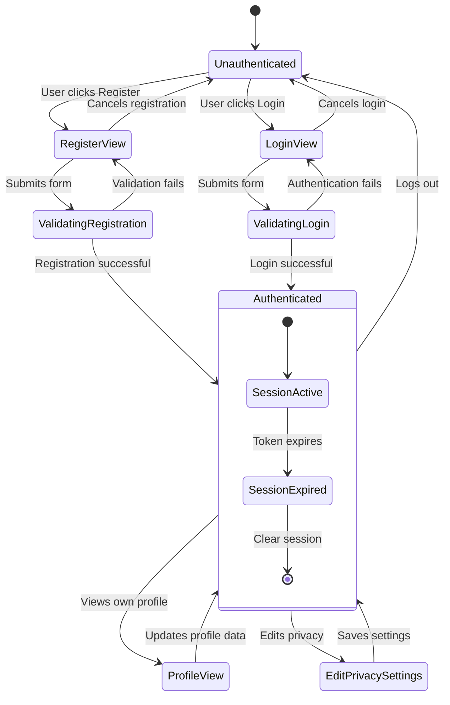

# Smirkle Profile Section Architecture

## 1. User Data Schema

### Core User Profile Type

```typescript
// src/types/user.ts

export type PrivacyLevel = 'public' | 'private';

export interface PrivacySettings {
  profilePicture: PrivacyLevel;
  birthdate: PrivacyLevel;
  bio: PrivacyLevel;
  motto: PrivacyLevel;
  showOnLeaderboard: PrivacyLevel;
  showStats: PrivacyLevel;
}

export interface UserProfile {
  id: string;
  username: string;
  email: string;
  profilePicture?: string;
  birthdate?: string; // ISO 8601 format: YYYY-MM-DD
  bio?: string;
  motto?: string;
  privacySettings: PrivacySettings;
  stats: UserStats;
  createdAt: string;
  lastLogin: string;
}

export interface UserStats {
  totalGames: number;
  totalSmirksDetected: number;
  totalSmilesDetected: number;
  bestSurvivalTime: number;
  averageSurvivalTime: number;
  achievements: Achievement[];
}

export interface Achievement {
  id: string;
  name: string;
  description: string;
  unlockedAt?: string;
  icon: string;
}
```

### Privacy Settings Object Structure

```typescript
// Default privacy settings for new users
export const defaultPrivacySettings: PrivacySettings = {
  profilePicture: 'public',
  birthdate: 'private', // Age is sensitive - show year only or private
  bio: 'public',
  motto: 'public',
  showOnLeaderboard: 'public',
  showStats: 'public'
};
```

### User Data Schema Example

```json
{
  "currentUser": {
    "id": "user_abc123",
    "username": "SmirkMaster99",
    "email": "user@example.com",
    "profilePicture": "https://api.smirkle.app/avatars/default.png",
    "birthdate": "1995-03-15",
    "bio": "Professional smirker. Try not to make me laugh! 😄",
    "motto": "Keep a straight face, win the game",
    "privacySettings": {
      "profilePicture": "public",
      "birthdate": "private",
      "bio": "public",
      "motto": "public",
      "showOnLeaderboard": "public",
      "showStats": "public"
    },
    "stats": {
      "totalGames": 42,
      "totalSmirksDetected": 15,
      "totalSmilesDetected": 127,
      "bestSurvivalTime": 45.23,
      "averageSurvivalTime": 12.45,
      "achievements": [
        {
          "id": "first_game",
          "name": "First Steps",
          "description": "Played your first game",
          "unlockedAt": "2024-01-15T10:30:00Z",
          "icon": "🎮"
        }
      ]
    },
    "createdAt": "2024-01-01T00:00:00Z",
    "lastLogin": "2024-03-15T10:30:00Z"
  }
}
```

## 2. Login/Register Flow with LocalStorage

### Authentication Service

```typescript
// src/services/authService.ts

const STORAGE_KEYS = {
  CURRENT_USER: 'smirkle_currentUser',
  SESSION_TOKEN: 'smirkle_sessionToken',
  USERS: 'smirkle_users_db'
};

// User registration
export async function registerUser(userData: {
  username: string;
  email: string;
  password: string;
  birthdate?: string;
}): Promise<UserProfile> {
  // Validate input
  validateRegistrationInput(userData);
  
  // Check if username/email already exists
  const existingUsers = getUsersFromStorage();
  if (existingUsers.find(u => u.email === userData.email)) {
    throw new Error('Email already registered');
  }
  if (existingUsers.find(u => u.username === userData.username)) {
    throw new Error('Username already taken');
  }
  
  // Create new user
  const newUser: UserProfile = {
    id: generateUserId(),
    username: userData.username,
    email: userData.email,
    profilePicture: undefined,
    birthdate: userData.birthdate,
    bio: undefined,
    motto: undefined,
    privacySettings: defaultPrivacySettings,
    stats: {
      totalGames: 0,
      totalSmirksDetected: 0,
      totalSmilesDetected: 0,
      bestSurvivalTime: 0,
      averageSurvivalTime: 0,
      achievements: []
    },
    createdAt: new Date().toISOString(),
    lastLogin: new Date().toISOString()
  };
  
  // Save to storage (in real app, this would be API call)
  saveUserToStorage(newUser, userData.password);
  
  // Auto-login after registration
  loginUser(userData.email, userData.password);
  
  return newUser;
}

// User login
export async function loginUser(email: string, password: string): Promise<UserProfile> {
  const users = getUsersFromStorage();
  const user = users.find(u => u.email === email);
  
  if (!user) {
    throw new Error('User not found');
  }
  
  // In real app, verify password hash
  // For LocalStorage demo, simple comparison
  const userWithCredentials = getUserWithCredentials(email, password);
  if (!userWithCredentials) {
    throw new Error('Invalid credentials');
  }
  
  // Update last login
  userWithCredentials.lastLogin = new Date().toISOString();
  updateUserInStorage(userWithCredentials);
  
  // Set as current user
  setCurrentUser(userWithCredentials);
  
  return userWithCredentials;
}

// Logout user
export function logoutUser(): void {
  localStorage.removeItem(STORAGE_KEYS.CURRENT_USER);
  localStorage.removeItem(STORAGE_KEYS.SESSION_TOKEN);
}

// Get current logged-in user
export function getCurrentUser(): UserProfile | null {
  const userData = localStorage.getItem(STORAGE_KEYS.CURRENT_USER);
  return userData ? JSON.parse(userData) : null;
}

// Check if user is authenticated
export function isAuthenticated(): boolean {
  return getCurrentUser() !== null;
}

// Update user profile
export async function updateUserProfile(updates: Partial<UserProfile>): Promise<UserProfile> {
  const currentUser = getCurrentUser();
  if (!currentUser) {
    throw new Error('No user logged in');
  }
  
  const updatedUser = {
    ...currentUser,
    ...updates,
    id: currentUser.id // Prevent ID changes
  };
  
  updateUserInStorage(updatedUser);
  setCurrentUser(updatedUser);
  
  return updatedUser;
}

// Update privacy settings
export async function updatePrivacySettings(settings: Partial<PrivacySettings>): Promise<UserProfile> {
  const currentUser = getCurrentUser();
  if (!currentUser) {
    throw new Error('No user logged in');
  }
  
  const updatedUser = {
    ...currentUser,
    privacySettings: {
      ...currentUser.privacySettings,
      ...settings
    }
  };
  
  updateUserInStorage(updatedUser);
  setCurrentUser(updatedUser);
  
  return updatedUser;
}

// Storage helper functions (simplified for LocalStorage)
function getUsersFromStorage(): UserProfile[] {
  const data = localStorage.getItem(STORAGE_KEYS.USERS);
  return data ? JSON.parse(data) : [];
}

function saveUserToStorage(user: UserProfile, password: string): void {
  const users = getUsersFromStorage();
  users.push({ ...user, password }); // Store password hash in real app
  localStorage.setItem(STORAGE_KEYS.USERS, JSON.stringify(users));
}

function getUserWithCredentials(email: string, password: string): UserProfile | null {
  const users = getUsersFromStorage();
  return users.find(u => u.email === email && u.password === password) || null;
}

function updateUserInStorage(user: UserProfile): void {
  const users = getUsersFromStorage();
  const index = users.findIndex(u => u.id === user.id);
  if (index !== -1) {
    users[index] = { ...users[index], ...user };
    localStorage.setItem(STORAGE_KEYS.USERS, JSON.stringify(users));
  }
}

function setCurrentUser(user: UserProfile): void {
  const safeUser = { ...user };
  delete (safeUser as any).password; // Never store password in session
  localStorage.setItem(STORAGE_KEYS.CURRENT_USER, JSON.stringify(safeUser));
}
```

## 3. Conditional Rendering Based on Privacy Toggles

### Mermaid Diagram: Profile Data Flow



### Mermaid Diagram: Login/Register State Flow



### Privacy Filter Hook

```typescript
// src/hooks/usePrivacyFilter.ts

import { useMemo } from 'react';
import { UserProfile, PrivacySettings } from '../types/user';

interface PrivacyFilteredProfile {
  profilePicture: string | null;
  birthdate: string | null;
  bio: string | null;
  motto: string | null;
  age?: number | null;
  isOwner: boolean;
}

export function usePrivacyFilter(
  profile: UserProfile | null,
  viewerId: string | null
): PrivacyFilteredProfile {
  return useMemo(() => {
    if (!profile) {
      return {
        profilePicture: null,
        birthdate: null,
        bio: null,
        motto: null,
        age: null,
        isOwner: false
      };
    }
    
    const isOwner = profile.id === viewerId;
    const settings = profile.privacySettings;
    
    // Calculate age from birthdate if public
    const age = settings.birthdate === 'public' && profile.birthdate
      ? calculateAge(profile.birthdate)
      : null;
    
    return {
      profilePicture: settings.profilePicture === 'public' || isOwner 
        ? profile.profilePicture 
        : null,
      birthdate: settings.birthdate === 'public' || isOwner 
        ? profile.birthdate 
        : null,
      bio: settings.bio === 'public' || isOwner 
        ? profile.bio 
        : null,
      motto: settings.motto === 'public' || isOwner 
        ? profile.motto 
        : null,
      age,
      isOwner
    };
  }, [profile, viewerId]);
}

function calculateAge(birthdate: string): number {
  const today = new Date();
  const birth = new Date(birthdate);
  let age = today.getFullYear() - birth.getFullYear();
  const monthDiff = today.getMonth() - birth.getMonth();
  
  if (monthDiff < 0 || (monthDiff === 0 && today.getDate() < birth.getDate())) {
    age--;
  }
  
  return age;
}
```

## 4. Profile Component Architecture

### Profile Page Component

```tsx
// src/components/Profile/ProfilePage.tsx

import React, { useState, useEffect } from 'react';
import { usePrivacyFilter } from '../../hooks/usePrivacyFilter';
import { getCurrentUser, logoutUser } from '../../services/authService';
import { UserProfile } from '../../types/user';
import ProfileCard from './ProfileCard';
import PrivacySettingsPanel from './PrivacySettingsPanel';
import EditProfileModal from './EditProfileModal';

export default function ProfilePage() {
  const [currentUser, setCurrentUser] = useState<UserProfile | null>(null);
  const [isEditing, setIsEditing] = useState(false);
  const [showPrivacySettings, setShowPrivacySettings] = useState(false);
  
  const filteredProfile = usePrivacyFilter(currentUser, currentUser?.id || null);
  
  useEffect(() => {
    const user = getCurrentUser();
    setCurrentUser(user);
  }, []);
  
  const handleLogout = () => {
    logoutUser();
    // Navigate to home or login page
  };
  
  if (!currentUser) {
    return (
      <div className="min-h-screen flex items-center justify-center">
        <div className="text-center">
          <h2 className="text-2xl font-bold mb-4">Please log in to view your profile</h2>
          <button className="bg-blue-500 text-white px-6 py-2 rounded-lg">
            Go to Login
          </button>
        </div>
      </div>
    );
  }
  
  return (
    <div className="min-h-screen pt-20 px-4 pb-8">
      <div className="max-w-4xl mx-auto">
        {/* Profile Header */}
        <div className="flex justify-between items-center mb-8">
          <h1 className="text-4xl font-bold bg-gradient-to-r from-blue-400 via-purple-500 to-pink-500 bg-clip-text text-transparent">
            My Profile
          </h1>
          <div className="flex gap-4">
            <button
              onClick={() => setShowPrivacySettings(true)}
              className="flex items-center gap-2 px-4 py-2 rounded-lg bg-white/10 hover:bg-white/20 transition-colors"
            >
              🔒 Privacy Settings
            </button>
            <button
              onClick={() => setIsEditing(true)}
              className="flex items-center gap-2 px-4 py-2 rounded-lg bg-blue-500 hover:bg-blue-600 transition-colors"
            >
              ✏️ Edit Profile
            </button>
            <button
              onClick={handleLogout}
              className="flex items-center gap-2 px-4 py-2 rounded-lg bg-red-500 hover:bg-red-600 transition-colors"
            >
              🚪 Logout
            </button>
          </div>
        </div>
        
        {/* Profile Card */}
        <ProfileCard 
          profile={currentUser}
          filteredProfile={filteredProfile}
        />
        
        {/* Modals */}
        {isEditing && (
          <EditProfileModal
            user={currentUser}
            onClose={() => setIsEditing(false)}
            onUpdate={(updatedUser) => {
              setCurrentUser(updatedUser);
              setIsEditing(false);
            }}
          />
        )}
        
        {showPrivacySettings && (
          <PrivacySettingsPanel
            user={currentUser}
            onClose={() => setShowPrivacySettings(false)}
          />
        )}
      </div>
    </div>
  );
}
```

### Privacy Settings Panel Component

```tsx
// src/components/Profile/PrivacySettingsPanel.tsx

import React, { useState } from 'react';
import { updatePrivacySettings } from '../../services/authService';
import { UserProfile, PrivacySettings } from '../../types/user';

interface PrivacySettingsPanelProps {
  user: UserProfile;
  onClose: () => void;
}

export default function PrivacySettingsPanel({ user, onClose }: PrivacySettingsPanelProps) {
  const [settings, setSettings] = useState<PrivacySettings>(user.privacySettings);
  const [isSaving, setIsSaving] = useState(false);
  
  const handleToggle = (field: keyof PrivacySettings) => {
    setSettings(prev => ({
      ...prev,
      [field]: prev[field] === 'public' ? 'private' : 'public'
    }));
  };
  
  const handleSave = async () => {
    setIsSaving(true);
    try {
      await updatePrivacySettings(settings);
      onClose();
    } catch (error) {
      console.error('Failed to save privacy settings:', error);
    } finally {
      setIsSaving(false);
    }
  };
  
  const privacyFields = [
    { key: 'profilePicture', label: 'Profile Picture', icon: '📷' },
    { key: 'birthdate', label: 'Birthdate', icon: '🎂' },
    { key: 'bio', label: 'Bio', icon: '📝' },
    { key: 'motto', label: 'Motto', icon: '✨' },
    { key: 'showOnLeaderboard', label: 'Show on Leaderboard', icon: '🏆' },
    { key: 'showStats', label: 'Show Statistics', icon: '📊' }
  ] as const;
  
  return (
    <div className="fixed inset-0 z-50 flex items-center justify-center bg-black/50 backdrop-blur-sm">
      <div className="bg-gray-900 rounded-2xl p-6 max-w-md w-full mx-4 border border-white/10">
        <div className="flex justify-between items-center mb-6">
          <h2 className="text-2xl font-bold text-white">Privacy Settings</h2>
          <button 
            onClick={onClose}
            className="text-gray-400 hover:text-white transition-colors"
          >
            ✕
          </button>
        </div>
        
        <div className="space-y-4">
          {privacyFields.map(({ key, label, icon }) => (
            <div 
              key={key}
              className="flex items-center justify-between p-4 rounded-xl bg-white/5 border border-white/10"
            >
              <div className="flex items-center gap-3">
                <span className="text-xl">{icon}</span>
                <span className="text-white font-medium">{label}</span>
              </div>
              
              <button
                onClick={() => handleToggle(key)}
                className={`
                  relative inline-flex h-6 w-11 items-center rounded-full transition-colors
                  ${settings[key] === 'public' ? 'bg-green-500' : 'bg-red-500'}
                `}
              >
                <span
                  className={`
                    inline-block h-4 w-4 transform rounded-full bg-white transition-transform
                    ${settings[key] === 'public' ? 'translate-x-6' : 'translate-x-1'}
                  `}
                />
              </button>
            </div>
          ))}
        </div>
        
        <div className="mt-6 flex gap-4">
          <button
            onClick={onClose}
            className="flex-1 py-3 rounded-xl bg-white/10 text-white font-medium hover:bg-white/20 transition-colors"
          >
            Cancel
          </button>
          <button
            onClick={handleSave}
            disabled={isSaving}
            className="flex-1 py-3 rounded-xl bg-gradient-to-r from-blue-500 to-purple-500 text-white font-medium hover:opacity-90 transition-opacity disabled:opacity-50"
          >
            {isSaving ? 'Saving...' : 'Save Changes'}
          </button>
        </div>
      </div>
    </div>
  );
}
```

## 5. Implementation Recommendations

### Priority Order for Implementation

1. **Phase 1: Core Infrastructure**
   - Define TypeScript types for UserProfile and PrivacySettings
   - Implement authService with LocalStorage persistence
   - Create usePrivacyFilter hook
   
2. **Phase 2: UI Components**
   - Build ProfileCard component
   - Create PrivacySettingsPanel with toggle switches
   - Implement EditProfileModal
   
3. **Phase 3: Integration**
   - Add Profile option to Navbar
   - Integrate auth flow into App.jsx
   - Add profile routes to navigation

### Security Considerations for Production

- **Never store passwords in LocalStorage** - Use sessionStorage or memory for tokens
- **Implement proper password hashing** - Use bcrypt or similar
- **Add CSRF protection** - For any future API calls
- **Implement session timeout** - Auto-logout after inactivity
- **Add rate limiting** - Prevent brute force attacks on login

### Performance Optimizations

- **Lazy load profile components** - Only load when needed
- **Memoize privacy filters** - Prevent unnecessary re-renders
- **Debounce privacy setting saves** - Reduce LocalStorage writes
- **Cache user data** - Reduce repeated storage access

### Future Enhancements

- **Social login integration** - Google, Facebook OAuth
- **Profile picture upload** - With cloud storage (S3, Cloudinary)
- **Achievement system** - Gamify the privacy features
- **Friend system** - Different privacy levels for friends vs strangers
- **Activity log** - Show who viewed your profile

---

*Document Version: 1.0*
*Last Updated: 2024-03-15*
*Author: Smirkle Architecture Team*
