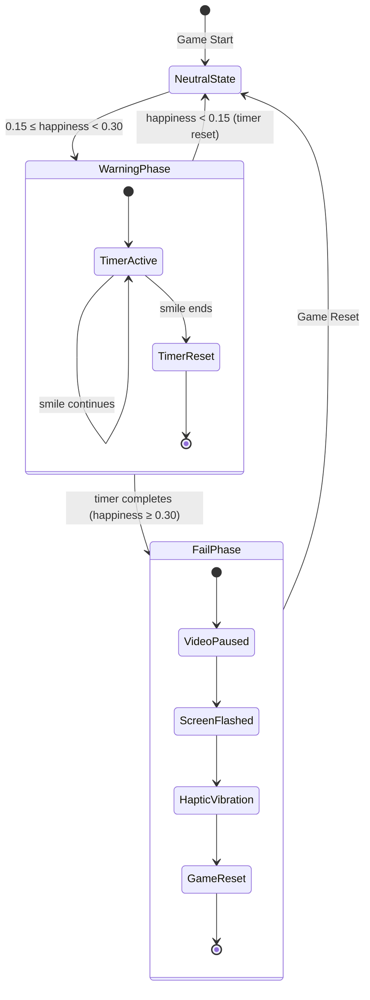
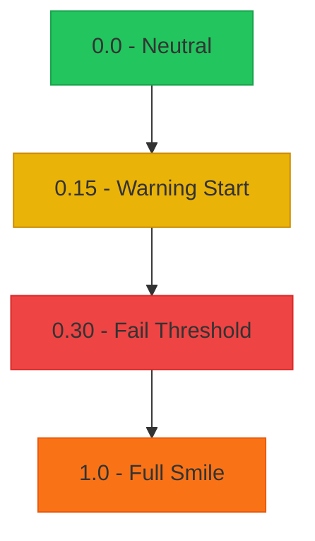
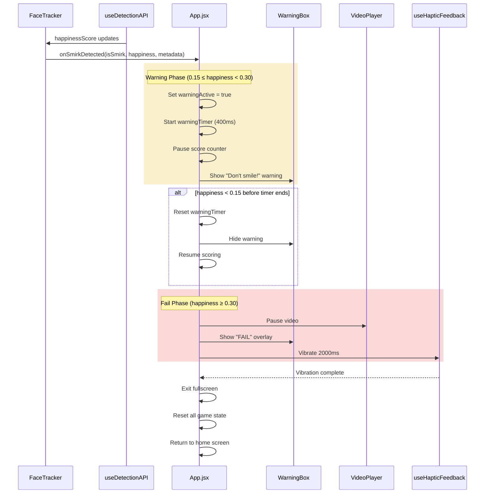
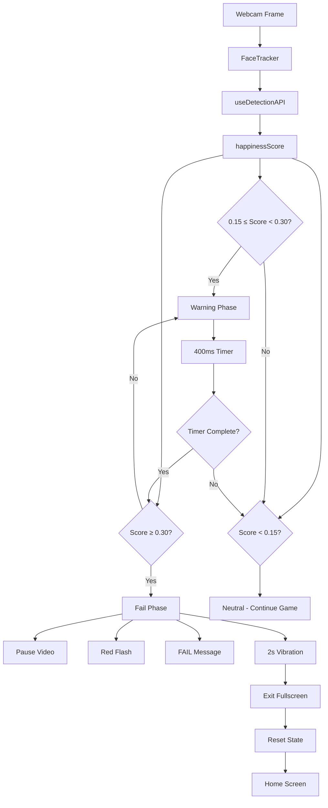

# Two-Stage Smile Detection Architecture

## Overview

This document describes the two-stage smile detection system for Smirkle's "Try Not to Laugh" challenge. The system provides a graduated warning mechanism before triggering game over, giving players a chance to recover from partial smiles.

## Current State Analysis

### Existing Components
- **[`constants.js`](src/utils/constants.js)**: Already has `NEUTRAL_EXPRESSION_THRESHOLD = 0.15` and `SMILE_THRESHOLD = 0.3`
- **[`FaceTracker.jsx`](src/components/FaceTracker.jsx:341-366)**: Handles detection via `useDetectionAPI` hook, calls `onSmirkDetected` callback
- **[`VideoPlayer.jsx`](src/components/VideoPlayer.jsx:151-174)**: Already has `isSmiling` prop that pauses video
- **[`WarningBox.jsx`](src/components/WarningBox.jsx)**: Existing warning component with `faceNotCentered`, `eyesClosed`, `lowLight` types

### Required Additions
- **New constants**: `SMILE_FAIL_THRESHOLD` and `SMILE_WARNING_DURATION`
- **New state variables**: `warningActive`, `warningTimer`, `smileFailTimer`
- **New WarningBox type**: `smiling` for smile warnings
- **Enhanced FaceTracker**: Two-stage detection logic
- **Enhanced VideoPlayer**: Support for warning overlay rendering

---

## State Flow Diagram



---

## Happiness Threshold Zones



| Range | Zone | Behavior |
|-------|------|----------|
| `0.0 - 0.15` | Neutral | Normal gameplay, scoring active |
| `0.15 - 0.30` | Warning | Score paused, warning overlay shown, 400ms timer starts |
| `≥ 0.30` | Fail | Video paused, red flash, "FAIL" message, haptic vibration, game reset |

---

## Component Integration Diagram



---

## New Constants to Add

### File: [`src/utils/constants.js`](src/utils/constants.js)

```javascript
// ===========================
// Smile Detection Settings (ADD)
// ===========================

/**
 * Happiness threshold for smile fail detection
 * Values >= 0.30 trigger the fail phase after warning duration
 * Mirrors SMILE_THRESHOLD for backward compatibility
 */
export const SMILE_FAIL_THRESHOLD = 0.30;

/**
 * Duration of warning phase before fail triggers
 * 400ms provides balance between responsiveness and fairness
 */
export const SMILE_WARNING_DURATION = 400; // milliseconds

/**
 * Minimum consecutive frames required in warning zone before timer starts
 * Prevents flickering from momentary expressions
 */
export const WARNING_ENTRY_FRAMES = 2;
```

---

## New State Variables

### File: [`src/App.jsx`](src/App.jsx)

```javascript
// Add to game state
const [warningActive, setWarningActive] = useState(false);
const [warningTimer, setWarningTimer] = useState(null);
const [smileFailTimer, setSmileFailTimer] = useState(null);
const [isFailPhase, setIsFailPhase] = useState(false);
```

---

## WarningBox Enhancement

### File: [`src/components/WarningBox.jsx`](src/components/WarningBox.jsx)

Add new warning type:

```javascript
// Add to defaultMessages
const defaultMessages = {
  // ... existing types
  smiling: "Don't smile!"
};

// Add to icons
const icons = {
  // ... existing icons
  smiling: (
    <svg className="w-6 h-6" fill="none" viewBox="0 0 24 24" stroke="currentColor">
      <path strokeLinecap="round" strokeLinejoin="round" strokeWidth={2} 
        d="M14.828 14.828a4 4 0 01-5.656 0M9 10h.01M15 10h.01M21 12a9 9 0 11-18 0 9 9 0 0118 0z" />
    </svg>
  )
};

// Add to bgColors
const bgColors = {
  // ... existing colors
  smiling: 'from-yellow-400/90 to-orange-400/90'
};

// Add to borderColors
const borderColors = {
  // ... existing borders
  smiling: 'border-yellow-300'
};
```

---

## FaceTracker Integration

### File: [`src/components/FaceTracker.jsx`](src/components/FaceTracker.jsx)

The `onSmirkDetected` callback should be enhanced to pass warning state:

```javascript
// Existing callback (lines 353-358)
if (onSmirkDetected && lastDetection.is_smirk !== undefined) {
  onSmirkDetected(lastDetection.is_smirk, lastDetection.happiness || 0, {
    consecutiveFrames: consecutiveSmirkCount,
    requiredFrames: CONSECUTIVE_FRAMES_REQUIRED,
    gameOver: isGameOver,
    // NEW: Pass warning zone info
    inWarningZone: lastDetection.happiness >= NEUTRAL_EXPRESSION_THRESHOLD 
                  && lastDetection.happiness < SMILE_FAIL_THRESHOLD
  });
}
```

---

## Two-Stage Detection Logic

### File: [`src/App.jsx`](src/App.jsx)

```javascript
// Main detection handler
const handleSmirkDetected = useCallback((isSmirk, happiness, metadata) => {
  // Stage 1: Warning Phase Check
  if (happiness >= NEUTRAL_EXPRESSION_THRESHOLD && happiness < SMILE_FAIL_THRESHOLD) {
    if (!warningActive) {
      // Enter warning phase
      setWarningActive(true);
      
      // Start warning timer
      const timer = setTimeout(() => {
        // Timer completed - check if still smiling
        if (happiness >= SMILE_FAIL_THRESHOLD) {
          triggerFailPhase();
        } else {
          // Recovered during warning
          setWarningActive(false);
        }
      }, SMILE_WARNING_DURATION);
      
      setWarningTimer(timer);
    }
    return; // Don't trigger smirk yet
  }
  
  // Player recovered to neutral
  if (happiness < NEUTRAL_EXPRESSION_THRESHOLD && warningActive) {
    clearTimeout(warningTimer);
    setWarningActive(false);
    setWarningTimer(null);
    return;
  }
  
  // Stage 2: Fail Phase - Smirk detected after warning
  if (isSmirk && warningActive) {
    clearTimeout(warningTimer);
    triggerFailPhase();
    return;
  }
  
  // Normal smirk detection (immediate fail without warning)
  if (isSmirk && !warningActive) {
    triggerFailPhase();
  }
}, [warningActive, warningTimer]);

// Fail Phase Handler
const triggerFailPhase = useCallback(() => {
  setIsFailPhase(true);
  
  // Pause video immediately
  if (onVideoPause) {
    onVideoPause(true);
  }
  
  // Haptic feedback (2 seconds)
  if (hapticEnabled) {
    vibrate(2000);
  }
  
  // After vibration completes
  setTimeout(() => {
    // Exit fullscreen
    if (onExitFullscreen) {
      onExitFullscreen();
    }
    
    // Reset all game state
    resetGameState();
    
    // Return to home screen
    navigate('/');
  }, 2000);
}, [hapticEnabled, vibrate, onVideoPause, onExitFullscreen, navigate]);

// Reset Game State
const resetGameState = useCallback(() => {
  setScore(0);
  setCalibrationComplete(false);
  setFaceDetected(false);
  setEyesOpen(false);
  setNotSmiling(true);
  setModelsLoaded(false);
  setCameraReady(false);
  setWarningActive(false);
  setWarningTimer(null);
  setSmileFailTimer(null);
  setIsFailPhase(false);
}, []);
```

---

## VideoPlayer Enhancement

### File: [`src/components/VideoPlayer.jsx`](src/components/VideoPlayer.jsx)

Add warning overlay support:

```javascript
// Add props
function VideoPlayer({ 
  // ... existing props
  warningActive = false,
  failPhase = false,
  onRequestFullscreenExit
}) {
  // ... existing code
  
  return (
    <div ref={fullscreenContainerRef} className="relative w-full h-full overflow-hidden">
      {/* Main video element */}
      <video ... />
      
      {/* Warning Overlay */}
      {warningActive && (
        <div className="absolute inset-0 bg-yellow-500/20 pointer-events-none z-20" />
      )}
      
      {/* Fail Overlay */}
      {failPhase && (
        <div className="absolute inset-0 bg-red-600/80 pointer-events-none z-30 flex items-center justify-center">
          <h1 className="text-6xl font-bold text-white">FAIL</h1>
        </div>
      )}
      
      {/* ... existing UI */}
    </div>
  );
}
```

---

## Data Flow Summary



---

## Implementation Checklist

- [ ] Add `SMILE_FAIL_THRESHOLD` and `SMILE_WARNING_DURATION` to [`constants.js`](src/utils/constants.js)
- [ ] Add `smiling` type to [`WarningBox.jsx`](src/components/WarningBox.jsx)
- [ ] Add warning state variables to [`App.jsx`](src/App.jsx)
- [ ] Implement `handleSmirkDetected` with two-stage logic in [`App.jsx`](src/App.jsx)
- [ ] Implement `triggerFailPhase` with haptic feedback in [`App.jsx`](src/App.jsx)
- [ ] Implement `resetGameState` function in [`App.jsx`](src/App.jsx)
- [ ] Add warning and fail overlays to [`VideoPlayer.jsx`](src/components/VideoPlayer.jsx)
- [ ] Update [`FaceTracker.jsx`](src/components/FaceTracker.jsx) to pass `inWarningZone` metadata
- [ ] Add haptic feedback integration with [`useHapticFeedback`](src/hooks/useHapticFeedback.js)
- [ ] Test warning phase timeout behavior
- [ ] Test fail phase vibration and reset flow
