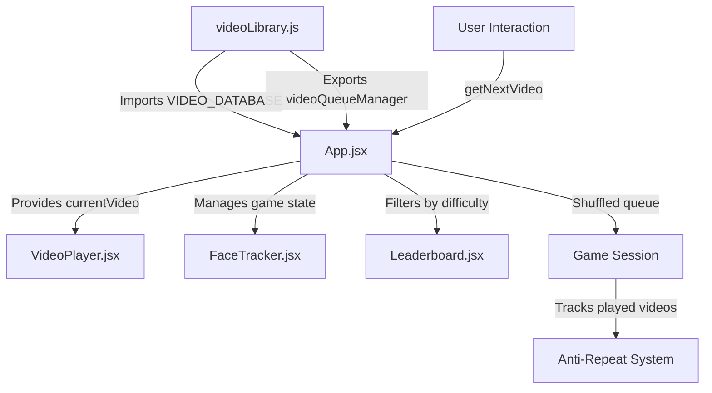
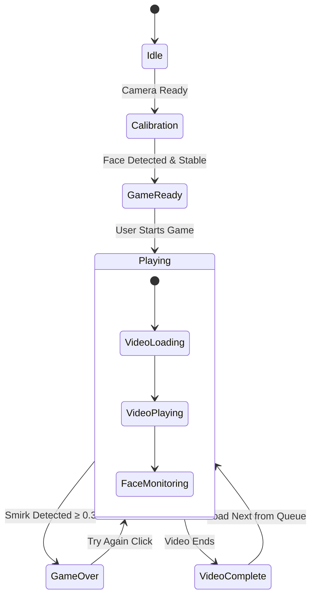
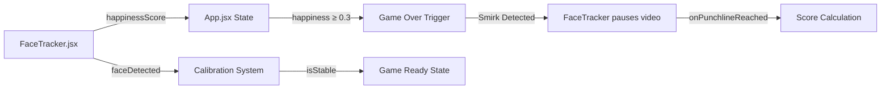

# Smirkle Video Library Architecture

## Executive Summary

This document outlines the centralized data management system for the Smirkle "Try Not to Laugh" challenge application. The system provides a scalable, maintainable approach to video content delivery with anti-repeat gameplay mechanics and real-time content filtering capabilities.

## 1. Updated VIDEO_DATABASE Schema

### 1.1 Core Schema Definition

```javascript
/**
 * Smirkle Video Library - Centralized Data Management
 * 
 * Schema: { id, title, url, difficulty, tags, previewImage, punchlineTimestamp }
 * Difficulty levels: Easy, Medium, Hard
 * punchlineTimestamp: Time in seconds where the "punchline" occurs (for score timing)
 */

export const VIDEO_DATABASE = [
  {
    id: 'video_001',
    title: 'Funny Cat Jumps',
    url: 'https://videos.pexels.com/video-files/4025164/4025164-uhd_2560_1440_25fps.mp4',
    difficulty: 'Easy',
    tags: ['animals', 'cats', 'comedy', 'pets'],
    previewImage: 'https://images.pexels.com/videos/4025164/free-video-4025164.jpg?auto=compress&cs=tinysrgb&dpr=1&w=500',
    punchlineTimestamp: 8.5
  },
  {
    id: 'video_002',
    title: 'Comedy Club Performance',
    url: 'https://videos.pexels.com/video-files/856973/856973-uhd_2560_1440_25fps.mp4',
    difficulty: 'Medium',
    tags: ['stand-up', 'comedy', 'adult', 'live'],
    previewImage: 'https://images.pexels.com/videos/856973/free-video-856973.jpg?auto=compress&cs=tinysrgb&dpr=1&w=500',
    punchlineTimestamp: 15.2
  },
  {
    id: 'video_003',
    title: 'Stand-up Comedy Special',
    url: 'https://videos.pexels.com/video-files/855070/855070-uhd_2560_1440_25fps.mp4',
    difficulty: 'Hard',
    tags: ['stand-up', 'comedy', 'special', 'professional'],
    previewImage: 'https://images.pexels.com/videos/855070/free-video-855070.jpg?auto=compress&cs=tinysrgb&dpr=1&w=500',
    punchlineTimestamp: 22.8
  }
];
```

### 1.2 Field Specifications

| Field | Type | Required | Description |
|-------|------|----------|-------------|
| `id` | string | Yes | Unique identifier (format: `video_XXX`) |
| `title` | string | Yes | Human-readable video title |
| `url` | string | Yes | Direct MP4 URL for streaming |
| `difficulty` | enum | Yes | 'Easy', 'Medium', or 'Hard' |
| `tags` | string[] | Yes | Array of content categories |
| `previewImage` | string | Yes | Thumbnail URL for gallery views |
| `punchlineTimestamp` | number | Yes | Seconds into video where laugh trigger occurs |

### 1.3 TypeScript Interface (Future Enhancement)

```typescript
interface VideoEntry {
  id: string;
  title: string;
  url: string;
  difficulty: 'Easy' | 'Medium' | 'Hard';
  tags: string[];
  previewImage: string;
  punchlineTimestamp: number;
}
```

## 2. Data Flow Architecture

### 2.1 Component Data Flow Diagram



### 2.2 State Transition Diagram



## 3. App.jsx Integration Pattern

### 3.1 Import Strategy

```javascript
// src/App.jsx
import React, { useState, useEffect, useRef, useCallback } from 'react';
import { 
  VIDEO_DATABASE, 
  videoQueueManager, 
  getVideosByDifficulty,
  getVideoById,
  DIFFICULTY 
} from './data/videoLibrary.js';
```

### 3.2 State Management for Video Content

```javascript
// Video Library State in App.jsx
const [currentVideo, setCurrentVideo] = useState(null);
const [availableVideos, setAvailableVideos] = useState(VIDEO_DATABASE);
const [filteredByDifficulty, setFilteredByDifficulty] = useState(null);

// Initialize video queue on game start
useEffect(() => {
  if (currentView === 'game' && !currentVideo) {
    const nextVideo = videoQueueManager.getNextVideo();
    setCurrentVideo(nextVideo);
  }
}, [currentView, currentVideo]);

// Filter videos by difficulty for difficulty selection UI
const handleDifficultyFilter = (difficulty) => {
  const filtered = getVideosByDifficulty(difficulty);
  setFilteredByDifficulty(filtered);
  setAvailableVideos(filtered);
};
```

### 3.3 Video Queue Integration

```javascript
// Anti-repeat queue management
const handleResume = () => {
  // Reset game state
  setIsSmirking(false);
  setGameOver(false);
  setSurvivalTime(0);
  
  // Get next unplayed video
  const nextVideo = videoQueueManager.getNextVideo();
  setCurrentVideo(nextVideo);
  
  // Start video playback
  if (videoRef.current) {
    videoRef.current.src = nextVideo.url;
    videoRef.current.play();
  }
};
```

## 4. VideoPlayer.jsx Integration Pattern

### 4.1 Props Interface

```javascript
// src/components/VideoPlayer.jsx
function VideoPlayer({ 
  currentVideo, 
  videoRef, 
  onPunchlineReached,
  isPaused = false 
}) {
  // Implementation
}
```

### 4.2 Enhanced Video Player with Punchline Support

```javascript
import React, { useEffect, useRef } from 'react';

function VideoPlayer({ currentVideo, videoRef, onPunchlineReached, isPaused = false }) {
  const localVideoRef = useRef(null);
  const videoElement = videoRef || localVideoRef;
  const punchlineReachedRef = useRef(false);

  // Get full video data from currentVideo prop
  const videoSrc = currentVideo?.url || null;
  const punchlineTimestamp = currentVideo?.punchlineTimestamp || 0;

  // Handle video source changes
  useEffect(() => {
    const video = videoElement.current;
    if (video && videoSrc) {
      punchlineReachedRef.current = false;
      video.load();
      video.play().catch(e => console.log('Autoplay blocked:', e));
    }
  }, [currentVideo]);

  // Monitor punchline timestamp
  useEffect(() => {
    const video = videoElement.current;
    if (!video || !punchlineTimestamp) return;

    const checkPunchline = () => {
      if (!punchlineReachedRef.current && video.currentTime >= punchlineTimestamp) {
        punchlineReachedRef.current = true;
        onPunchlineReached?.(currentVideo);
      }
    };

    video.addEventListener('timeupdate', checkPunchline);
    return () => video.removeEventListener('timeupdate', checkPunchline);
  }, [punchlineTimestamp, currentVideo, onPunchlineReached]);

  // Pause/play control
  useEffect(() => {
    const video = videoElement.current;
    if (video) {
      isPaused ? video.pause() : video.play();
    }
  }, [isPaused]);

  return (
    <video
      ref={videoElement}
      className="w-full h-full object-cover"
      autoPlay
      playsInline
      muted={false}
      src={videoSrc}
    />
  );
}

export default VideoPlayer;
```

## 5. VideoQueueManager Anti-Repeat Algorithm

### 5.1 Queue Management Class

```javascript
/**
 * VideoQueueManager - Anti-Repeat Queue System
 * Uses Fisher-Yates shuffle for unbiased randomization
 * Tracks played videos per session to prevent repeats
 */
export class VideoQueueManager {
  constructor(videoDatabase = VIDEO_DATABASE) {
    this.allVideos = videoDatabase;
    this.playedVideos = new Set();      // Track played IDs
    this.currentQueue = [];             // Shuffled queue
    this.sessionId = Date.now();        // Session identifier
  }

  /**
   * Generates a shuffled queue excluding already played videos
   * Uses Fisher-Yates shuffle algorithm - O(n) complexity
   */
  generateShuffledQueue() {
    const availableVideos = this.allVideos.filter(
      video => !this.playedVideos.has(video.id)
    );
    
    // Fisher-Yates shuffle
    const shuffled = [...availableVideos];
    for (let i = shuffled.length - 1; i > 0; i--) {
      const j = Math.floor(Math.random() * (i + 1));
      [shuffled[i], shuffled[j]] = [shuffled[j], shuffled[i]];
    }
    
    this.currentQueue = shuffled;
    return shuffled;
  }

  /**
   * Marks a video as played and returns the next video
   * Regenerates queue if empty
   */
  getNextVideo() {
    if (this.currentQueue.length === 0) {
      this.generateShuffledQueue();
    }
    
    const nextVideo = this.currentQueue.pop();
    if (nextVideo) {
      this.playedVideos.add(nextVideo.id);
    }
    
    return nextVideo;
  }

  /**
   * Check if video has been played in current session
   */
  hasBeenPlayed(videoId) {
    return this.playedVideos.has(videoId);
  }

  /**
   * Get count of unique videos played
   */
  getPlayedCount() {
    return this.playedVideos.size;
  }

  /**
   * Get remaining videos count
   */
  getRemainingCount() {
    return this.currentQueue.length;
  }

  /**
   * Reset session - clears played videos and queue
   */
  resetSession() {
    this.playedVideos.clear();
    this.currentQueue = [];
    this.sessionId = Date.now();
  }

  /**
   * Get session statistics
   */
  getSessionStats() {
    return {
      sessionId: this.sessionId,
      totalVideos: this.allVideos.length,
      playedCount: this.getPlayedCount(),
      remainingCount: this.getRemainingCount(),
      playedVideoIds: Array.from(this.playedVideos)
    };
  }
}

// Export singleton instance for app-wide access
export const videoQueueManager = new VideoQueueManager(VIDEO_DATABASE);
```

### 5.2 Algorithm Complexity Analysis

| Operation | Time Complexity | Space Complexity |
|-----------|----------------|-----------------|
| `generateShuffledQueue()` | O(n) | O(n) |
| `getNextVideo()` | O(1) | O(1) |
| `hasBeenPlayed()` | O(1) | O(1) |
| `resetSession()` | O(1) | O(1) |

## 6. videoData.json Structure

### 6.1 External Data File Format

```json
{
  "version": "1.0",
  "lastUpdated": "2026-02-08T22:00:00Z",
  "videos": [
    {
      "id": "video_001",
      "title": "Funny Cat Jumps",
      "url": "https://videos.pexels.com/video-files/4025164/4025164-uhd_2560_1440_25fps.mp4",
      "difficulty": "Easy",
      "tags": ["animals", "cats", "comedy", "pets"],
      "previewImage": "https://images.pexels.com/videos/4025164/free-video-4025164.jpg",
      "punchlineTimestamp": 8.5,
      "duration": 15,
      "metadata": {
        "source": "Pexels",
        "license": "Free",
        "uploadedAt": "2026-01-15"
      }
    }
  ],
  "categories": {
    "animals": ["video_001", "video_004"],
    "comedy": ["video_001", "video_002", "video_003"],
    "stand-up": ["video_002", "video_003"]
  }
}
```

### 6.2 Async Data Loading Pattern

```javascript
// hooks/useVideoLibrary.js
import { useState, useEffect, useCallback } from 'react';
import { VIDEO_DATABASE } from '../data/videoLibrary.js';

export function useVideoLibrary() {
  const [videos, setVideos] = useState(VIDEO_DATABASE);
  const [loading, setLoading] = useState(false);
  const [error, setError] = useState(null);

  const loadExternalData = useCallback(async () => {
    try {
      setLoading(true);
      const response = await fetch('/data/videoData.json');
      const data = await response.json();
      setVideos(data.videos);
    } catch (err) {
      setError(err);
      // Fallback to embedded data
      setVideos(VIDEO_DATABASE);
    } finally {
      setLoading(false);
    }
  }, []);

  useEffect(() => {
    loadExternalData();
  }, [loadExternalData]);

  return { videos, loading, error, reload: loadExternalData };
}
```

## 7. Guardian Logic Integration

### 7.1 Face-Expression Monitoring Data Flow



### 7.2 Happiness Threshold Logic

```javascript
// Guardian Logic Constants
export const GUARDIAN_THRESHOLDS = {
  SMIRK_HAPPINESS: 0.3,      // Game over trigger
  SMILE_HAPPINESS: 0.5,      // Video pause trigger
  CALIBRATION_STABLE: 0.85,  // Face stability threshold
  MIN_CONFIDENCE: 0.7        // Minimum detection confidence
};

// In FaceTracker.jsx - detection loop
const checkHappiness = (expressions) => {
  const { happy, neutral } = expressions;
  
  // Guardian Logic: Immediate game over on smirk (happy ≥ 0.3)
  if (happy >= GUARDIAN_THRESHOLDS.SMIRK_HAPPINESS) {
    onSmirkDetected(true, happy);
    return true;
  }
  
  return false;
};
```

## 8. Implementation Checklist

### 8.1 Required Updates

- [ ] Update `src/data/videoLibrary.js` schema to include `tags` and `punchlineTimestamp`
- [ ] Rename `thumbnail` field to `previewImage` for consistency
- [ ] Add utility functions for tag-based filtering
- [ ] Update `App.jsx` to import enhanced video library
- [ ] Enhance `VideoPlayer.jsx` to support punchline timestamp monitoring
- [ ] Add `videoData.json` for external data management (optional)
- [ ] Implement error handling for video loading failures
- [ ] Add unit tests for `VideoQueueManager`

### 8.2 Component Dependencies

```
src/data/videoLibrary.js (core data)
    ↓
src/App.jsx (state management)
    ↓
src/components/VideoPlayer.jsx (playback)
src/components/FaceTracker.jsx (Guardian Logic)
src/components/Leaderboard.jsx (difficulty filtering)
```

## 9. Performance Considerations

### 9.1 Optimization Strategies

1. **Lazy Loading**: Videos load on-demand, not at app startup
2. **Queue Pre-generation**: Shuffle queue during idle time
3. **Thumbnail Caching**: Browser cache for preview images
4. **Video Preloading**: Use `preload="metadata"` for faster start

### 9.2 Memory Management

```javascript
// Cleanup in VideoPlayer.jsx
useEffect(() => {
  const video = videoElement.current;
  
  return () => {
    if (video) {
      video.pause();
      video.src = '';
      video.load();
    }
  };
}, []);
```

## 10. Conclusion

This architecture provides a robust foundation for the Smirkle video library system with:
- **Centralized Data Management**: Single source of truth for video content
- **Anti-Repeat Gameplay**: Fisher-Yates shuffle algorithm ensures fair play
- **Scalable Schema**: Easy to add new fields (duration, metadata, etc.)
- **Component Decoupling**: Clear data flow between App.jsx and VideoPlayer.jsx
- **Guardian Logic Integration**: Seamless happiness threshold monitoring

The system is ready for implementation in Code Mode with minimal refactoring required.
