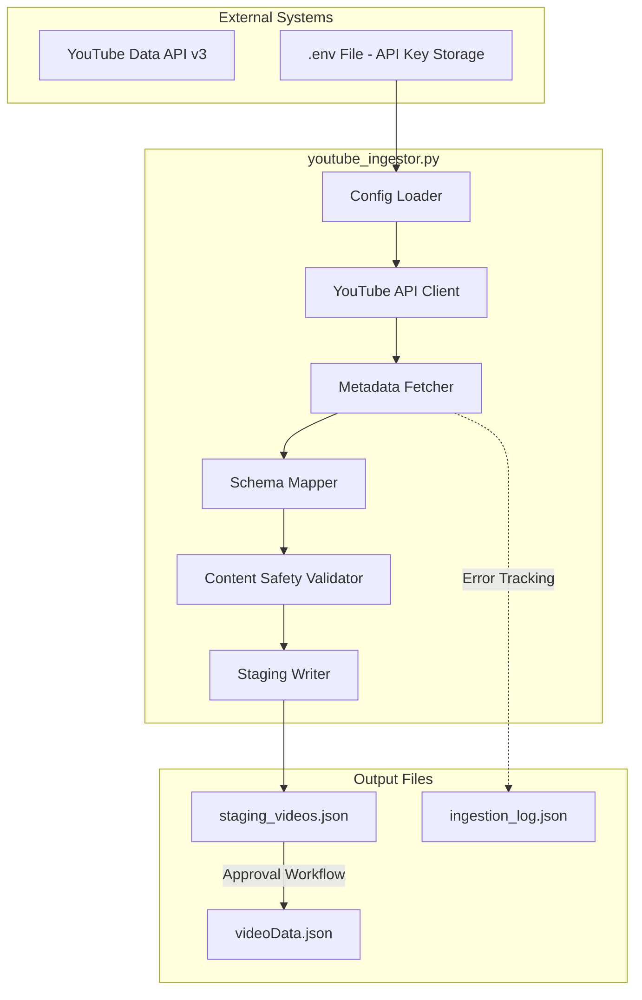
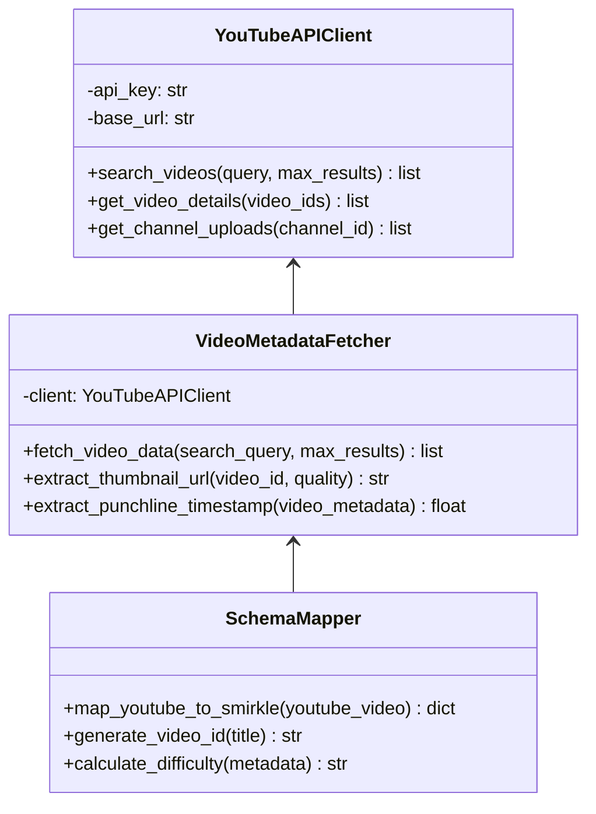
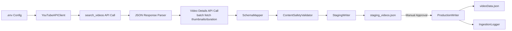
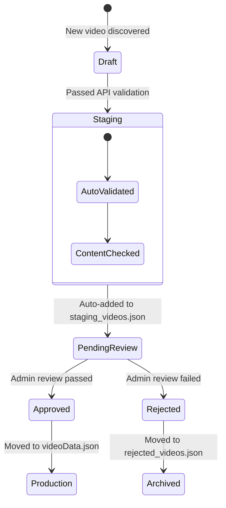
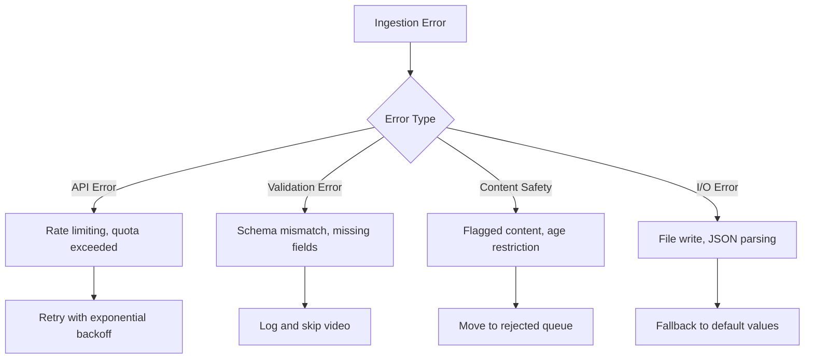

# Smirkle YouTube Video Ingestor - Architecture Document

## Executive Summary

This document outlines the architecture for `youtube_ingestor.py`, a bulk video metadata ingestion system that leverages the YouTube Data API v3 to populate the Smirkle video library. The system is designed with a staging-based workflow to satisfy DeveloperWeek 2026 hackathon content safety requirements, using a "Pending Approval" buffer before videos enter the production library.

## 1. YouTube Ingestor Architecture Overview

### 1.1 System Components



### 1.2 File Structure

```
smirkle/
├── scripts/
│   ├── youtube_ingestor.py      # Main ingestion script
│   ├── .env                     # Environment variables (API key)
│   └── requirements.txt         # Python dependencies
├── data/
│   ├── staging_videos.json      # Pending approval queue
│   ├── videoData.json           # Production video library
│   └── ingestion_log.json      # Audit trail
└── docs/
    └── youtube-ingestor-architecture.md  # This document
```

## 2. Configuration Management

### 2.1 Environment Variables (.env)

```bash
# .env - NEVER commit to version control
YOUTUBE_API_KEY=your_api_key_here
YOUTUBE_SEARCH_QUERY=funny cat videos fail compilation comedy
MAX_RESULTS=50
OUTPUT_DIR=data
STAGING_FILE=staging_videos.json
PRODUCTION_FILE=videoData.json
DIFFICULTY_DEFAULT=Medium
```

### 2.2 Configuration Schema

```python
# Configuration constants
CONFIG = {
    'YOUTUBE_API_KEY': os.getenv('YOUTUBE_API_KEY'),
    'YOUTUBE_SEARCH_QUERY': os.getenv('YOUTUBE_SEARCH_QUERY', 'funny videos'),
    'MAX_RESULTS': int(os.getenv('MAX_RESULTS', '50')),
    'OUTPUT_DIR': os.getenv('OUTPUT_DIR', 'data'),
    'STAGING_FILE': os.getenv('STAGING_FILE', 'staging_videos.json'),
    'PRODUCTION_FILE': os.getenv('PRODUCTION_FILE', 'videoData.json'),
    'DIFFICULTY_DEFAULT': os.getenv('DIFFICULTY_DEFAULT', 'Medium'),
    'API_BASE_URL': 'https://www.googleapis.com/youtube/v3',
    'THUMBNAIL_BASE_URL': 'https://img.youtube.com/vi/{video_id}/{quality}.jpg'
}
```

## 3. YouTube Data API Integration

### 3.1 API Client Architecture



### 3.2 YouTube API Response Mapping

The YouTube Data API v3 returns JSON responses that must be mapped to the Smirkle schema:

```python
# YouTube API Response Structure
YOUTUBE_API_RESPONSE = {
    "kind": "youtube#searchListResponse",
    "etag": "etag_value",
    "nextPageToken": "token",
    "regionCode": "US",
    "pageInfo": {
        "totalResults": 1000,
        "resultsPerPage": 50
    },
    "items": [
        {
            "kind": "youtube#searchResult",
            "id": {
                "kind": "youtube#video",
                "videoId": "dQw4w9WgXcQ"  # <-- Extract this
            },
            "snippet": {
                "publishedAt": "2024-01-15T10:00:00Z",
                "channelId": "UC_x5XG1OV2P6uZZ5FSM9Ttw",
                "title": "Rick Astley - Never Gonna Give You Up",  # <-- Map to title
                "description": "Official music video...",
                "thumbnails": {
                    "default": {"url": "https://i.ytimg.com/vi/dQw4w9WgXcQ/default.jpg", "width": 120, "height": 90},
                    "medium": {"url": "https://i.ytimg.com/vi/dQw4w9WgXcQ/mqdefault.jpg", "width": 320, "height": 180},
                    "high": {"url": "https://i.ytimg.com/vi/dQw4w9WgXcQ/hqdefault.jpg", "width": 480, "height": 360}
                },
                "channelTitle": "RickAstleyVEVO",
                "liveBroadcastContent": "none",
                "publishTime": "2024-01-15T10:00:00Z"
            }
        }
    ]
}
```

### 3.3 Schema Mapping Logic

```python
# Schema Mapping: YouTube → Smirkle
YOUTUBE_TO_SMIRKLE_MAPPING = {
    'id': {
        'source': ('id', 'videoId'),
        'transform': 'generate_smirkle_id'
    },
    'title': {
        'source': ('snippet', 'title'),
        'transform': 'clean_title'
    },
    'url': {
        'source': ('id', 'videoId'),
        'transform': 'youtube_url'
    },
    'thumbnail': {
        'source': ('snippet', 'thumbnails', 'high', 'url'),
        'transform': 'none'
    },
    'difficulty': {
        'source': None,
        'transform': 'calculate_difficulty'
    },
    'tags': {
        'source': ('snippet', 'tags'),
        'transform': 'extract_tags'
    },
    'previewImage': {
        'source': ('snippet', 'thumbnails', 'medium', 'url'),
        'transform': 'none'
    },
    'punchlineTimestamp': {
        'source': ('contentDetails', 'duration'),
        'transform': 'estimate_punchline'
    },
    'metadata': {
        'source': {
            'source': ('snippet', 'channelTitle'),
            'api_response_id': ('id', 'videoId'),
            'published_at': ('snippet', 'publishedAt')
        },
        'transform': 'build_metadata'
    }
}
```

## 4. Data Flow Architecture

### 4.1 End-to-End Data Flow



### 4.2 Ingestion Pipeline Steps

```python
# Main ingestion pipeline
def run_ingestion_pipeline():
    """
    Pipeline Steps:
    1. Load configuration from .env
    2. Initialize YouTube API client
    3. Search for videos using configured query
    4. Batch fetch video details (thumbnails, duration)
    5. Map YouTube metadata to Smirkle schema
    6. Validate content safety
    7. Write to staging area
    8. Log ingestion results
    """
    
    # Step 1: Configuration
    config = load_config()
    validate_api_key(config['YOUTUBE_API_KEY'])
    
    # Step 2: Initialize client
    client = YouTubeAPIClient(config['YOUTUBE_API_KEY'])
    
    # Step 3: Search videos
    search_results = client.search_videos(
        query=config['YOUTUBE_SEARCH_QUERY'],
        max_results=config['MAX_RESULTS'],
        type='video',
        relevance_language='en',
        safe_search='strict'
    )
    
    # Step 4: Fetch details
    video_ids = extract_video_ids(search_results)
    video_details = client.get_video_details(video_ids)
    
    # Step 5: Map to Smirkle schema
    mapper = SchemaMapper()
    mapped_videos = []
    for video in video_details:
        smirkle_video = mapper.map_youtube_to_smirkle(video)
        mapped_videos.append(smirkle_video)
    
    # Step 6: Content safety validation
    validator = ContentSafetyValidator()
    validated_videos = validator.validate_batch(mapped_videos)
    
    # Step 7: Write to staging
    staging_writer = StagingWriter(config['OUTPUT_DIR'], config['STAGING_FILE'])
    staging_writer.write(validated_videos)
    
    # Step 8: Log results
    logger = IngestionLogger()
    logger.log_ingestion({
        'timestamp': datetime.utcnow().isoformat(),
        'total_found': len(search_results),
        'total_mapped': len(mapped_videos),
        'total_validated': len(validated_videos),
        'rejected_count': len(mapped_videos) - len(validated_videos),
        'video_ids': [v['id'] for v in validated_videos]
    })
```

## 5. Staging Workflow for Content Safety

### 5.1 Three-Stage Approval Process



### 5.2 Staging File Schema

```json
{
  "version": "1.0",
  "lastUpdated": "2026-02-09T18:00:00Z",
  "stagingStatus": "PENDING_REVIEW",
  "videos": [
    {
      "id": "yt_video_001",
      "title": "Funny Cat Compilation 2024",
      "url": "https://www.youtube.com/watch?v=dQw4w9WgXcQ",
      "difficulty": "Medium",
      "tags": ["animals", "cats", "comedy", "funny"],
      "previewImage": "https://i.ytimg.com/vi/dQw4w9WgXcQ/mqdefault.jpg",
      "punchlineTimestamp": 12.5,
      "metadata": {
        "source": "YouTube",
        "source_id": "dQw4w9WgXcQ",
        "channel_title": "Funny Animals",
        "uploaded_at": "2024-01-15T10:00:00Z",
        "view_count": 1500000,
        "like_count": 75000
      },
      "safety_review": {
        "auto_approved": false,
        "reviewed_by": null,
        "reviewed_at": null,
        "approved": false,
        "rejection_reason": null,
        "notes": "Awaiting manual review"
      },
      "ingestion": {
        "ingested_at": "2026-02-09T18:00:00Z",
        "batch_id": "batch_2026_02_09_001",
        "source_query": "funny cat videos"
      }
    }
  ],
  "batch_info": {
    "batch_id": "batch_2026_02_09_001",
    "ingested_at": "2026-02-09T18:00:00Z",
    "total_videos": 25,
    "pending_review": 25,
    "approved": 0,
    "rejected": 0
  }
}
```

### 5.3 Approval Workflow Commands

```bash
# Ingestion workflow commands
python youtube_ingest.py --search "funny animal fails" --max-results 50

# Approval workflow (separate admin script)
python admin_approve.py --batch-id batch_2026_02_09_001 --approve-all
python admin_approve.py --video-id yt_video_001 --approve
python admin_approve.py --video-id yt_video_002 --reject --reason "Inappropriate content"

# Production promotion
python promote_to_production.py --batch-id batch_2026_02_09_001
```

## 6. Smirkle Schema Integration

### 6.1 Schema Compatibility Mapping

The `youtube_ingestor.py` must produce output compatible with the Smirkle `VIDEO_DATABASE` schema:

```python
# Smirkle Schema (from src/data/videoLibrary.js)
SMIRKLE_VIDEO_SCHEMA = {
    'id': 'str',              # Format: yt_video_XXX or video_XXX
    'title': 'str',           # Human-readable title
    'url': 'str',             # Video URL (YouTube watch URL)
    'difficulty': 'enum',     # 'Easy', 'Medium', 'Hard'
    'tags': 'list[str]',      # Content categories
    'previewImage': 'str',    # Thumbnail URL
    'punchlineTimestamp': 'float',  # Seconds where punchline occurs
    'metadata': 'dict'        # Extended metadata
}

# YouTube to Smirkle Field Mapping
FIELD_MAPPING = {
    # YouTube field path -> Smirkle field
    ('id', 'videoId'): 'id',
    ('snippet', 'title'): 'title',
    ('id', 'videoId'): lambda vid_id: f'https://www.youtube.com/watch?v={vid_id}',
    ('snippet', 'thumbnails', 'high', 'url'): 'previewImage',
    None: 'difficulty',  # Calculated field
    ('snippet', 'tags'): 'tags',
    ('contentDetails', 'duration'): 'punchlineTimestamp',
}
```

### 6.2 ID Generation Strategy

```python
def generate_smirkle_id(youtube_video_id: str, existing_ids: set) -> str:
    """
    Generate unique Smirkle video ID
    Format: yt_video_{incremental} for YouTube sources
    
    Example: yt_video_001, yt_video_002, etc.
    """
    base_id = 'yt_video'
    counter = 1
    
    while f'{base_id}_{counter:03d}' in existing_ids:
        counter += 1
    
    return f'{base_id}_{counter:03d}'
```

### 6.3 Difficulty Calculation Algorithm

```python
def calculate_difficulty(video_metadata: dict) -> str:
    """
    Calculate video difficulty based on:
    - View count (popularity indicator)
    - Like ratio (engagement quality)
    - Duration (longer videos = harder)
    - Category risk (some categories are inherently harder)
    """
    
    view_count = video_metadata.get('statistics', {}).get('viewCount', 0)
    like_count = video_metadata.get('statistics', {}).get('likeCount', 0)
    duration_seconds = video_metadata.get('contentDetails', 'duration', 'PT0S')
    
    # Normalize metrics
    view_score = min(view_count / 1_000_000, 1.0)  # Cap at 1M views
    like_ratio = like_count / max(view_count, 1)
    duration_minutes = parse_iso_duration(duration_seconds) / 60
    
    # Base score calculation
    difficulty_score = (
        (view_score * 0.3) +                    # More views = easier
        (like_ratio * 0.3) +                     # Higher like ratio = more engaging = harder
        (min(duration_minutes / 10, 1.0) * 0.4)  # Longer = harder (max 10 min)
    )
    
    # Map to difficulty levels
    if difficulty_score < 0.33:
        return 'Easy'
    elif difficulty_score < 0.66:
        return 'Medium'
    else:
        return 'Hard'
```

## 7. Error Handling and Logging

### 7.1 Error Categories



### 7.2 Ingestion Log Schema

```json
{
  "ingestion_log": [
    {
      "timestamp": "2026-02-09T18:00:00Z",
      "batch_id": "batch_2026_02_09_001",
      "action": "ingest",
      "status": "completed",
      "statistics": {
        "total_found": 50,
        "total_mapped": 48,
        "total_validated": 45,
        "rejected_count": 3,
        "errors": [
          {
            "video_id": "dQw4w9WgXcQ",
            "error_type": "AGE_RESTRICTED",
            "error_message": "Video is age-restricted"
          }
        ]
      }
    }
  ]
}
```

## 8. Implementation Checklist

### 8.1 Required Components

| Component | File | Priority |
|-----------|------|----------|
| Configuration Loader | `youtube_ingestor.py` - Config section | High |
| YouTube API Client | `youtube_ingestor.py` - API client class | High |
| Metadata Fetcher | `youtube_ingestor.py` - Fetch functions | High |
| Schema Mapper | `youtube_ingestor.py` - Mapping logic | High |
| Content Safety Validator | `youtube_ingestor.py` - Safety checks | High |
| Staging Writer | `youtube_ingestor.py` - I/O functions | High |
| Ingestion Logger | `youtube_ingestor.py` - Logging | Medium |
| Admin Approval Script | `admin_approve.py` | Medium |
| Production Promotion Script | `promote_to_production.py` | Medium |

### 8.2 Python Dependencies

```txt
# requirements.txt
requests>=2.31.0
python-dotenv>=1.0.0
```

### 8.3 Execution Flow

```bash
# Step 1: Set up environment
cp .env.example .env
# Edit .env with your YouTube API key

# Step 2: Install dependencies
pip install -r requirements.txt

# Step 3: Run ingestion
python youtube_ingestor.py --search "funny cat videos" --max-results 25

# Step 4: Review staging area
cat data/staging_videos.json

# Step 5: Approve videos (manual or automated)
python admin_approve.py --batch-id batch_XXX --approve-all

# Step 6: Promote to production
python promote_to_production.py --batch-id batch_XXX
```

## 9. Security Considerations

### 9.1 API Key Protection

```python
# NEVER log or expose API key
def validate_api_key(api_key: str) -> bool:
    """
    Validate API key format and basic connectivity.
    """
    if not api_key:
        raise ValueError("YOUTUBE_API_KEY not found in environment variables")
    
    if len(api_key) < 20:
        raise ValueError("Invalid API key format")
    
    # Test API connectivity
    client = YouTubeAPIClient(api_key)
    return client.test_connection()
```

### 9.2 Content Safety Validation

```python
class ContentSafetyValidator:
    """
    Validates videos before staging.
    Checks for:
    - Age restriction
    - Inappropriate content flags
    - Copyright claims
    - Duration limits (too short/long)
    """
    
    VALIDATION_RULES = {
        'min_duration_seconds': 5,
        'max_duration_seconds': 600,  # 10 minutes
        'allowed_content_types': ['video'],
        'blocked_keywords': ['nsfw', 'explicit', '18+']
    }
    
    def validate_video(self, video: dict) -> tuple[bool, str]:
        """
        Returns (is_valid, rejection_reason)
        """
        # Check duration
        duration = parse_iso_duration(video.get('duration', 'PT0S'))
        if duration < self.VALIDATION_RULES['min_duration_seconds']:
            return False, "Video too short"
        
        if duration > self.VALIDATION_RULES['max_duration_seconds']:
            return False, "Video exceeds maximum duration"
        
        # Check for blocked keywords in title
        title_lower = video.get('title', '').lower()
        for keyword in self.VALIDATION_RULES['blocked_keywords']:
            if keyword in title_lower:
                return False, f"Blocked keyword found: {keyword}"
        
        return True, None
```

## 10. Summary

This architecture document defines the complete design for `youtube_ingestor.py`, a bulk video metadata ingestion system that:

1. **Secures API credentials** using `.env` file configuration
2. **Maps YouTube metadata** to the Smirkle `VIDEO_DATABASE` schema
3. **Implements a staging workflow** via `staging_videos.json` for content safety
4. **Provides audit logging** via `ingestion_log.json`
5. **Enables manual approval** before production deployment

The system is designed to be modular, scalable, and compliant with DeveloperWeek 2026 hackathon content safety requirements.
